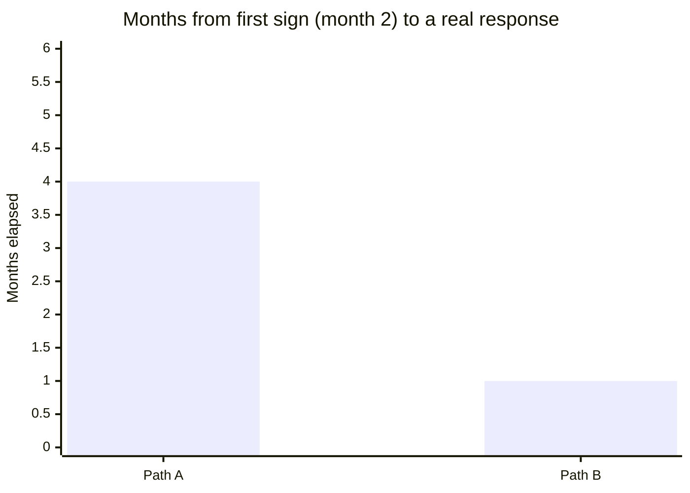

import Scenario from "../../../components/Scenario.astro";

<Scenario label="The scenario">
  <Fragment slot="facts">
    

      
🔥 Month 2 — exhaustion sign, both paths

      
😏 Month 3 — cynicism sign, both paths

      
📉 Month 4 — flat sense of accomplishment, both paths

    

    
Where the paths split

    

      
🅰️ Path A: signs dismissed individually, month over month

      
🅱️ Path B: combination named to manager, month 3

      
⏱️ Result: 4 extra months before Path A becomes visible

    

  </Fragment>

An engineer has been on a high-pressure project for six months:
consistently longer hours, a string of production incidents, and slowly
mounting frustration with a process they used to tolerate fine. Watch how
noticing (or not noticing) the specific early signs from L2 changes what
happens next.

</Scenario>

## Path A: signs dismissed as "just being tired"

**Month 2:** Notices needing real effort to start tasks that used to be automatic — chalks it up to a demanding sprint, plans to "push through to the next milestone."

**Month 3:** Catches themselves being sarcastic in a retro ("sure, another process improvement, that'll fix everything") — laughs it off internally as normal venting, not a real signal.

**Month 4:** A project that shipped successfully doesn't produce the satisfaction it would have six months earlier — notices this, briefly, then reasons "I'm just tired, I'll feel it once I get a real weekend."

**Month 5:** Takes a genuine, fully-disconnected week off. Comes back physically rested — and the cynicism and flat sense of accomplishment are almost entirely unchanged. Concludes, confused, that the vacation "didn't really work," without connecting this specifically to the fact that rest resolves exhaustion, not the other two components.

**Month 6:** A minor, previously-routine code review comment triggers a disproportionate, uncharacteristic frustration response in a team meeting — the first time this pattern becomes visible to colleagues, not just self-observed. This is roughly where Path A's story becomes a visible problem for others, four months after the first individually-noticeable sign in month 2.

## Path B: signs checked against the specific list, and named early

**Month 2:** Notices the same "routine tasks now need real effort" sign — this time, explicitly checks it against exhaustion/cynicism/efficacy rather than assuming it's just sprint pressure. Recognizes it as exhaustion alone, at this point — genuinely plausible ordinary overwork, not yet clear evidence of burnout's fuller pattern, but flags it as worth watching.

**Month 3:** Notices the same sarcastic retro comment — this time, explicitly connects it to the cynicism component from the checklist, rather than dismissing it as normal venting. Now two of three components are present.

**Month 3, same week:** Raises this directly and specifically with their manager: "I've noticed I'm both more exhausted than usual and genuinely more cynical about whether process changes matter — that combination is a real burnout signal, not just a rough sprint, and I want to flag it before it gets worse." This is possible specifically because the signs were named precisely, not vaguely — "I'm burned out" alone invites "everyone's tired, push through"; "I'm exhausted AND increasingly cynical, and that specific combination is what burnout actually looks like" is harder to wave off.

**Month 4:** Workload is genuinely adjusted (a lower-priority feature is deprioritized, a second engineer is added to share on-call load) — not a vacation, since Path A already demonstrates rest alone wasn't going to be the fix once cynicism was present, but an actual change to the underlying load driving all three components.

**Month 5–6:** Exhaustion, cynicism, and the sense of futile effort all measurably ease, because the actual driver (unsustainable load, not insufficient rest) was addressed directly.

## The same signs, two different timelines

```mermaid
flowchart TD
    subgraph A["Path A — dismissed individually"]
        A2["Month 2: exhaustion\n(dismissed as sprint pressure)"] --> A3["Month 3: cynicism\n(dismissed as venting)"] --> A4["Month 4: flat accomplishment\n('just need a weekend')"] --> A5["Month 5: vacation\n(doesn't resolve it)"] --> A6["Month 6: visible to team"]
    end
    subgraph B["Path B — checked against the checklist"]
        B2["Month 2: exhaustion\n(flagged, watch it)"] --> B3["Month 3: cynicism\n(named as a combination)"] --> B3b["Same week: raised with manager"] --> B4["Month 4: workload adjusted"] --> B56["Month 5-6: components ease"]
    end
```

## What separated the two paths

Both engineers experienced the identical initial signs at the same times. Path A's dismissal wasn't a personal failing — it's the predictable effect of the self-referential trap from L2: cynicism about the sign itself ("am I just being dramatic") delayed recognition until the pattern became undeniable to others, four months later. Path B's early, specific naming of the _combination_ of components (not just "I'm tired") is what made the difference — both in catching it sooner and in getting a response that actually addressed cause rather than symptom.

Counted directly, not as a vague impression:

Path A: four months from the first noticeable sign (month 2) to the moment it became a visible problem for the team (month 6) — and even then, nothing had actually been addressed yet, only noticed. Path B: one month from the first sign (month 2) to a specific, actionable conversation with a manager (month 3) that led to a real fix by month 4.

## Failure modes

| Failure                                                                              | What it looks like                                                                                               | The fix                                                                                                                                      |
| ------------------------------------------------------------------------------------ | ---------------------------------------------------------------------------------------------------------------- | -------------------------------------------------------------------------------------------------------------------------------------------- |
| Treating any single early sign as sufficient evidence on its own                     | Month 2's exhaustion-only signal treated as "this proves burnout"                                                | Flag a single sign as "watch this," not "confirmed" — per L2, exhaustion alone is also consistent with ordinary overwork                     |
| Waiting for a scheduled check-in to raise this, rather than flagging it when noticed | Sitting on a two-component signal until the next quarterly review or annual survey                               | Raise it the same week the pattern becomes clear, like Path B did — waiting costs exactly the window where earlier intervention matters most |
| Treating rest as the default fix regardless of which components are present          | Recommending or taking a vacation as a one-size response, without checking which components are actually present | Match the fix to the component: rest for exhaustion, a real workload change for cynicism and reduced efficacy                                |
| Assuming recognizing the pattern is itself the whole solution                        | Naming the signs, then stopping there, expecting the naming alone to fix anything                                | Recognition is the necessary first step that makes an effective response possible — not a substitute for the response itself                 |

## Beyond this example

This engineer's six months is one case, not the whole territory — a few questions to test whether the model actually transfers:

- What changes if the person noticing the signs isn't the one experiencing them, but a manager watching a direct report show the same pattern from the outside? Which signs are still visible externally, and which (like the internal "am I being dramatic" self-doubt) simply aren't?
- What if Path B's manager conversation had gotten a dismissive response — "everyone's tired, this is just a rough quarter"? Does naming the specific combination still help, or does the fix at that point require going around or above that manager?
- Where in your own recent months would you place yourself on this same timeline — closer to month 2's single, dismissible sign, or already at a combination worth naming out loud?
