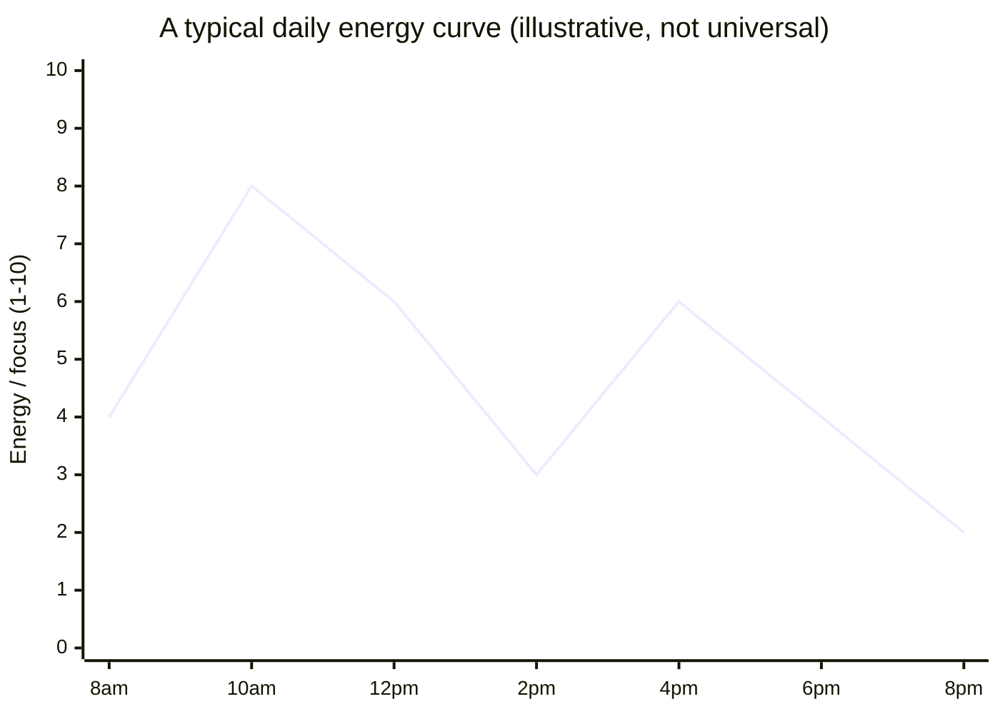
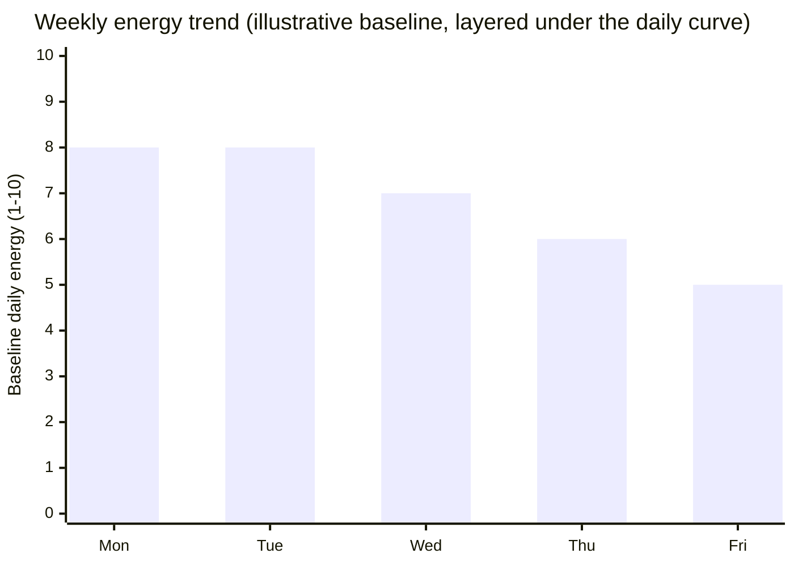

## What actually varies across a day

**If Maya's two-hour blocks are identical in length, what's the
variable that makes one productive and the other a waste?** Her
underlying energy level at the time — most people's alertness follows
a fairly predictable shape across a working day, not a flat line:

Two things to notice in that shape: the **morning peak** (around
10am, after being awake long enough to be alert but before decision
fatigue sets in) and the **post-lunch dip** (2pm, a well-documented
low point independent of what was eaten). The late-afternoon partial
recovery around 4-6pm is real but smaller than the morning peak for
most people. This exact shape isn't universal — some people peak
later, some earlier — but nearly everyone has _a_ shape, not a flat
line, and the shape is what makes energy management a real lever
distinct from time management.

## Matching task type to the curve, not fighting it

**If the curve is roughly fixed for a given day, what's actually
adjustable?** Not the curve itself — which task lands in which part
of it:

| Energy state                  | What it's good for                                                          | What it's bad for                                                       |
| ----------------------------- | --------------------------------------------------------------------------- | ----------------------------------------------------------------------- |
| High (peak)                   | Hard problems, first drafts, high-stakes decisions, learning new material   | Nothing — this is the scarcest resource, don't spend it on routine work |
| Medium (recovering/declining) | Editing, structured meetings, planning, moderately complex replies          | Starting something genuinely new and hard                               |
| Low (dip)                     | Routine replies, filing, scheduling, tasks with a checklist already in hand | Anything requiring a first decision or sustained novel thinking         |

The failure Maya hit wasn't a time-management failure — she had the
hours. It was scheduling a **high-demand task into a low-energy
slot** (hard problem at 2pm) while a **low-demand task consumed a
high-energy slot** (routine replies at 10am). Swapping which task
occupies which slot, with zero change to the total hours worked,
changes the outcome.

## The slower trend layered underneath: a week, not just a day

**Does the daily curve look the same on Friday as it does on
Monday?** Usually not — on top of the daily up-and-down, most people
carry a slower weekly trend: fresher and more resilient early in the
week, more depleted by the end, recovering over a rest period before
the cycle restarts.

This matters for scheduling beyond a single day: the same 10am slot
that reliably hits "8" on Monday might only reach "5" by Friday. A
schedule that assumes every Monday-equivalent hour behaves the same
all week will keep placing hard work into a slot that's quietly
gotten weaker, and the mismatch compounds rather than resetting each
morning.

## Failure modes at this level

- **Assuming your curve matches someone else's.** The shape above is
  a common pattern, not a law — some people are genuine late-peakers.
  Scheduling by a borrowed curve instead of your own observed one
  reproduces the same mismatch it's meant to solve.
- **Treating the dip as a willpower failure.** Reaching for more
  caffeine or self-criticism to force high-focus work through a
  natural low point usually costs more (recovery time, error rate)
  than just moving a low-demand task into that slot and rescheduling
  the hard work.
- **Optimizing only the daily curve and ignoring the weekly trend.**
  A schedule that looks perfectly energy-matched on Monday can still
  fail by Thursday if it doesn't account for the slower weekly
  decline layered underneath.
