import LevelIntro from "../../../components/LevelIntro.astro";
import Checkpoint from "../../../components/Checkpoint.astro";

L2 established the shape of an energy curve and the principle of
matching task difficulty to it. L3 takes one real day's worth of
tasks and slots, scores two competing schedules against each other,
and shows exactly how much the matching principle is worth in
concrete terms.

<LevelIntro
  items={[
    "Scoring a schedule with an effectiveness formula",
    "Comparing an energy-blind schedule to an energy-matched one",
    "Where the matching principle breaks down",
  ]}
/>

## Setting up a real day to compare

Maya has five tasks to fit into one day, and a known energy curve for
that day (from L2's shape: high at 9am, moderate at 11am, low at
1-2pm, partial recovery at 4pm):

| Task                    | Difficulty (1-10) |
| ----------------------- | ----------------- |
| Draft the hard proposal | 9                 |
| Plan next sprint        | 6                 |
| Review teammate's PR    | 5                 |
| Reply to routine emails | 2                 |
| File expense report     | 1                 |

| Slot | Energy (1-10) |
| ---- | ------------- |
| 9am  | 8             |
| 11am | 6             |
| 1pm  | 3             |
| 2pm  | 3             |
| 4pm  | 6             |

**Effectiveness** for a task placed in a slot is scored two ways,
both penalizing mismatch: if the slot's energy is _below_ the task's
difficulty, effectiveness drops fast (overreach — you can't force a
9-difficulty task through 3 units of energy and get a 9-quality
result); if the slot's energy is _above_ what the task needed,
effectiveness still drops, but more gently (squandered potential — a
1-difficulty task doesn't need 8 units of energy, so most of that
energy was available for something better and went unused):

```
effectiveness(energy, difficulty):
  if energy >= difficulty:
      return energy - (energy - difficulty) * 0.5   # squandered potential
  else:
      return max(0, energy - (difficulty - energy) * 1.5)  # overreach
```

## Schedule A: time-blocked, energy-blind

Maya just works through her list in the order it occurred to her,
dropping each task into the next open slot:

| Slot (energy) | Task (difficulty)           | Effectiveness |
| ------------- | --------------------------- | ------------- |
| 9am (8)       | Draft the hard proposal (9) | 6.5           |
| 11am (6)      | Review teammate's PR (5)    | 5.5           |
| 1pm (3)       | Reply to routine emails (2) | 2.5           |
| 2pm (3)       | Plan next sprint (6)        | **0**         |
| 4pm (6)       | File expense report (1)     | 3.5           |
| **Total**     |                             | **18.0**      |

**Before reading the next section — where's the worst mismatch in
this table, and why is its effectiveness exactly 0 rather than just
low?** It's "Plan next sprint" at 2pm: a difficulty-6 task dropped
into a difficulty-3 slot. The gap (3) times the overreach penalty
(1.5) exactly cancels the slot's own energy (3), so effectiveness
floors at zero — not "did it badly," but "produced nothing usable,"
which matches the real experience of trying to plan something
consequential during a genuine energy trough.

<Checkpoint question="In Schedule A, filing the expense report (difficulty 1) landed in the 4pm slot (energy 6), scoring 3.5 rather than the full 6. Is that a mismatch in the same direction as the sprint-planning failure at 2pm, and does it call for the same kind of fix?">

No — it's the opposite direction of mismatch. The sprint-planning
failure was overreach: too little energy for the task, penalized
heavily (1.5x the gap), which is why it floored at zero. The expense
report at 4pm is squandered potential: too much energy for a task
that barely needed any, penalized more gently (0.5x the gap), so it
still scores 3.5 rather than collapsing to zero. Both lose points
against the same slot-task pair being reversed, but the fix isn't
symmetric in urgency — overreach produces unusable output and is the
one worth fixing first, while squandered potential just leaves value
on the table rather than failing outright. That asymmetry is exactly
why the formula penalizes the two directions at different rates.

</Checkpoint>

## Schedule B: energy-matched

Same five tasks, same five slots — only the _assignment_ changes:
hardest task into the highest-energy slot, and so on down both lists
in matching rank order.

```mermaid
xychart-beta
    title "Effectiveness by schedule: energy-blind vs. energy-matched"
    x-axis ["Proposal", "Sprint plan", "PR review", "Emails", "Expense report"]
    y-axis "Effectiveness" 0 --> 10
    bar [6.5, 0, 5.5, 2.5, 3.5]
    bar [6.5, 6, 5.5, 2.5, 2]
```



| Slot (energy) | Task (difficulty)           | Effectiveness |
| ------------- | --------------------------- | ------------- |
| 9am (8)       | Draft the hard proposal (9) | 6.5           |
| 11am (6)      | Plan next sprint (6)        | 6.0           |
| 4pm (6)       | Review teammate's PR (5)    | 5.5           |
| 1pm (3)       | Reply to routine emails (2) | 2.5           |
| 2pm (3)       | File expense report (1)     | 2.0           |
| **Total**     |                             | **22.5**      |

Total hours worked: identical in both schedules — five tasks, same
five slots, same total time. **Total effectiveness: 18.0 → 22.5, a
25% improvement, from re-ordering which task lands in which slot and
nothing else.** The proposal (the one task that was already correctly
placed in the highest-energy slot in schedule A) doesn't change at
all — the entire gain comes from fixing the other four assignments.

## What this example does and doesn't prove

**Would this same 25% gap hold for a different set of tasks, or a
person whose curve peaks in the evening instead of the morning?** Not
necessarily the same number — the gap's size depends on how badly
mismatched the _original_ schedule happened to be, and a schedule
that's already close to matched has little room left to improve. What
generalizes is the mechanism, not the 25%: **any schedule that ignores
energy state will have some mismatched pairs, and reordering toward
matched pairs recovers effectiveness at zero cost in total hours.**
For a genuine evening-peaker, the entire "9am/11am high, 1-2pm low"
energy table would need to be re-measured from that person's own
observed pattern first (see L2's warning against borrowing someone
else's curve) — the matching _procedure_ (rank tasks by difficulty,
rank slots by energy, pair top-to-top) still applies unchanged once
that person's real curve is known.

<Checkpoint question="A colleague's daily curve peaks in the evening rather than the morning, and they ask whether the rank-tasks-by-difficulty, rank-slots-by-energy, pair-top-to-top procedure still applies to them. What do you tell them?">

Yes, the procedure still applies unchanged — what has to change is the
input, not the method. The procedure never assumed a morning peak; it
only assumed that difficulty and energy can each be ranked and paired
top-to-top, whatever shape the underlying curve actually has. What
would be wrong is reusing Maya's specific energy table (9am high,
2pm low) for someone whose real curve peaks in the evening — that
would just reintroduce a mismatch by feeding the procedure the wrong
person's numbers. Once they measure their own curve, the same ranking
and pairing steps recover the same kind of gain the 18.0-to-22.5
example showed.

</Checkpoint>

## Failure modes

| Failure mode                                                 | What it gets wrong                                                                                                                                                                                                                           |
| ------------------------------------------------------------ | -------------------------------------------------------------------------------------------------------------------------------------------------------------------------------------------------------------------------------------------- |
| Matching by task _urgency_ instead of task _difficulty_      | An urgent-but-easy task (file the expense report by 5pm) doesn't need a high-energy slot just because it's due soon — urgency affects _when in the day_ it must happen, difficulty affects _how much energy_ it needs                        |
| Assuming the schedule only needs fixing once                 | The weekly trend from L2 means a slot's real energy shifts across the week — a schedule matched for Monday can silently become mismatched by Thursday without anyone re-checking                                                             |
| Overcorrecting into rigid energy-only scheduling             | Some tasks (a scheduled client call, a hard deadline) can't move to the "ideal" slot regardless of energy — the matching principle is a default to lean toward, not an absolute rule that overrides every other constraint                   |
| Treating a single bad day as proof the whole approach failed | One day's actual energy curve can deviate from the usual pattern (poor sleep, an early meeting) — matching against yesterday's assumed curve rather than today's actual state reintroduces the same mismatch the technique is meant to avoid |

**Try extending it yourself:** if Maya's energy at 4pm were an 8
instead of a 6 (say she's a genuine post-dip recoverer whose second
peak nearly matches her first), which task moves, and does the total
effectiveness gap between the two schedules get larger or smaller?
