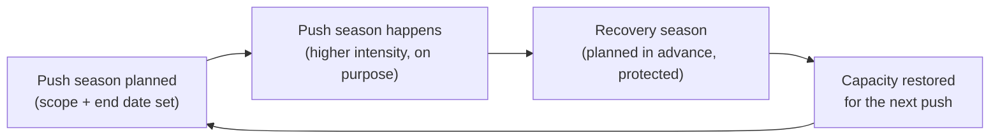

import LevelIntro from "../../../components/LevelIntro.astro";
import Checkpoint from "../../../components/Checkpoint.astro";

L1 named the trap: every quarter can look like a win individually while
the run of them adds up to something that isn't sustainable at all. L2
works out why that happens and what actually has to be true for a
career-length pace to hold.

<LevelIntro
  items={[
    "Why quarter-optimal isn't decade-optimal",
    "What the seasons model actually requires",
    "What staff-level output depends on that raw hours don't buy",
  ]}
/>

## Why does optimizing every quarter individually not add up to a good decade?

**If each quarter, judged on its own, was genuinely a strong quarter,
where does the damage come from?** From what each "strong quarter"
decision quietly borrows against the next one. Working at 130% pace
for one quarter, with no plan to come back down, produces a real,
visible result now — and a real, invisible cost later, paid out of
focus, judgment, and patience the person doesn't notice missing until
it's already gone. Because the cost lands in a later quarter, it never
shows up in the quarter that caused it, which is exactly why a string
of individually-defensible decisions can compound into a trajectory
nobody would have chosen on purpose:

| Viewed one quarter at a time                     | Viewed across a decade                                                                |
| ------------------------------------------------ | ------------------------------------------------------------------------------------- |
| "This launch matters, I'll push hard to hit it." | The fourth consecutive launch pushed hard, with no quarter budgeted to recover        |
| "I can skip the vacation, the project needs me." | Ten skipped recovery windows in a row, invisible individually, compounding silently   |
| "I stayed sharp enough to ship this well."       | Judgment quietly eroding each cycle, only visible in hindsight once it's already gone |

**Does this mean every high-intensity quarter is a mistake?** No — a
genuine push, taken on purpose, is often the right call. The mistake
isn't the push itself; it's treating every quarter as if it should be
one, with no season afterward built to pay down what the push
borrowed.

<Checkpoint question="An engineer says, 'I don't understand the problem — I checked, and every single one of my last six quarters individually had a good, defensible reason to run hot.' Using the table above, what's missing from that defense?">

Each quarter being individually defensible is exactly what makes the
pattern easy to miss — the damage was never visible from inside any one
quarter, because it's not a property of a single quarter at all. It's a
property of the sequence: six quarters run hot with no recovery season
between them means six borrowings against judgment and focus with zero
repayments, and that debt doesn't reset itself just because each
individual withdrawal had a good reason. The right question isn't "was
this quarter's push justified" — it's "when is the recovery season that
pays this back," and if there's no answer to that, the defense doesn't
actually hold up at the decade scale.

</Checkpoint>

## What does the seasons model actually require to work?

**If the fix is "alternate high-intensity seasons with recovery
seasons," isn't that just... occasionally taking it easy? What makes
this a model rather than common sense everyone already does?** The
difference is that the seasons model requires the recovery season to be
**planned before the push starts**, sized to the push, and actually
protected once it arrives — not "I'll rest when things calm down,"
which in practice means resting only if nothing else comes up, which
for anyone in a demanding role is close to never.

**What happens if the recovery season gets skipped "just this once"
because something urgent comes up?** The debt from the push season
doesn't get canceled — it rolls forward and stacks on top of whatever
the next push season borrows, the same way skipping one loan payment
doesn't erase the balance, it just adds to what's owed next time. A
seasons model that treats recovery as optional whenever something more
urgent shows up isn't actually a seasons model; it's a push model with
an aspirational label.

**Does a recovery season mean doing nothing?** Not necessarily — it
usually means lower-intensity, lower-stakes work: less on-call, fewer
concurrent projects, more of the reflection and mentoring work that a
push season crowds out. The defining feature isn't zero output, it's
protected slack — room to notice what's drifting before it becomes a
crisis, instead of everything staying at maximum load all the time.

## What does staff-level output over years actually depend on?

**Doesn't staff level just mean "does more, for longer"? Why would more
hours, sustained indefinitely, not be the straightforward way to get
there?** Because a meaningful share of what staff-level work actually
consists of — judgment about which problems matter, mentoring that
compounds through other people's output, cross-team trust built by
being predictable rather than by being available at all hours — depends
on having spare capacity to reflect, teach, and notice early warning
signs. Someone permanently redlined has _less_ of that spare capacity,
not more, even while logging more raw hours than anyone else on the
team.

| What raw hours buy                  | What decade-scale staff output actually needs                                                        |
| ----------------------------------- | ---------------------------------------------------------------------------------------------------- |
| More tickets closed this sprint     | Judgment about which problems are worth solving at all                                               |
| More individual output this quarter | Other people's output going up because of mentoring, which needs slack to do well                    |
| Being the person always available   | Being the person consistently trusted — built by predictability over years, not availability at 11pm |

<Checkpoint question="A manager argues, 'She's the hardest worker on the team — she'll make staff fastest.' Based on the distinction above, what would you want to know before agreeing with that prediction?">

Hardest-working, measured in hours, isn't the same axis as decade-scale
staff output — the question worth asking is whether that intensity has
any planned recovery season attached to it, and whether the hours are
converting into the judgment, mentoring, and cross-team trust that
staff-level work actually depends on, or just into more individual
output this quarter. Someone running hot with no seasons plan can look
like the obvious next staff engineer for a year or two and still be the
person most likely to burn out or quietly disengage before reaching it
— hardest-working right now predicts almost nothing about what holds up
over a decade without knowing whether it's sustainable.

</Checkpoint>

## Failure modes at this level

- **Treating every quarter as the most important one.** If nothing is
  ever the "lighter" season, the seasons model collapses into a
  permanent push, which is exactly the pattern that produces the
  Scenario's flat, dreading-Monday reaction after a promotion that
  should have felt like a win.
- **Making recovery conditional on nothing else being urgent.** For
  almost any demanding role, something else is always available to be
  urgent — recovery that only happens when the calendar is otherwise
  empty effectively never happens.
- **Measuring staff-readiness by hours logged instead of by what those
  hours are producing.** Raw hours and decade-scale judgment/trust are
  different things; optimizing the wrong one can look identical to
  optimizing the right one for a year or two before the gap shows up.
