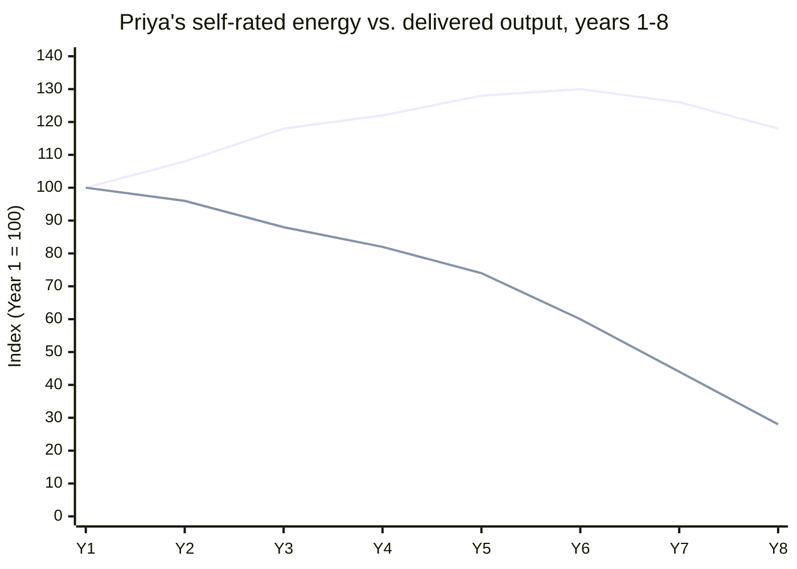

import LevelIntro from "../../../components/LevelIntro.astro";
import Checkpoint from "../../../components/Checkpoint.astro";

L2 established why quarter-optimal isn't decade-optimal and what the
seasons model actually requires to work. L3 walks that model through a
full decade of one engineer's real trajectory — including the point
where it nearly broke, and the specific, concrete adjustments that
followed.

<LevelIntro
  items={[
    "The decade, year by year, before the inflection",
    "The near-burnout point and what forced the change",
    "What actually changed afterward, and what it cost",
  ]}
/>

## Years 1–5: the run that looked entirely fine

Priya joined a mid-sized payments company as a junior engineer. For the
first five years, her career looked like a straightforward success
story — every performance cycle rated "exceeds," every launch she
touched shipped on time, and a promotion roughly every eighteen months.
None of those five years, taken alone, looked like a problem:

| Year | What happened                                                         | How it looked at the time             |
| ---- | --------------------------------------------------------------------- | ------------------------------------- |
| 1–2  | Ramped fast, became the go-to for the checkout service                | Promising junior, promoted early      |
| 3    | Owned a major re-platforming project solo, ~50h/week average          | High performer, clearly senior-track  |
| 4    | Promoted to senior; immediately took on the on-call rotation lead     | Rewarded for reliability              |
| 5    | Volunteered for a second critical launch mid-year on top of the first | Seen as "someone who always delivers" |

**Was anything about years 1–5 actually a mistake, judged one year at a
time?** Not obviously — each individual year had a real, defensible
reason behind it: ramping fast is good, owning a hard project is a
legitimate growth move, being reliable on-call is valuable, and
delivering two launches in a year is impressive. The pattern only
becomes visible in aggregate: five years, and not one of them was ever
planned as a lighter one. No season of the "seasons model" from L2 ever
actually arrived — it was five years of push, back to back, with the
recovery season perpetually deferred to "after this next thing."

## Years 6–8: the debt compounds, quietly

By year 6, Priya was a staff-track senior engineer leading the
company's biggest infrastructure migration — the project that would
make the case for her staff promotion. She kept the same pace: roughly
55 hours a week became the norm, not the exception, across years 6
through 8.

**What actually changed during these three years, if the external
picture — promotions, praise, delivery — looked the same as before?**
What changed was invisible from outside the work itself: her patience
in code review got shorter, she stopped proactively flagging risks she
would have caught a year earlier, and she began treating her own
one-on-ones as the thing to cancel first when a sprint got tight. None
of this showed up in a performance review, because performance reviews
measure delivered output, not the reserve capacity behind it — and her
delivered output, for those three years, kept looking fine.

**Why does the output line stay high for years after the energy line
starts dropping?** Because delivered output is partly funded by
accumulated skill and reputation, which don't disappear the moment
reserve capacity does — Priya could still ship a good migration on
fumes for a while, drawing down a reserve rather than replenishing it.
That gap between the two lines is the recovery debt from L2, made
visible: it's why the crash, when it came, looked sudden to everyone
watching from outside, and had actually been building since year 3.

<Checkpoint question="Looking at the chart, delivered output actually peaks in Year 6, two years after the energy line has already started its steepest decline. If a manager only looked at delivered output to judge whether Priya's pace was sustainable, what would they conclude, and why would that conclusion be wrong?">

Looking only at delivered output, a manager would conclude Priya's pace
was working — output was still rising through year 6, which looks like
confirmation that the intensity was paying off. That conclusion is
wrong because delivered output at that point was being funded by a
shrinking reserve rather than a stable or growing one; the two lines
are measuring different things, and only the energy line was actually
signaling what was coming. Output lagging the real signal is exactly
why the near-burnout point in year 8 read as sudden from outside — the
warning had been visible for years, just not in the metric anyone was
watching.

</Checkpoint>

## Year 8, month 10: the inflection point

The migration shipped in month 9 of year 8 — on time, well-reviewed,
the project that made her staff case. A week later, HR opened the
formal promotion process. Priya describes what happened next as "the
worst-timed feeling of my career": instead of relief, she felt nothing,
then dread, then found herself unable to concentrate for more than a
few minutes at a stretch. She missed two consecutive 1:1s with her own
reports — something she had never done before — not from a scheduling
conflict, but because she genuinely couldn't face them.

This is the Scenario from L1, made specific: eight years in, staff
finally within reach, and the reaction was a flat "now what" instead of
satisfaction. **What made this the inflection point rather than just
another hard stretch she'd push through, the way she had every other
one?** Two things: it was the first time the exhaustion didn't lift
after the triggering project ended (previous crunches had a clear
finish line; this one didn't resolve when the migration shipped), and
it was the first time it visibly affected people other than herself —
her reports noticing missed 1:1s made the cost concrete rather than
private.

## What she actually changed, concretely

Priya's manager, seeing the missed 1:1s, asked directly rather than
waiting for a formal complaint. What followed wasn't a vacation and a
return to the same pace — it was a structural change to how her next
several years were planned:

1. **Named the pattern explicitly, out loud, with her manager.** Not
   "I'm tired this month" but "the last three years had no recovery
   season in them at all, and I need the next four quarters to include
   at least one." Naming it as a multi-year pattern, not a bad week,
   was what made the next steps possible — a bad-week framing would
   have produced a bad-week fix (a few days off) instead of a
   structural one.
2. **Took herself off the on-call rotation lead for two full quarters**,
   handing it to a senior engineer she'd been meaning to develop into
   that role anyway — turning her own recovery season into someone
   else's growth opportunity, rather than treating the two as
   unrelated.
3. **Declined the next "critical" launch when it was offered a month
   later**, using the trade-off framing from `sustainable-boundary-setting`
   explicitly: naming what she was already carrying, and handing the
   prioritization call back to her manager instead of silently
   absorbing a fourth consecutive push.
4. **Blocked recurring, protected time — not "when things calm down"
   time** — for the mentoring and cross-team design review work she'd
   quietly stopped doing since year 5, treating it as fixed, not
   optional, the same way a shipping deadline would be treated as
   fixed.
5. **Got the staff promotion four months later than the original
   timeline**, once the migration's aftermath had settled without her
   personally absorbing every follow-up fire.

**Did point 5 mean the recovery season cost her the promotion?** No —
it delayed it by four months, and the version of her that got promoted
had already demonstrated the exact staff-level behavior (developing
another engineer into the on-call lead role, protecting design-review
time for the team rather than just for her own output) that the
recovery season made room for. The delay was real, but it wasn't a
setback measured against what the alternative — no recovery season,
promotion on the original timeline, continuing the year 6–8 trend — was
actually heading toward.

<Checkpoint question="Suppose Priya's manager, instead of asking directly, had told her: 'Just take a long weekend and you'll be back to normal.' Based on what actually changed in the list above, why would that response likely have failed to address the real problem?">

A long weekend addresses acute fatigue, not a three-year pattern of
never planning a recovery season — it's a bad-week fix applied to a
multi-year problem. None of the five concrete changes Priya actually
made (naming the pattern explicitly, stepping back from on-call lead,
declining the next launch, protecting mentoring time, accepting a
delayed promotion) would happen from a long weekend, because a long
weekend doesn't touch the structural cause: work kept arriving at the
same intensity with no season built to absorb it. She would very likely
have returned refreshed for a few weeks and landed back at the same
point within another year, since nothing about how work was allocated
to her had actually changed.

</Checkpoint>

## What generalizes, and what's specific to Priya

The core lesson — that a run of individually-defensible high-intensity
quarters can compound into an unsustainable trajectory precisely
because the cost is invisible from inside any single quarter, and that
recovering from it requires a structural change to how future work gets
allocated, not just rest — generalizes well beyond payments-industry
engineering: the same pattern shows up in academic research,
residencies, sales, and any role where "the next push" is always
available to justify skipping the recovery season. What's specific to
Priya: the exact five-year runway before the inflection, the specific
migration project, and the specific four-month promotion delay are her
situation — someone else's decade will have different trigger projects
and a different-length runway before the same underlying pattern
catches up with them, if it's never interrupted.

**Try extending it yourself:** suppose Priya's inflection point had
happened not at year 8, with a supportive manager who asked directly,
but at year 4, right after her first promotion, with a manager who
treated the missed 1:1s as a performance problem rather than a capacity
signal. What would the seasons model from L2 suggest she'd need to do
differently in that version — and does the fact that she has far less
tenure and organizational trust at year 4 than at year 8 change what
"declining the next launch" would actually cost her, or just make it
harder to do?

## Failure modes across the decade

| Failure mode                                                                         | What it gets wrong                                                                                                       |
| ------------------------------------------------------------------------------------ | ------------------------------------------------------------------------------------------------------------------------ |
| Judging pace sustainability by delivered output instead of reserve capacity          | Output can keep rising for years while running down a reserve that isn't being replenished — it's a lagging signal       |
| Treating "I'll rest when things calm down" as a real recovery plan                   | For most demanding roles, something else is always available to be urgent — this plan effectively never executes         |
| Responding to a near-burnout point with rest alone, no structural change             | Rest addresses the acute symptom; the multi-year pattern that produced it needs a change to how future work is allocated |
| Assuming the recovery season is purely a personal cost with no organizational upside | Priya's recovery season doubled as another engineer's growth opportunity — a well-designed one often isn't zero-sum      |
