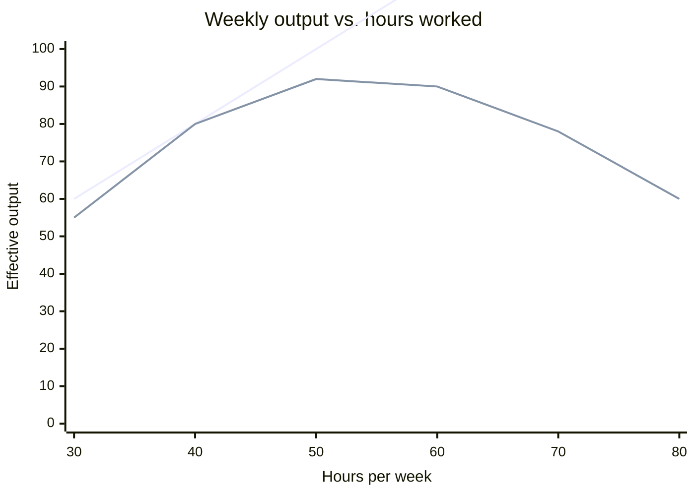

## The assumed model vs. the observed one



The assumed line keeps climbing forever — it's the mental model behind "if we need 20% more done, work 20% more hours." The observed line tracks it closely at first (30–50 hours), then flattens (diminishing returns: each added hour buys less), then turns downward past roughly 60 hours in this illustrative curve (negative returns: the marginal hour is actively destructive, not just less productive). The gap between the two lines _is_ the cost of treating the linear model as true past the point where it stops holding.

## Why the curve bends: three compounding mechanisms

```python
function effective_output(hours_worked):
    focus_quality = degrade_with_fatigue(hours_worked)      # attention/judgment drop over time-on-task
    error_rate = increase_with_fatigue(hours_worked)         # mistakes become more frequent when tired
    rework_cost = error_rate * average_cost_to_fix_a_mistake # each error consumes FUTURE hours, not just now

    raw_output = hours_worked * focus_quality
    net_output = raw_output - rework_cost
    return net_output  # can go negative in marginal terms even as raw_output keeps rising
```

The key mechanic that produces the downward-bending curve, not just a flattening one: `rework_cost` isn't paid by the tired hour that caused it — it's paid by _future_ hours that have to be spent finding and fixing whatever the fatigued hour got wrong. A model that only tracks hours worked against direct output misses this entirely, because the cost shows up on a different day than the hour that caused it.

## Diminishing vs. negative returns — the distinction matters for the decision

| Region                        | What's happening                                      | What it implies                                                                                                |
| ----------------------------- | ----------------------------------------------------- | -------------------------------------------------------------------------------------------------------------- |
| Linear region (~30–50h)       | Each hour adds roughly the same output as the last    | More hours is a reasonable lever if output is genuinely needed                                                 |
| Diminishing returns (~50–60h) | Each additional hour adds less than the one before it | More hours still helps, but at a worsening exchange rate — worth questioning, not automatically worth avoiding |
| Negative returns (~60h+)      | An additional hour actively reduces total output      | Adding hours here isn't just inefficient, it's counterproductive — the correct move is fewer hours, not more   |

The practically important line isn't "linear vs. not" — it's the boundary between diminishing and negative returns, because that's the point where "push harder" stops being a suboptimal-but-still-helpful lever and becomes a lever pointed the wrong direction entirely.

## What determines where the curve bends

The exact shape isn't universal — it depends on the nature of the work (deep, error-consequential technical work bends earlier than routine low-stakes work, because mistakes in the former are more expensive to find and fix) and the time horizon (a single hard push before a real deadline operates on a much shorter fatigue-accumulation curve than a sustained weekly pattern held for months, where the "rework_cost" term keeps compounding across weeks, not just within one day).
