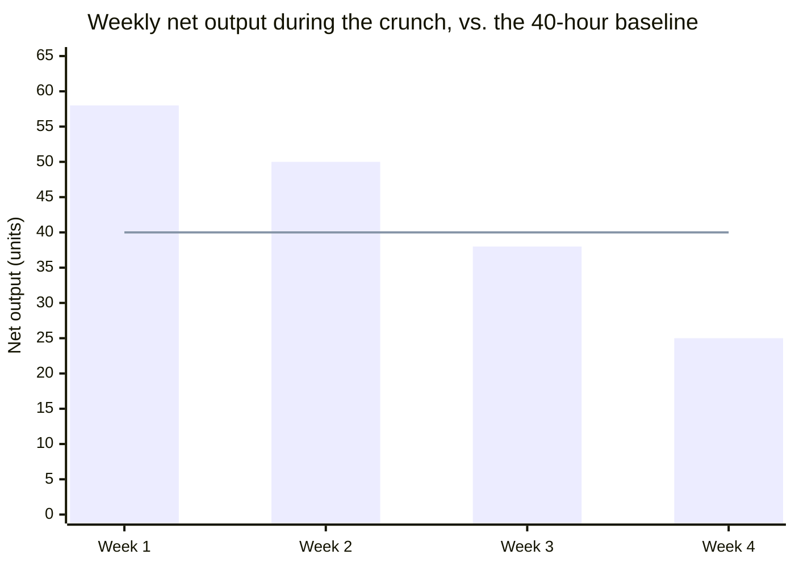

import Scenario from "../../../components/Scenario.astro";
import LevelIntro from "../../../components/LevelIntro.astro";
import Checkpoint from "../../../components/Checkpoint.astro";

L2 worked out why the curve bends — fatigue-driven rework paid on a later
day than the hour that caused it. L3 grounds that mechanism in real
historical data and a full worked crunch scenario with actual numbers,
week by week.

<LevelIntro
  items={[
    "Historical evidence the curve is real, not anecdotal",
    "A worked four-week crunch, arithmetic included",
    "Failure modes in how teams reason about the trade-off",
  ]}
/>

## The historical evidence: this isn't just a modern anecdote

One of the most frequently cited data sources for this exact question comes from detailed factory output records from WWI-era munitions plants, analyzed decades later by economist John Pencavel. The pattern found: weekly output climbed with hours worked up to roughly the high-40s/low-50s range, then flattened — and for weeks where hours were pushed well past 60, total weekly output was measurably **lower** than weeks with fewer hours worked, not just proportionally less productive per hour. This is the same diminishing-then-negative shape from L2's chart, observed in a domain (physical factory output) with none of the "maybe it's just a knowledge-work thing" ambiguity — the mechanism (fatigue degrading output faster than added time compensates for) shows up even in comparatively simple, repetitive manual labor.

<Checkpoint question="Someone objects: 'Pencavel's data is from WWI-era factory labor — that tells us nothing about knowledge work like software or writing.' Is that objection correct?">

The objection has a valid point buried in it, but the conclusion is too strong. It's true that the exact hour count where the curve bends probably differs between repetitive manual labor and deep knowledge work — L2 already established that error-consequential work bends earlier than routine work, so the specific numbers shouldn't transfer directly. But the objection claims the finding is irrelevant, not just imprecise, and that's the overreach: factory labor is actually the _harder_ case for this shape to show up in, since it's about as far from "creative burnout" as work gets. If a diminishing-then-negative curve appears even in comparatively simple, repetitive manual output, that's evidence the mechanism (fatigue degrading output faster than added time compensates for) is a general property of sustained effort, not a fragile effect that only shows up in the kind of work someone finds subjectively draining. The historical data is evidence the shape is real; it was never meant to hand knowledge workers a precise hour count.

</Checkpoint>

<Scenario label="A worked crunch scenario">
  <Fragment slot="facts">
    

      
🗓️ Normal pace: 40h/week

      
📈 Plan: 65h/week, sustained 4 weeks

      
🧮 Linear prediction: 260 units (65 × 4)

    

    
Weekly net output

    

      
1️⃣ Week 1: 58 units

      
2️⃣ Week 2: 50 units

      
3️⃣ Week 3: 38 units

      
4️⃣ Week 4: 25 units (below the 40-unit baseline)

    

  </Fragment>

A team facing a deadline considers pushing from a normal 40-hour week to a
sustained 65-hour week for four weeks, reasoning "that's 62% more hours, so
we should get roughly 62% more done."

**Before reading the week-by-week breakdown: does a fatigue-driven rework
cost that compounds week over week predict a total that's still ahead of
the linear forecast, roughly even with it, or behind the four-week output
of just working normal weeks the whole time?**

</Scenario>

## The actual arithmetic

**What a linear model predicts:** if 40 hours produces 40 "units" of net output per week (using round numbers for legibility), 65 hours should produce 65 units — a 25-unit weekly gain, 100 units over four weeks... which compounds to a 260-unit four-week total (65 × 4) if you take the "62% more hours, 62% more output" reasoning at face value.

**What actually happens, modeling fatigue-driven rework explicitly:**

- Week 1: focus holds up reasonably well early in a crunch. 65 hours produces close to the linear prediction — say 58 units (some early fatigue cost, but modest).
- Week 2: accumulated fatigue starts raising the error rate. Raw hours still produce more _attempted_ work, but a rising share requires rework the following days. Net output: 50 units.
- Week 3: rework from week 2's mistakes consumes real hours this week, on top of new fatigue-driven mistakes compounding further. Net output: 38 units.
- Week 4: the team is now spending a meaningful fraction of each day fixing problems introduced in weeks 2–3, on top of new ones. Net output: 25 units — **less than the original 40-hour week would have produced**.

**Four-week total: 58 + 50 + 38 + 25 = 171 units**, against a 40-hour-baseline four-week total of 160 units (40 × 4) — only marginally ahead of just working normal weeks the whole time, despite averaging 62% more hours across the month, and with the team now fatigued heading into whatever comes next. The naive linear prediction (260 units) overstates the real outcome by roughly 50%, because it has no term for compounding rework cost at all.

This is an illustrative model, not a universal formula — the specific numbers depend on the type of work and the team — but the _shape_ (a real early gain, shrinking week over week, eventually going net-negative relative to the baseline pace) matches both the historical factory data and the mechanism described in L2: fatigue-driven errors aren't paid for by the hour that caused them, they're paid for by every hour afterward spent finding and fixing them.

<Checkpoint question="A manager looks only at hours logged during the four-week crunch (all four weeks show roughly 65 hours) and concludes the team sustained a strong effort the whole time. Using the week-by-week numbers above, what is that read missing?">

It's missing the entire point of the distinction between hours worked and net output. Hours logged stayed flat around 65 across all four weeks — by that measure, nothing changed. But net output fell every single week: 58, then 50, then 38, then 25, ending below what a normal 40-hour week produces. The hours figure is measuring activity, not the thing that actually matters, which is finished, correct, usable work. A manager reading only the hours log would see a team working exactly as hard in week 4 as week 1, when in reality the team was spending a growing share of those same hours fixing problems from earlier weeks rather than producing anything new. Judging effort by hours logged is exactly the failure mode that let the crunch look sustainable right up until the total came in barely ahead of just working normal weeks.

</Checkpoint>

## Failure modes

| Failure                                                                       | What it looks like                                                                                                             | The fix                                                                                                                     |
| ----------------------------------------------------------------------------- | ------------------------------------------------------------------------------------------------------------------------------ | --------------------------------------------------------------------------------------------------------------------------- |
| Measuring only raw hours or raw output, never net output                      | Crunch-week activity (hours logged, raw work "started") looks impressive while net _usable, correct_ output is quietly falling | Track net output — finished, correct, doesn't-need-redoing — not activity                                                   |
| Judging a single all-nighter by the same curve as a sustained pattern         | Treating a one-time push before a hard, immovable deadline as equally risky as a chronic 65-hour month                         | Weigh duration, not just intensity — a short push and a sustained pattern sit on very different fatigue-accumulation curves |
| Assuming the fix is "work fewer hours" in isolation, with no alternative plan | Cutting hours without addressing why the crunch was called in the first place                                                  | Address scope, sequencing, or staffing — the curve is an argument about hours as the lever, not about ignoring the deadline |
| Applying a factory-labor finding to knowledge work without checking it holds  | Treating Pencavel's exact hour counts as a precise, transferable benchmark for any kind of work                                | Use the historical data as evidence the _shape_ is real, not as an exact number to import — the bend point still varies     |

## Beyond this example

The 65-hour crunch above is one case, not the whole territory — a few questions to test whether the model actually transferred:

- What changes if the work is routine and low-stakes instead of deep and error-consequential — does the curve still bend around 60 hours, or does the earlier "curve shape determinants" section from L2 predict it bends later, or barely at all?
- What if the deadline is a single unmovable date three days out, not a sustained four-week push — would the arithmetic above (58, 50, 38, 25) even apply to a 3-day sprint, or does a much shorter fatigue-accumulation window change which failure mode is actually the risk?
- If you had to defend "we should NOT add more hours here" to someone under real deadline pressure, using only this unit's evidence — the historical factory data, the compounding-rework mechanic, the 171-vs-160 arithmetic — which piece would you lead with, and why?
