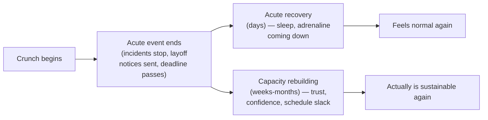

import LevelIntro from "../../../components/LevelIntro.astro";
import Checkpoint from "../../../components/Checkpoint.astro";

L1 named the trap: assuming the crisis ending means the team recovered.
L2 works out why that assumption fails, what "carrying it forward"
concretely looks like, and the structure of a debrief that actually
closes a brutal period out instead of just letting the calendar move on.

<LevelIntro
  items={[
    "Two recovery timelines, not one",
    "The specific things a crunch spends",
    "A debrief framework that closes the loop",
  ]}
/>

## Why does "the crisis ended" feel like "we recovered" when it isn't?

**If the incidents stopped Friday, what's still owed on Monday?**
Because the thing that ended and the thing that needs to recover are
different things, moving on different clocks:

A few nights of real sleep resolves the acute exhaustion fast — often
within a week, which is exactly why a team can look and feel "back to
normal" by the following Monday. But the other things a crunch spends —
whether people trust that "urgent" still means something, whether
teammates trust each other's judgment after decisions made under
pressure, whether there's any schedule slack left to absorb the next
surprise — don't move on that timeline at all. They were spent over
weeks and take weeks or months to rebuild, and unlike sleep, they don't
rebuild automatically just because the pressure is off.

**Is it fair to just call this "morale" and leave it there?** Not
really — "morale" is too vague to act on. The useful move is naming
which specific thing was spent, because each has a different repair:
lost trust needs a conversation and consistent follow-through, borrowed
schedule slack needs a real (not nominal) lighter sprint, and eroded
confidence in "urgent" needs the next few requests to actually be
handled with normal urgency, not another crunch.

<Checkpoint question="A manager says, 'The team seems fine — the incidents stopped a week ago and everyone's back at their desks.' Using the distinction above, what is that manager likely measuring, and what might it be missing?">

The manager is likely observing acute recovery — people are no longer
sleep-deprived or in a state of active crisis, which does resolve
relatively fast. What it misses is capacity rebuilding, which runs on a
much slower clock and isn't visible in the same way: whether people
still trust that the next "urgent" ask is genuinely urgent, whether the
schedule has any real slack left, and whether trust between teammates
who made high-pressure calls during the crunch has been repaired.
"Back at their desks" is consistent with either a team that's genuinely
recovered or one that's carrying real unaddressed cost forward — the
two look identical from the outside until something tests them.

</Checkpoint>

## What "carrying it forward" actually looks like

**If nobody deliberately closes out the crunch, where does the unresolved
cost go — does it just disappear?** No — it tends to resurface later,
usually looking like something unrelated enough that nobody connects it
back to the crunch:

| Unresolved cost from crunch                         | How it resurfaces later, looking unrelated                                            |
| --------------------------------------------------- | ------------------------------------------------------------------------------------- |
| Trust eroded by decisions made under pressure       | Passive-aggressive code review comments, or people quietly re-doing each other's work |
| Schedule slack never actually restored              | The next real surprise (a smaller one) still causes a crunch-level scramble           |
| "Urgent" stopped meaning anything during the crunch | People start ignoring genuinely urgent requests, or over-escalating minor ones        |
| Nobody said the crunch was hard, out loud           | Quiet resignations months later, framed as "just wasn't the right fit"                |

**Why does this matter more than it looks like at first?** Because each
of these reads, on its own, as an ordinary team problem — a
communication issue, a scheduling miss, an attrition case — with no
obvious link back to "we went through a brutal three weeks and never
actually closed it out." A manager treating the symptom without
recognizing the root cause ends up solving the wrong problem, repeatedly.

## A debrief framework that actually closes the loop

**What does a debrief need to do that a standard incident postmortem
doesn't?** An incident postmortem is about the system: what broke, why,
what changes technically. A crunch debrief is about the team's cost of
getting through it — a different set of questions, asked deliberately
rather than assumed to be covered by the technical retro:

1. **Name it, out loud, as a group.** State plainly that the period was
   hard, specifically (not "things were busy" but "we had four major
   incidents in three weeks and someone was paged almost every night") —
   this is the step most often skipped, because naming it can feel like
   dwelling on something already over.
2. **Ask what got spent, specifically.** Not "how's everyone doing" in
   the abstract, but the concrete version: did anyone make a call under
   pressure they're still uneasy about? Did anything get skipped that
   normally wouldn't be? Is there a decision from the crunch that needs
   revisiting now that there's time to think clearly?
3. **Make the rebuilding plan concrete and scheduled, not a vague
   promise.** "We'll take it easier for a bit" isn't a plan — an actual
   lighter sprint with specific things descoped, and a specific date it
   ends, is.
4. **Check back in, not just once.** Trust and confidence rebuild over
   weeks, not in one meeting — a single debrief starts the process, it
   doesn't complete it.

<Checkpoint question="A manager runs a single one-hour debrief right after a brutal quarter, covers what went wrong technically, thanks the team for their effort, and considers the matter closed. Based on the framework above, what's missing?">

The technical retro and the thanks address the crisis and the effort, but
the framework above is about a different thing entirely: what the period
cost the team specifically (trust, schedule slack, confidence in
"urgent"), and a concrete, scheduled plan to rebuild it — not just an
acknowledgment that it was hard. A single meeting that closes with
"thanks, that's done" also misses step 4: capacity rebuilds over weeks,
so treating one debrief as the entire recovery is the same mistake as
assuming the crisis ending was the recovery — just moved one step later.

</Checkpoint>

## Failure modes at this level

- **Treating acute recovery as if it were the whole recovery.** A team
  that looks rested a week later can still be carrying real,
  unaddressed cost — the two are not the same signal.
- **Running the technical postmortem and skipping the human debrief.**
  What broke in the system and what the period cost the people who
  fixed it are different questions, and only one of them gets asked by
  default in most engineering cultures.
- **Treating the debrief as a single event instead of a process.**
  Naming the cost once is the start of rebuilding trust and slack, not
  the completion of it.
