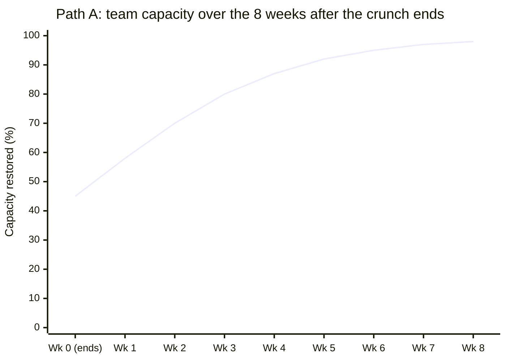
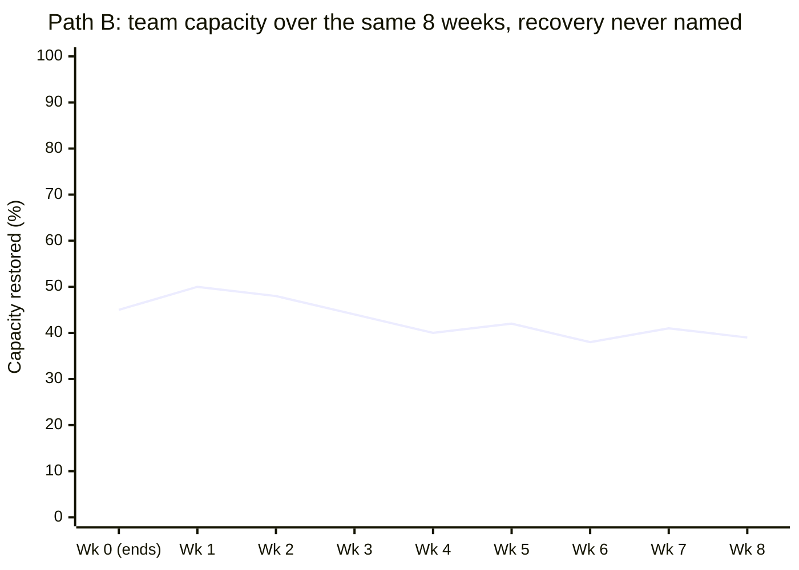

import LevelIntro from "../../../components/LevelIntro.astro";
import Checkpoint from "../../../components/Checkpoint.astro";

L2 established the framework: acute recovery and capacity rebuilding run
on different timelines, and a real debrief has to address what the
period specifically cost, not just what broke technically. L3 walks
L1's Scenario team through two versions of what came after — one where
recovery was handled well, one where it wasn't — to make the difference
concrete.

<LevelIntro
  items={[
    "The team and what the crunch actually cost",
    "Path A: recovery handled well, week by week",
    "Path B: the same team, recovery skipped",
  ]}
/>

## The team, and what three weeks actually cost

A six-person platform team — call the manager Priya — just came through
three weeks of incident crunch: a cascading failure in a payments
dependency triggered four major incidents, two of them overnight. Two
engineers, Marcus and Dana, carried most of the on-call load because
they knew the payments integration best. By the time the last incident
closed on a Friday, this is what the crunch had actually spent:

| What got spent           | Specific cost in this team                                                                                |
| ------------------------ | --------------------------------------------------------------------------------------------------------- |
| Sleep / acute exhaustion | Marcus and Dana averaging ~5 hours a night for two of the three weeks                                     |
| Trust in "urgent"        | A non-incident feature request got labeled "urgent" mid-crunch by a PM — team stopped believing the label |
| Schedule slack           | The next sprint's roadmap items were already commitments made before the crunch started                   |
| Trust between teammates  | A rollback decision Dana made alone, under pressure, that Marcus privately still disagrees with           |
| Confidence in the system | Nobody on the team fully trusts the payments dependency won't do this again                               |

**Is this list something Priya can just infer from watching the team,
or does she actually need to ask?** Two of these five — the disagreement
over Dana's rollback call, and the eroded trust in "urgent" — are
things Priya has no way of knowing happened unless someone tells her.
That's the case for step 1 and 2 of L2's framework: naming it out loud
isn't a formality, it surfaces information the manager genuinely
doesn't have.

<Checkpoint question="Of the five costs in the table above, which ones would show up in a standard incident postmortem (the technical retro on the four outages), and which wouldn't?">

The technical postmortem would likely surface the rollback decision only
insofar as it affected the timeline of the fix — not the interpersonal
disagreement Marcus still carries about it. It wouldn't surface the
eroded trust in "urgent," the sleep deficit, the missing schedule slack,
or the team's lowered confidence in the payments dependency as a
people-and-process cost — those aren't the postmortem's job, they're
what L2 called the human debrief's job, and none of them get asked about
by an incident-focused retro unless someone deliberately asks a
different set of questions.

</Checkpoint>

## Path A: recovery handled well

**Monday morning. What does Priya actually do differently from just
resuming the sprint?**

1. **She opens the team meeting by naming the specific cost, not a
   vague acknowledgment.** "We had four major incidents in three weeks,
   two of them overnight, and Marcus and Dana carried most of that load
   on top of everyone else covering gaps. I want to be specific about
   that instead of just saying 'great work, everyone' and moving on."
2. **She asks the concrete question from L2's framework, not "how's
   everyone doing."** In a 1:1 with Dana specifically: "You made the
   call to roll back the payments service alone, at 2am, under real
   pressure. How are you feeling about that decision now that there's
   time to think it through?" Dana says she'd make the same call again,
   but wishes she'd looped in Marcus even for two minutes — the
   isolation of the decision, not the decision itself, is what still
   bothers her.
3. **She surfaces the trust gap around "urgent" directly with the PM
   who mislabeled the mid-crunch request**, in front of the team: "That
   request wasn't actually urgent, and labeling it that way during an
   active crunch cost us something. Let's agree on what 'urgent' means
   going forward." This is the step most managers skip, because it
   means having an uncomfortable conversation with a peer rather than
   just managing the team internally.
4. **She makes the lighter sprint real, not nominal.** Instead of
   quietly hoping the team self-paces, she descopes two committed
   roadmap items publicly, tells the team's stakeholders why, and sets
   a specific date (three weeks out) when normal velocity resumes.
5. **She schedules a follow-up, not just the one debrief.** Two weeks
   later, a short check-in specifically revisits: has Marcus and Dana's
   trust around the rollback call actually repaired, or does it need
   another conversation? Has the "urgent" label actually been used
   correctly since?

**What made the difference between this and just "being a supportive
manager"?** Every one of Priya's five moves in Path A is concrete and
checkable — a specific sentence said out loud, a specific descoped item,
a specific date on the calendar — not a general intention to "check in
more" or "be understanding." That specificity is what actually restores
trust and capacity; a well-meant but vague "let's take it easy for a
bit" doesn't give the team anything to hold her to, and doesn't give
her anything to verify against later.

## Path B: the same crunch, recovery skipped

**Same team, same crunch. What does Priya do differently in the version
where recovery gets carried forward instead of closed out?**

Monday's standup opens with "great work everyone, glad that's behind
us" and moves straight into sprint planning. No one asks Dana about the
rollback call. The roadmap items that were already commitments stay
commitments — nothing gets descoped, on the theory that the team is
"back to normal" now that the incidents have stopped. The PM who
mislabeled the mid-crunch request as "urgent" never hears that it
mattered.

**What actually happens over the following weeks, and does it look like
"the crunch" to anyone watching?**

| Week | What surfaces                                                                               | Does it look connected to the crunch?         |
| ---- | ------------------------------------------------------------------------------------------- | --------------------------------------------- |
| 2    | Dana starts double-checking Marcus's PRs on the payments service more than usual            | No — reads as normal thoroughness             |
| 4    | A minor payments alert (not even a real incident) triggers a full overnight scramble        | No — reads as an overcautious on-call culture |
| 6    | The PM's next "urgent" request gets quietly deprioritized without anyone flagging it to her | No — reads as a dropped ball                  |
| 9    | Marcus mentions in a 1:1 he's been "thinking about other opportunities"                     | No — reads as unrelated career drift          |

None of these four events gets labeled, by Priya or anyone else, as
"the crunch we never actually recovered from." Each one gets solved (or
ignored) on its own terms — a comment about PR review thoroughness, a
note that on-call maybe needs clearer escalation criteria, a
retention conversation with Marcus that focuses on comp and growth. The
actual root cause — unresolved trust from the rollback call, schedule
slack that was never restored, "urgent" that still doesn't mean
anything reliable — never gets addressed, because it was never named.

<Checkpoint question="In Path B, week 4's overnight scramble over a minor alert looks, from the outside, like an on-call process problem. Based on the table of what the crunch actually spent, what's the more likely underlying cause?">

The more likely underlying cause is the eroded confidence in the payments
dependency and the team's own judgment under pressure — after the
crunch, nobody fully trusts that a "minor" alert on that system really
is minor, because the last time something in that area looked small it
cascaded into four major incidents. A team with genuinely restored
confidence would be more able to correctly triage a minor alert as
minor; a team still carrying the crunch's cost overreacts, because the
cost of being wrong about "this is fine" was just demonstrated to be
severe. Treating it as a pure process problem (better escalation
criteria) might help marginally, but it misses that the real gap is
trust the team never got help rebuilding.

</Checkpoint>

**Why does Path B's line flatten out around 40% instead of continuing
to recover on its own, the way acute exhaustion did?** Because acute
exhaustion resolves with time and rest regardless of whether anyone
names it — sleep works passively. Trust, confidence in "urgent," and
schedule slack don't have that property; L2 established they require
deliberate rebuilding, not just time passing. Without anyone doing that
work, Path B's team stabilizes at a partially-recovered level and stays
there, occasionally dipping when something (like the week 4 scramble)
tests the parts that never actually repaired.

## Try extending it yourself

This worked example assumed a manager, Priya, with the standing and
awareness to run Path A. **What would Path A look like if Priya herself
were one of the two people who carried the on-call load** — if she,
not just Dana, made a high-pressure call she's still unsure about?
Can a manager credibly run steps 1 through 5 while also being a
subject of the recovery, or does that specific case need someone else
(a skip-level, a peer manager) to run parts of it? And separately: this
example was incident crunch — how much of Path A's five-step structure
would still apply as-is to a **layoff aftermath**, where the "crunch"
wasn't shared exhaustion but survivor guilt and a much larger trust
break between the team and leadership, and where does the structure
above actually need to change rather than just being reused?

## Failure modes, side by side

| Failure mode                                                                         | What it gets wrong                                                                                                                                          |
| ------------------------------------------------------------------------------------ | ----------------------------------------------------------------------------------------------------------------------------------------------------------- |
| Assuming acute recovery (people look rested) means full recovery                     | Confuses the fast clock (sleep, adrenaline) with the slow one (trust, confidence, slack) — Path B's core mistake                                            |
| Running only the technical postmortem, never the human debrief                       | Answers "what broke in the system" while leaving "what did this cost the people who fixed it" completely unasked                                            |
| A vague, unscheduled "let's take it easier for a while"                              | Gives the team nothing concrete to hold the manager to, and gives the manager nothing to verify later — compare to Priya's specific descoped items and date |
| Treating one debrief conversation as the entire recovery                             | Trust and slack rebuild over weeks; a single meeting starts that process, it doesn't finish it                                                              |
| Letting a peer's behavior during the crunch (the mislabeled "urgent") go unaddressed | Leaves the actual trust break intact even if the team's own internal dynamics get real attention                                                            |
