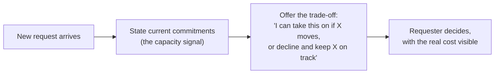

## What a flat "no" actually communicates, versus what's intended

**If declining is really about capacity, not capability, why does a
plain "no" so often get heard as the latter?** Because a bare "no"
gives the listener nothing else to work with — without an explicit
reason attached, people tend to fill in the most available
explanation, and "this person can't handle it" is a common default
interpretation, especially absent any other context:

| What's said                                                                                         | What it risks being heard as                                                   |
| --------------------------------------------------------------------------------------------------- | ------------------------------------------------------------------------------ |
| "No, I can't."                                                                                      | An unexplained capability judgment — reads as reluctance or overwhelm          |
| "I don't have room for that right now — I'm already committed to X, Y, and Z through this quarter." | A factual capacity statement — reads as informed prioritization, not inability |

**Is the second version just a longer, softer way of saying no?** Not
quite — it does something the first doesn't: it makes the actual
constraint visible, which shifts the conversation from "can this
person do it" to "given everything already committed, does this new
thing take priority over something else." That's a genuinely
different, more useful conversation for both people.

## Trade-off framing: putting the decision where the information actually is

**Once the capacity constraint is stated, who should decide what
happens next?** Usually not the person raising the constraint alone —
the requester (often a manager) has context the person raising it
doesn't: how urgent this new thing really is relative to what's
already committed. Trade-off framing hands that decision back with
the information needed to make it:

**Does this put the entire burden of prioritization back on the
requester unfairly?** No — it's actually fairer to both people: the
requester gets to make an informed call using authority they actually
have (re-prioritizing across projects), while the person raising the
constraint isn't left guessing what's actually more important, or
silently sacrificing something without anyone deciding that was the
right trade.

## What makes a capacity signal credible instead of vague

**Would saying "I'm pretty busy right now" work as well as naming the
three specific projects?** Not as well — a vague capacity claim
("I'm busy") is easy to dismiss because it gives the listener nothing
concrete to weigh against the new request. Naming the actual
commitments (which projects, what's already at stake) is what makes
the trade-off real and specific enough to actually reason about,
rather than sounding like a general excuse.

## Failure modes at this level

- **Absorbing the new work silently instead of surfacing the
  trade-off.** This feels like the "safe" choice in the moment, but
  it hides the real cost from the person who could have made an
  informed call, and it's what leads to the option running out.
- **Delivering a flat refusal with no capacity context.** Without the
  factual grounding, a "no" reads as a judgment call about
  willingness or ability, not an informed statement about current
  commitments.
- **Making the trade-off decision unilaterally instead of offering
  it.** Deciding on your own which existing commitment should slip to
  make room for the new one, without surfacing that to the requester,
  removes their ability to weigh in on a call that's often actually
  theirs to make.
