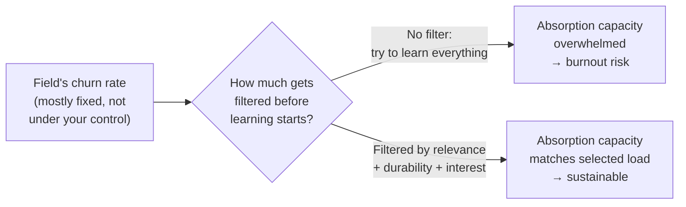

import LevelIntro from "../../../components/LevelIntro.astro";
import Checkpoint from "../../../components/Checkpoint.astro";

L1 named the trap: treating "caught up" as a reachable state, and
lumping all learning together as if it were one activity with one
cost. L2 works out why that framing fails on its own terms, and builds
the model that replaces it — a way to tell learning that's actually
worth the hours from learning that's just anxiety wearing a course
title.

<LevelIntro
  items={[
    "Why 'keeping up' is the wrong finish line",
    "Two different drivers behind the same behavior",
    "A pacing model, and a real filter for what to skip",
  ]}
/>

## Why "keeping up" is the wrong finish line

**If the goal is to keep up with the field, what would "done"
actually look like?** There isn't one — the field doesn't pause once
you've learned this year's tools so you can rest at parity. It keeps
producing new things at roughly the same rate regardless of how much
any individual person has absorbed. That means "keeping up" isn't a
finish line that occasionally moves — it's not a finish line at all,
which makes it a strange thing to spend years chasing.

|                              | Treating "caught up" as reachable | Treating a permanent gap as normal                                |
| ---------------------------- | --------------------------------- | ----------------------------------------------------------------- |
| What every new release means | Another sign you're behind        | Expected — the field always produces more than one person absorbs |
| What "success" looks like    | Closing the gap (never happens)   | Learning the things that matter for your actual goals, on purpose |
| Emotional cost over years    | Chronic, compounding              | Bounded — there's no unreachable target driving it                |

**Does accepting a permanent gap mean giving up on growing?** No — it
means retargeting what growth is measured against. The useful question
stops being "have I learned everything new" (always no) and becomes
"have I learned the things that actually move my work and my goals
forward" (answerable, and achievable).

## Two different drivers behind the same behavior

**Two engineers both spend Saturday morning on a course about the same
new tool. Are they doing the same thing?** Not necessarily — the same
outward behavior can be driven by two very different things, and the
driver changes both what sticks and what it costs:

| Signal                        | Curiosity-driven learning                          | Anxiety-driven learning                                      |
| ----------------------------- | -------------------------------------------------- | ------------------------------------------------------------ |
| What triggers it              | A real question or problem you're currently facing | The existence of the new thing itself — a launch, a headline |
| How it feels while doing it   | Engaging, sometimes effortful but not draining     | Urgent, low-grade dread if it isn't started soon             |
| What happens if you stop      | You return to it later, no cost                    | Feels like falling further behind, pressure builds           |
| What tends to stick afterward | Retained — tied to a real use                      | Shallow — often forgotten once the anxiety passes            |

**Is anxiety-driven learning always bad, then?** Not automatically — it
can still teach something real. The problem isn't that it happened; it's
that it's driven by the trigger (a launch) rather than by a question
worth answering, which means it competes for the same limited hours as
curiosity-driven learning without the same odds of sticking or mattering
later.

<Checkpoint question="A senior engineer spends every free evening for two weeks working through a new framework's docs the week it launches, then never opens the framework again. Based on the table above, which driver does this most resemble, and what's the strongest piece of evidence for it?">

This most resembles anxiety-driven learning. The strongest evidence isn't
the launch-week timing by itself — plenty of curiosity-driven learning
also starts right after something ships — it's what happened afterward:
nothing stuck, and the framework was never touched again once the initial
urgency passed. Curiosity-driven learning tends to get revisited because
it's tied to a real question or use; a learning burst that evaporates
completely once the "new" feeling fades is the table's clearest signature
of anxiety as the actual driver, regardless of how it looked from the
outside.

</Checkpoint>

## A pacing model: churn rate versus sustainable absorption

**If the field's churn rate is fixed and largely outside your control,
what's actually left to manage?** The other side of the ratio: how much
of that churn you try to absorb, and at what depth. Sustainable pacing
isn't about increasing absorption capacity indefinitely — hours in a
week are fixed, and depth takes time regardless of urgency — it's about
keeping the ratio bounded on purpose instead of letting anxiety set it.

**Does filtering mean permanently missing things that turn out to
matter?** Occasionally, yes — no filter is perfect, and something
skipped will sometimes turn out to have been worth learning sooner. But
the unfiltered alternative — trying to absorb everything — doesn't avoid
that risk either; it just trades "occasionally miss something real" for
"reliably run out of sustainable hours," which is a worse trade over a
multi-year career, not a safer one.

## Deciding what not to learn, on purpose

**Given a new thing just launched, what actually decides whether it's
worth the hours?** Three questions, applied before starting rather than
after already being three hours into a tutorial:

- **Relevance** — does this connect to a problem in your current work,
  or a goal you actually hold, or is it interesting only because it's
  new?
- **Durability** — is this likely to still matter in two years, or is
  it more likely to be replaced by the next thing before it compounds
  into anything?
- **Genuine interest** — independent of relevance or durability, is
  there a real question pulling you toward it, or is the pull entirely
  "everyone's talking about it"?

A "yes" to any one of these is often reason enough to learn something.
A "no" to all three is a strong signal that the pull is anxiety, not a
real reason — and skipping it isn't falling behind, it's the filter
doing its job.

<Checkpoint question="A new client-side state-management library launches. It's unrelated to anything in the engineer's current stack, has already been through three competing approaches in the last two years, and the engineer feels no particular curiosity about it beyond 'it's trending.' Using the three questions above, what does the filter suggest?">

The filter suggests skipping it, at least for now. It fails relevance (not
connected to current work or an actual goal), fails durability (the
category has already churned through three competing approaches in two
years, so betting on this one compounding is a weak bet), and fails
genuine interest (the pull is "it's trending," not a real question). None
of the three questions returns a yes, which is exactly the signal the
filter is built to catch — the trending status alone is what's generating
the pull, not anything about the tool itself, and that's the anxiety
pattern from earlier in this level showing up again in a concrete case.

</Checkpoint>

## Failure modes at this level

- **Treating "caught up" as a real goal.** It isn't reachable, so
  chasing it guarantees a permanent sense of falling short regardless
  of effort spent.
- **Letting a launch decide what gets learned.** Reacting to whatever
  is newest hands the pacing decision to the field's churn rate instead
  of to your own relevance, durability, and interest filter.
- **Assuming all "no" verdicts are permanent.** The filter is applied
  to the current moment — a tool that fails relevance today can pass it
  later if your work changes; skipping something now isn't a lifetime
  ban on ever learning it.
