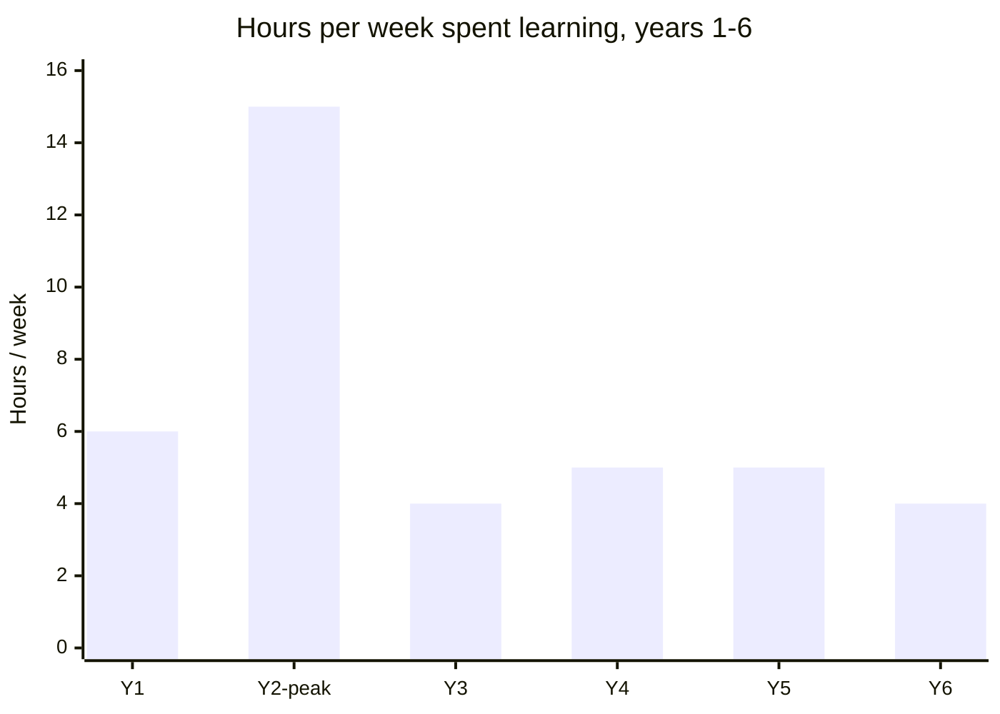

import Scenario from "../../../components/Scenario.astro";
import LevelIntro from "../../../components/LevelIntro.astro";
import Checkpoint from "../../../components/Checkpoint.astro";

<Scenario label="Same engineer, three waves: mobile-first, cloud-native, and the AI wave">
  <Fragment slot="facts">
    

      
🌊 <strong>3 waves</strong> — mobile-first (years 1–2), cloud-native (year 4), the AI wave (years 5–6)

      
🔥 <strong>Year 2 peak</strong> — ~15 hrs/week on learning, nights and most of both weekend days

      
⚖️ <strong>After the filter</strong> — ~4–5 hrs/week, sustained for years without another close call

    

  </Fragment>

**Before reading on, predict: an engineer who nearly burns out chasing
every mobile-first tool in year 2 goes on to handle two more major
technology waves — cloud-native, then the AI wave — without another
close call, on roughly the same free time. What has to change between
year 2 and year 4 for that to be possible, given that the field's
churn rate itself doesn't slow down?**

</Scenario>

<LevelIntro
  items={[
    "The wave that nearly caused burnout",
    "Applying the filter to the next two waves",
    "What generalizes across any future wave",
  ]}
/>

## The numbers this walkthrough uses

To keep the walkthrough concrete, it uses the same illustrative figures
introduced in L1 and used again in this unit's interactive demo:

- The field produces roughly **15 significant new things per year** —
  frameworks, tools, platform shifts, and (later) AI capabilities.
- Free time realistically available for learning, after a full-time
  job and a life, is roughly **3 hours a week** in an ordinary week.
- Getting genuinely competent in one new thing — not just aware of it,
  actually able to use it — costs roughly **20–30 hours**.

These are round estimates for illustration, not universal constants —
the specific numbers vary by person, field, and season of life. The
mechanism they illustrate is what matters: churn outpaces absorption by
default, and the gap has to be managed on purpose or it manages itself
through burnout or stagnation.

## Year 1–2: the mobile-first wave, handled by anxiety

Early in the engineer's career, mobile-first frameworks, three
competing state-management approaches, and two new build tools all
arrive within about eighteen months. Nothing in the L2 filter exists
yet — every launch just feels like something that has to be learned
immediately or risk falling behind for good.

| Month | What happens                                                                                                                                       |
| ----- | -------------------------------------------------------------------------------------------------------------------------------------------------- |
| 1–3   | First mobile framework launches; engineer works through it nights and weekends on top of a full work schedule                                      |
| 4–7   | A competing framework gains traction; engineer starts over, worried the first choice was already the wrong one                                     |
| 8–14  | Two new build tools and a third state-management approach launch in quick succession; engineer tries to stay current on all of them simultaneously |
| 15–18 | Free time on learning peaks around 15 hours a week — most weeknights and both weekend days — sleep and non-work relationships both start slipping  |

By month 18, the engineer has shallow exposure to nearly everything
that launched and genuine competence in almost none of it — the same
"busy the whole time, little to show for it" pattern from the effort
itself, not from a lack of trying. A manager notices declining code
review quality and asks directly if something's wrong.

<Checkpoint question="At month 18, the engineer has spent roughly 15 hours a week learning for well over a year and can point to almost nothing they'd call genuine competence. Using the curiosity-vs-anxiety distinction from L2, what does that outcome suggest about what was actually driving the learning — and what would you expect to see if curiosity had been the driver instead?">

It suggests the driving force was anxiety, not curiosity — L2's table
predicts exactly this outcome for anxiety-driven learning: high effort,
shallow retention, because the trigger was each launch itself rather than
a real question the engineer was trying to answer. If curiosity had been
the driver, the picture would look different even at the same 15 hours a
week: fewer things attempted, but genuine depth in the ones pursued,
because a real question tends to hold attention through to competence
instead of scattering it across everything that launches. The volume of
hours alone doesn't tell you which is happening — the pattern of what
stuck (or didn't) is the tell.

</Checkpoint>

The manager's question is the turning point. Year 3 becomes a
deliberate reset: not "learn less" as a resolution, but adopting
something closer to L2's filter — relevance, durability, genuine
interest — before starting anything new, instead of after already being
hours into it.

## Year 4: the cloud-native wave, handled with a filter

By year 4, the field is in the middle of a cloud-native and
containerization wave: Kubernetes, three competing service-mesh
tools, and a wave of "serverless-first" frameworks all arrive within
the year. The engineer now works with a container-based deployment
pipeline at their actual job — this time, each new thing gets run
through the filter before any hours are committed.

| New thing                               | Relevant to current work?                          | Durable?                                                   | Genuine interest?                                | Verdict      |
| --------------------------------------- | -------------------------------------------------- | ---------------------------------------------------------- | ------------------------------------------------ | ------------ |
| Kubernetes                              | Yes — the team's deploys already use it            | Yes — already the dominant standard, several years running | Some — real curiosity about how scheduling works | Learn deeply |
| Service mesh tool A                     | No — team has no multi-service traffic problem yet | Unclear — three competitors, none has won                  | No                                               | Skip         |
| Service mesh tool B and C               | Same as above                                      | Same as above                                              | No                                               | Skip         |
| A trending "serverless-first" framework | No — unrelated to current deployment model         | Unclear — category has churned before                      | Mild, "it's trending" only                       | Skip         |

The result: roughly 5 hours a week, most of it going into Kubernetes,
and genuine competence by the end of the year — the team starts
routing the trickier deployment questions to the engineer specifically,
something that never happened after the year-2 sprint through five
different things at once.

## Year 5–6: the AI wave, the hardest filter call yet

The AI wave is different in kind from the previous two — it isn't one
tool among several competing options, it's a shift plausibly touching
almost every part of the job at once, which makes "is this relevant"
harder to answer with a clean no the way the service-mesh tools were.

**Does the filter still work when almost everything looks relevant?**
It still works, but the judgment gets harder rather than automatic —
relevance is close to a universal yes, so durability and genuine
interest have to carry more of the decision. The engineer ends up
splitting the difference deliberately: going deep on the specific
capability that already touches daily work (using an AI coding
assistant well, including its failure modes), staying aware-but-not-
deep on the fast-moving research layer (new model releases most
months) since durability there is still genuinely unclear, and
explicitly deciding that chasing every new model release isn't worth
committing hours to yet.

<Checkpoint question="In the AI wave, 'relevance' stops being a useful filter on its own, because almost everything plausibly qualifies. Based on how the engineer split the decision above, which of the other two questions — durability or genuine interest — ends up doing more of the filtering work, and why?">

Durability ends up doing more of the filtering work. Relevance is
essentially satisfied by default in this wave, so it stops discriminating
between options. Genuine interest still matters, but the engineer's
choice — going deep on the assistant already used daily, staying aware
but not deep on monthly model releases — tracks durability much more
closely: daily-use tooling is durable because it's already load-bearing
in the current job, while the pace of individual model releases makes
betting deep hours on any single one a weaker bet, regardless of how
interesting it is. When one filter question stops discriminating, the
model doesn't collapse — the remaining questions just have to carry more
of the decision.

</Checkpoint>

## Comparing the three waves

|                                 | Mobile-first (Y1–2)                | Cloud-native (Y4)                | AI wave (Y5–6)                                         |
| ------------------------------- | ---------------------------------- | -------------------------------- | ------------------------------------------------------ |
| Filter applied before starting? | No                                 | Yes                              | Yes                                                    |
| Peak weekly hours on learning   | ~15                                | ~5                               | ~5                                                     |
| Things attempted                | Nearly everything that launched    | Only what passed the filter      | Split: deep on daily-use tooling, aware-only elsewhere |
| Genuine competence gained       | Little, spread thin                | Real, in Kubernetes specifically | Real, in the daily-use capability specifically         |
| Cost                            | Near-burnout, flagged by a manager | Sustainable                      | Sustainable, despite harder judgment calls             |

## Extend it: what if the next wave moves even faster?

**This walkthrough's three waves each unfolded over one to two years.
What would have to change about applying the filter if a future wave —
say, a step change in AI capability — compressed that timeline to a
few months instead? Would the same three questions (relevance,
durability, genuine interest) still be answerable that fast, or does a
faster wave need something else added to the model?** Worth reasoning
through rather than assuming the filter scales to any speed unchanged
— the mobile-first wave's failure mode was partly a pacing problem, and
a genuinely faster wave could reproduce that same pressure even with a
filter in hand, if the filter itself takes longer to apply than the
wave takes to pass.

## Failure modes

| Failure mode                                                  | What it gets wrong                                                                                                                                           |
| ------------------------------------------------------------- | ------------------------------------------------------------------------------------------------------------------------------------------------------------ |
| Treating every new thing as equally urgent (year 2's pattern) | Spreads fixed hours across too much at once; produces wide, shallow exposure instead of genuine competence anywhere                                          |
| Applying the filter only after already investing hours        | The filter's value is in deciding _before_ starting — applied retroactively, it just becomes a reason to feel guilty about time already spent                |
| Assuming "relevant" alone is enough once a wave is big enough | As the AI-wave case shows, when relevance stops discriminating, durability and genuine interest have to do real work, not just get skipped                   |
| Mistaking a sustained low-anxiety pace for complacency        | Learning less than everything is the design, not a failure of ambition — 5 focused hours a week for years outperformed 15 scattered hours in a single sprint |
| Never revisiting a past "skip"                                | A "no" from the filter is a verdict on the current moment, not permanent — something skipped in year 4 can become relevant later if the work changes         |
