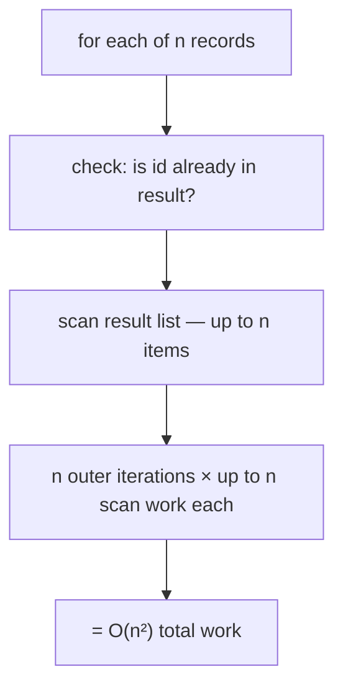
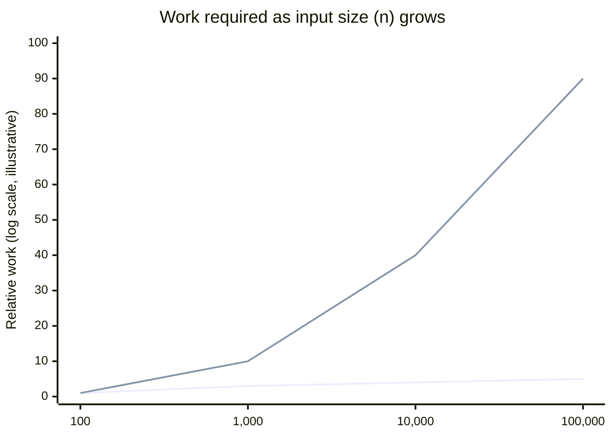

## The incident's actual shape, in pseudocode

**Before looking at the fix, look at the original function — where exactly does the extra work hide?**

```text
function removeDuplicates(records):
    result = []
    for record in records:               # runs n times
        if record.id not in result:      # scans up to n items EVERY time
            result.append(record)
    return result
```

`record.id not in result` looks like a single, cheap operation — but `result` is a plain
list, and checking "is this id in the list" means scanning every item already in `result`
until a match is found or the list ends. The outer loop runs `n` times; each iteration's
membership check can itself scan up to `n` items. That's `n` loops of up to `n` work each —
`n × n = n²` — even though nothing in the code looks like a nested loop at first glance.



## Why the two curves diverge the way they do

**If both curves start at nearly the same value for small `n`, why does one become
unusable while the other stays fine?**



The bottom, flatter line is `O(n log n)` — the growth rate of a hash-based or sort-based
approach. The steep line is `O(n²)` — the incident's actual growth rate. Both lines start
close together because at small `n`, the _difference_ in growth rate hasn't had room to
compound yet. The gap isn't a fixed amount that shows up early — it's a **multiplicative**
gap that only becomes visible once `n` is large enough for the multiplication to matter,
which is exactly why a 200-row test file gave no warning at all.

## The fix: trade a list scan for a hash lookup

```text
function removeDuplicates(records):
    seen = new Set()          # O(1) average-case lookup and insert
    result = []
    for record in records:    # still runs n times
        if record.id not in seen:   # O(1) instead of O(n)
            seen.add(record.id)
            result.append(record)
    return result
```

The outer loop is unavoidable — every record has to be looked at at least once, which is
`O(n)` by itself and can't be improved on without skipping data. The fix targets the _inner_
operation: a `Set` (hash-based) membership check is `O(1)` on average, not `O(n)`, because
it computes a hash and jumps almost directly to the right bucket instead of scanning
everything already stored. Swapping the data structure — not adding cleverness to the loop
— is what collapses `n` iterations of `O(n)` work into `n` iterations of `O(1)` work: `O(n²)`
becomes `O(n)`.

## The rules for reading Big-O off real code

**Given a piece of code, how do you actually derive its Big-O without a rigorous proof?**

1. **Drop constant factors.** A loop that does 3 operations per item is still `O(n)`, not
   `O(3n)` — as `n → ∞`, the constant `3` becomes irrelevant next to how `n` itself grows.
2. **Drop lower-order terms.** `O(n² + n)` is written `O(n²)` — the `n²` term dominates
   completely once `n` is large; the `+n` becomes a rounding error by comparison.
3. **Nested loops over the same collection multiply.** A loop inside a loop, each running
   roughly `n` times, is `O(n) × O(n) = O(n²)` — this is exactly what `not in result`
   hid: the "loop" was disguised as a single-line membership check.
4. **Sequential (non-nested) steps add, and the largest wins.** Sorting (`O(n log n)`)
   then scanning once (`O(n)`) is `O(n log n) + O(n)`, which simplifies to `O(n log n)`
   because it's the larger term.

## Worst case vs. average case: the Set lookup's fine print

A hash-based `Set`'s `O(1)` lookup is an **average-case** claim, not a worst-case
guarantee — in the rare case of many hash collisions, a lookup can degrade toward `O(n)`
for that operation. This matters for judgment, not just vocabulary: **Big-O almost always
describes a specific case (best, worst, or average)**, and conflating them is a common
source of "but the whitepaper said O(1)" surprises when a real system behaves differently
under adversarial or unlucky input. For the incident above, average-case `O(1)` is the
right claim to rely on for ordinary data — but it's worth knowing which claim is being made.
