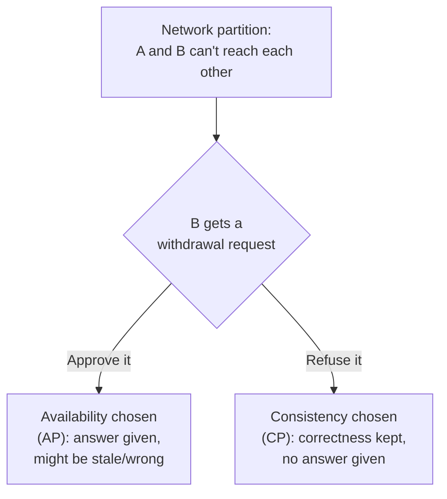

import Scenario from "../../../components/Scenario.astro";
import LevelIntro from "../../../components/LevelIntro.astro";

<Scenario label="The problem">
  <Fragment slot="facts">
    

      
🏦 <strong>Datacenter A (US)</strong> — approves a $200 withdrawal, balance was $500

      
🏦 <strong>Datacenter B (EU)</strong> — network link to A is down, still shows balance $500

      
❓ <strong>Customer in EU</strong> — tries to withdraw $400 from B during the outage

    

    

      

        
Approve it

        Customer served, balance can go to -$100
      

      

        
Refuse it

        Balance stays correct, customer sees "service unavailable"
      

    

  </Fragment>

A bank runs two datacenters, one in the US and one in the EU, each
holding a full copy of every account balance so that customers on
either continent get fast, local reads and writes. A fiber cut
severs the link between them. Neither side crashed — each is still
up, still serving traffic, still holding what looks like a perfectly
normal balance. They just can't talk to each other anymore.

A customer walks up to the EU datacenter and asks to withdraw $400.
Datacenter B has no way to know whether Datacenter A already paid out
money from this same account in the last ten minutes. It has exactly
two options: **approve the withdrawal anyway**, risking that both
sides pay out and the account goes negative, or **refuse to answer at
all** until the link comes back, risking an angry customer standing at
a working machine that won't do anything.

**There is no third option that gives a fast, correct answer during
the outage — why not?**

</Scenario>

Both datacenters are healthy. The data itself hasn't been corrupted.
The only thing broken is the ability for A and B to compare notes —
and that turns out to be enough to force an impossible-looking choice.

<LevelIntro
  items={[
    "What C, A, and P actually mean in CAP",
    "Why P isn't really optional in a distributed system",
    "The real choice: consistency or availability, only during a partition",
  ]}
/>

## The three letters

CAP theorem names the three properties a data store spread across
multiple nodes could try to offer at once, and proves you cannot
have all three whenever the network between nodes breaks.

| Letter | Property            | Plain meaning                                                                         |
| ------ | ------------------- | ------------------------------------------------------------------------------------- |
| **C**  | Consistency         | Every node returns the same, most-recent value for a given piece of data              |
| **A**  | Availability        | Every request that reaches a working node gets a response — not an error              |
| **P**  | Partition tolerance | The system keeps working even when network messages between nodes are lost or delayed |

The common summary — "pick any two of C, A, P" — is a useful mnemonic
but slightly misleading. Real networks drop packets, links get cut,
routers misbehave. **Partitions will happen**, so P is not a feature
you can opt out of; it's a fact about the environment every
multi-datacenter system has to survive. The theorem's real content is
narrower and sharper than "pick two":

  <strong>The actual choice CAP forces:</strong> when a partition is happening —
  and only then — a node cut off from the others must choose between answering
  with data it cannot confirm is current (favoring Availability) or refusing to
  answer until it can confirm (favoring Consistency). Outside of a partition,
  with the network healthy, a well-built system can offer both C and A at once.

## What the bank scenario shows

Datacenter B, cut off from A, had exactly the two options laid out
above:

Approving the withdrawal is choosing **Availability** over
Consistency during the partition — B answers, but it might be wrong.
Refusing is choosing **Consistency** over Availability — B stays
correct, but a legitimate customer gets nothing. Every distributed
data store that spans more than one node has to make this same call,
somewhere in its design, even if the engineers who chose it never
said "CAP theorem" out loud.

## Real systems lean one way or the other

No production system is purely CP or purely AP in every situation,
but each ships with a default lean that shows up in its marketing and
its failure mode during a real partition.

| System (typical default)                                 | Leans | What happens during a partition                                                    |
| -------------------------------------------------------- | ----- | ---------------------------------------------------------------------------------- |
| Zookeeper, etcd, most SQL clusters with sync replication | CP    | Minority side stops accepting writes rather than risk disagreement                 |
| Cassandra, DynamoDB, Riak (default settings)             | AP    | Every reachable replica keeps answering; conflicts get resolved later              |
| CockroachDB, Spanner-style systems                       | CP    | Sacrifice availability on a minority partition to keep a single consistent history |

**This isn't a permanent label** — many of these systems let you tune
the behavior per-request (more on that in L2's quorum settings). The
table describes what happens if you use the system out of the box.
