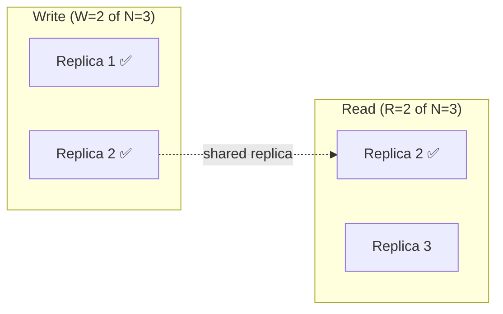
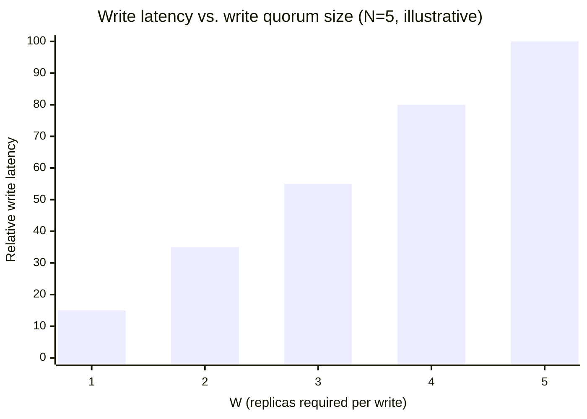

import Scenario from "../../../components/Scenario.astro";
import LevelIntro from "../../../components/LevelIntro.astro";
import Checkpoint from "../../../components/Checkpoint.astro";

<Scenario label="The problem">
  <Fragment slot="facts">
    <div class="not-prose flex flex-col gap-2 text-sm text-slate-700 dark:text-slate-300">
      <div class="flex items-center gap-1.5"><span>📦</span> <strong>3 replicas</strong> hold every product's stock count</div>
      <div class="flex items-center gap-1.5"><span>✍️</span> <strong>Write "stock = 4"</strong> lands on replicas 1 and 2, replica 3 is slow</div>
      <div class="flex items-center gap-1.5"><span>👀</span> <strong>A read</strong> arrives and only reaches replica 3</div>
    </div>
    <div class="not-prose mt-3 rounded border border-rose-300 bg-rose-50 p-2 text-xs dark:border-rose-800 dark:bg-rose-950">
      Replica 3 still says <strong>stock = 5</strong> — a customer could see room for one more order that doesn't actually exist.
    </div>

  </Fragment>

L1 showed that "consistent or available" is a binary choice only
during an actual partition. But even with the network fully healthy,
plain replication has a subtler gap: a write can finish being
acknowledged before every replica has the new value, so a read that
lands on the wrong replica sees stale data — no partition required.

**If a store has 3 replicas and a write only needs to reach 1 of them
to be called "successful," how many of the other 2 replicas are
allowed to still be wrong when the next read comes in?**

</Scenario>

Answering that question precisely — not "eventually consistent,
don't worry about it" — is what the rest of this level is about: a
knob called the **quorum**, and a spectrum of consistency guarantees
it lets you dial between.

<LevelIntro
  items={[
    "The consistency spectrum: strong, causal, eventual",
    "The quorum formula: W + R > N",
    "What changing W and R actually trades away",
  ]}
/>

## The consistency spectrum

**Is "consistent" a yes/no property, or a sliding scale?** It's a
scale — different guarantees promise different amounts about what a
reader is allowed to see, from the strictest (expensive, slow, always
correct) to the loosest (cheap, fast, occasionally stale).

| Model                 | Guarantee                                                                 | Cost                                                    |
| --------------------- | ------------------------------------------------------------------------- | ------------------------------------------------------- |
| Strong (linearizable) | Every read sees the most recent completed write, system-wide, instantly   | Every read/write may need to coordinate across nodes    |
| Causal consistency    | If write B happened after write A (causally), everyone sees A before B    | Cheaper than strong; ignores unrelated writes' ordering |
| Read-your-writes      | A client always sees its _own_ prior writes, though maybe not others' yet | Cheap — only needs to track one client's session        |
| Eventual consistency  | Given no new writes, all replicas _will_ converge — no promise about when | Cheapest; writes and reads never wait on each other     |

The bank example from L1 needed something close to strong consistency
for withdrawals — an eventually-consistent balance would let the same
$500 get paid out twice. A social media "like" counter, by contrast,
is a textbook case for eventual consistency: nobody is harmed if two
users briefly see slightly different counts.

<Checkpoint question="A chat app shows 'seen' receipts. Two users, Alice and Bob, are both online and their devices can reach the same replica. Which is the minimum consistency model that guarantees Bob immediately sees his own message appear in his own chat history right after sending it, even before it's replicated everywhere?">

Read-your-writes is enough for that specific guarantee — it only
promises a client sees its _own_ prior writes, which is exactly what
"Bob sees his own message in his own history" requires. It says
nothing about when Alice sees it; that would need a stronger guarantee
(causal, or strong) if the app also wanted to promise Alice sees it in
the correct causal order relative to her own messages. Reaching for
full strong consistency here would work but pay for a guarantee — global,
instant agreement across every replica — that this particular UI
requirement never asked for.

</Checkpoint>

## The quorum formula

**Given N replicas, how few of them does a write actually have to
reach before a later read is guaranteed to see it — without waiting
for every single replica, every single time?** The quorum formula
answers this directly:

```
W = number of replicas a write must reach before it's acknowledged
R = number of replicas a read must query before it returns a value
N = total number of replicas

W + R > N   →   every read is guaranteed to overlap with the latest write
```

Because a write touches `W` replicas and a read checks `R` replicas
out of the same `N`, requiring `W + R > N` guarantees the two sets
_must_ share at least one replica — pigeonhole-style, there's no way
to pick `W` replicas and `R` replicas from a pool of `N` without
overlap once their sizes sum past `N`. That shared replica is the
read's guarantee: it always holds the newest write, because the write
couldn't have completed without reaching it.



Replica 2 is in both sets — the read is guaranteed to see the write,
even though replica 3 never got it in time. This is exactly what
would have prevented the stock bug from this level's opening
Scenario: with `W=2, R=2, N=3` (`2+2=4 > 3`), the read could not have
landed only on the stale replica 3 without also querying at least one
replica that had the update.

## What the quorum trades away

Turning `W` or `R` up doesn't add capability for free — it buys the
overlap guarantee by making that operation wait on more replicas.



| Setting                  | Read/write cost         | Consistency of reads                   | Availability under partition                                                 |
| ------------------------ | ----------------------- | -------------------------------------- | ---------------------------------------------------------------------------- |
| `W=1, R=1` (N=3)         | Fastest, cheapest       | No overlap guaranteed — can read stale | Both sides of a partition can keep serving (AP-leaning)                      |
| `W=N, R=1`               | Slow writes, fast reads | Reads always fresh                     | Any single unreachable replica blocks every write                            |
| `W=majority, R=majority` | Balanced                | Overlap guaranteed                     | Minority side of a partition can't reach quorum, refuses writes (CP-leaning) |

This is the "tunable per-request" behavior L1 mentioned: a system
like Cassandra doesn't have one fixed CAP answer — an operator (or
even an individual query) can choose `W=1` for a cheap, best-effort
write, or `W=majority` for a write that needs the overlap guarantee,
on the same cluster.

<Checkpoint question="With N=5 replicas, you set W=3 and R=1 to make reads as fast as possible. Is a read still guaranteed to see the latest write?">

No — W + R = 3 + 1 = 4, which is not greater than N = 5, so the
pigeonhole overlap no longer holds: it's possible to pick 3 replicas
for the write and a different, non-overlapping single replica for the
read out of a pool of 5. Making reads cheap by shrinking R broke the
exact guarantee the quorum formula exists to provide — the fix isn't
to distrust quorums, it's to keep W + R > N whenever a read genuinely
needs the freshness guarantee, and only relax it deliberately for
reads that can tolerate staleness (an eventually-consistent read path,
same as the L1 social-like-counter example).

</Checkpoint>
