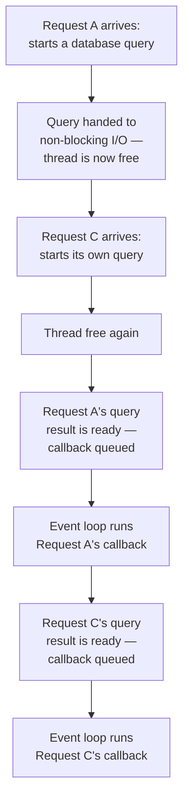

## Why non-blocking I/O lets one thread serve many requests

**If JavaScript really only runs one thing at a time, how does a
single-threaded server handle thousands of concurrent connections at
once?** The trick is that most of what a server does while handling a
request isn't CPU work at all — it's _waiting_: waiting for a database
query to return, waiting for a file to finish reading, waiting for
another service's response. Non-blocking I/O means the thread doesn't
sit idle during that wait — it hands the waiting-for-a-result operation
off to the runtime (which delegates the actual waiting to the OS), and
immediately moves on to another pending piece of work. When the result
is ready, the runtime queues a callback to resume that original
request, but the wait itself never occupied the one thread.

**None of these requests ever executes at the same literal instant as
another — this is concurrency without parallelism.** The single thread
is never running two callbacks simultaneously; it's rapidly taking
turns between callbacks that each became ready at a different moment,
and because the waiting itself happens off-thread, this can scale to
thousands of concurrent in-flight requests.

## What breaks the illusion

**Given that model, why did the opening scenario's 200ms calculation
block a completely unrelated 0ms timer?** Because a synchronous,
CPU-bound calculation isn't I/O — there's no "hand it off and wait for
a result" step. The thread has to actually execute every instruction of
that calculation itself, and it can't take a turn doing anything else
until it's done. The 0ms timer isn't slow because it was scheduled
poorly; it's slow because the single thread it needs to run on is
completely occupied for those 200ms, and a queued callback — no matter
how ready it is — still has to wait for its turn.

| Type of work                            | Occupies the single thread?                   | Blocks other callbacks?      |
| --------------------------------------- | --------------------------------------------- | ---------------------------- |
| Database query, file read, network call | No — handed off, thread is free while waiting | No                           |
| A `for` loop doing heavy computation    | Yes — every instruction runs on this thread   | Yes, for its entire duration |
| `JSON.parse` on a huge payload          | Yes                                           | Yes                          |

## Choosing the right concurrency tool

| Situation                                         | First tool to consider              | Why                                                               |
| ------------------------------------------------- | ----------------------------------- | ----------------------------------------------------------------- |
| Waiting on DB, file, HTTP, or network I/O         | Async/non-blocking I/O              | The thread can serve other callbacks while the outside work waits |
| CPU work that can be split into independent steps | Chunking with explicit yielding     | Other callbacks get turns between chunks                          |
| CPU work that cannot be split safely              | Worker thread or separate process   | The main event loop stays free while another execution unit works |
| Multiple execution units touching shared state    | Atomic operation or lock discipline | Parallel progress introduces race-condition risk                  |

More concurrency is not automatically more capacity. Each tool moves
pressure somewhere: async I/O reduces wasted waiting, chunking improves
fairness, workers/processes consume extra CPU and memory, and shared
state requires coordination.

## Threads and processes as an alternative model

**Is a single event loop the only way to get concurrency?** No — an
entirely different family of approaches uses actual OS threads or
separate processes, each with its own instruction pointer, genuinely
able to run in parallel on separate CPU cores. This solves the blocking
problem differently: a CPU-heavy calculation on one thread doesn't stop
a different thread from making progress, because they're not sharing
the one thread the event loop model relies on. The trade-off is a new
class of problem the event loop model doesn't have to deal with at all:
multiple threads that can genuinely run at the same instant can also
genuinely _collide_ at the same instant, if they touch the same shared
memory without coordination — a subject the next unit, `race-conditions`,
covers in depth. Separate processes avoid that specific collision (each
has its own memory), at the cost of needing explicit communication
(IPC) to share anything at all between them.

## The generalizable lesson

**Does "non-blocking" mean a server can never be blocked?** No — it
means I/O-bound work won't block it, which covers a large share of what
a typical server does. It says nothing about CPU-bound work, which
still blocks a single-threaded event loop exactly as completely as it
would block any other single thread. Recognizing which category a given
piece of work falls into — waiting on something external, or actually
computing something — is the actual skill; the event loop's concurrency
model only helps with one of the two.
