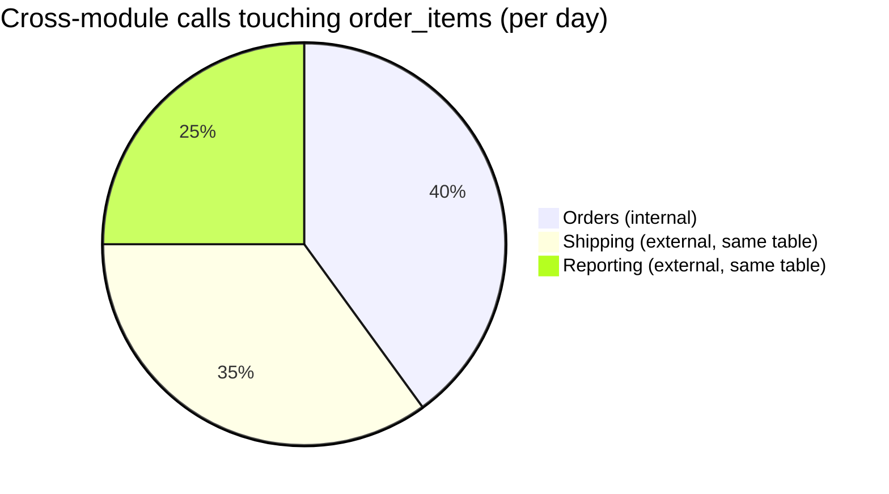

import Scenario from "../../../components/Scenario.astro";
import LevelIntro from "../../../components/LevelIntro.astro";

<Scenario label="The problem">
  <Fragment slot="facts">
    

      
🎯 <strong>Target picked by complaints</strong> — Orders is the module everyone hates working in

      
🔗 <strong>Hidden coupling</strong> — Orders and Shipping both read/write the same <code>order_items</code> table directly

      
💥 <strong>Result</strong> — "extracted" service still needs a distributed transaction on every write

    

    

      

        
Split by "most annoying"

        2 services, 1 shared table, constant sync bugs
      

      

        
Split by coupling data

        2 services, 0 shared tables, clean ownership
      

    

  </Fragment>

An e-commerce monolith has six modules — Orders, Inventory, Shipping,
Billing, Catalog, Users — all in one codebase, one database. Orders is
the module everyone complains about: it's the most-changed file, the
one every incident post-mortem mentions. So the team picks it as the
first thing to peel off into its own service.

Three weeks into the extraction, they hit a wall: Shipping's code
reads and writes the exact same `order_items` table Orders owns.
Splitting them into two services doesn't remove that coupling — it
just moves it across a network boundary and turns a single SQL
transaction into a distributed one, with all the retry logic,
partial-failure handling, and reconciliation jobs that implies. The
team didn't choose a bad pattern (the mechanics of the cutover itself
are covered in `strangler-fig`) — they chose the wrong **line to cut
along**.

| What decided the split       | What they were optimizing for               | What it missed                           |
| ---------------------------- | ------------------------------------------- | ---------------------------------------- |
| "Orders is the worst module" | Team pain, ticket volume                    | Whether Orders' _data_ is self-contained |
| Coupling/cohesion analysis   | Which modules actually share data and calls | Nothing — it's the thing that matters    |

**Both teams agree Orders needs to change. Why does only measuring coupling first avoid the distributed-transaction trap?**

</Scenario>

Picking a module to extract because it's annoying is picking by the
wrong signal. This level lays out the signal that actually predicts
whether a split will hold: how tightly a candidate boundary's modules
are coupled to everything outside it, and how cohesive they are with
each other.

<LevelIntro
  items={[
    "What a bounded context is, and why it's the unit you split along",
    "Coupling vs. cohesion as the two numbers that predict a clean split",
    "The concrete signals that reveal a boundary before you cut it",
  ]}
/>

## What is a bounded context?

A **bounded context** is a boundary inside which a term means one
consistent thing, one team (or one small group) owns the data, and
the code can change without asking permission from code on the other
side of the line. "Order" inside the Orders context means a
customer's purchase with line items and a status; "Order" inside a
Reporting context might mean a flattened analytics row with none of
that behavior. Same word, deliberately different meaning — that's
normal, not a naming bug, as long as each context is internally
consistent.

The monolith already has bounded contexts, whether anyone named them
or not — they're just not enforced. Splitting into services is really
the act of taking implicit boundaries and making them explicit
(separate deploys, separate databases, a real API instead of a
function call).

## Coupling and cohesion, in one table

Two measurements decide whether a candidate boundary is safe to cut:

| Metric       | Question it answers                                               | Bad sign for a split                                        |
| ------------ | ----------------------------------------------------------------- | ----------------------------------------------------------- |
| **Coupling** | How much does this group of modules depend on modules outside it? | Shared database tables, high call frequency across the line |
| **Cohesion** | How much do the modules _inside_ the group depend on each other?  | Modules inside the group barely call each other             |

A good boundary is **low coupling out, high cohesion in** — the group
holds together and doesn't lean on the rest of the system. A bad
boundary — like Orders alone, sharing `order_items` with Shipping —
is high coupling out, which is exactly the shape that turns into a
distributed transaction the moment you draw a network line through it.

## The signals that reveal a boundary

You don't need a design meeting to find these — they're measurable
from the code and the database as they exist today:

- **Shared tables** — two modules reading/writing the same table
  directly is the strongest coupling signal there is; it means no API
  boundary was ever enforced, only a convention.
- **Call frequency across modules** — how often one module calls
  another in the hot path. High frequency across a proposed boundary
  means that boundary will feel slow and fragile once it's a network
  call.
- **Co-change** — files that get edited together in the same commits,
  over and over, even across module folders. That's coupling the
  compiler can't see but `git log` can.
- **Vocabulary** — does "Order" mean the same thing everywhere it's
  used? A term that quietly means two different things in two parts
  of the code is often marking a boundary nobody drew yet.

None of these require rewriting anything to check — they're an
analysis you run against the monolith as it stands, before deciding
what to strangle first.
