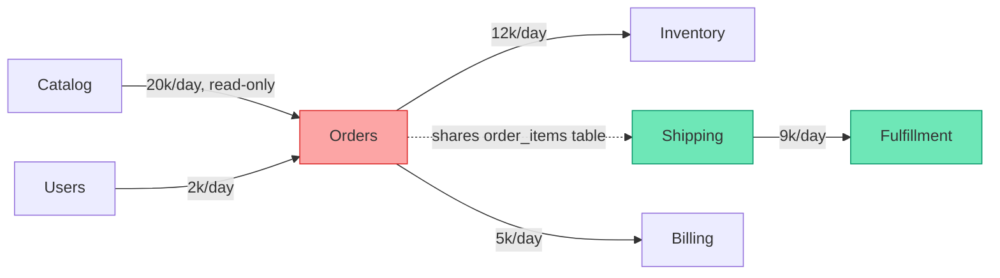
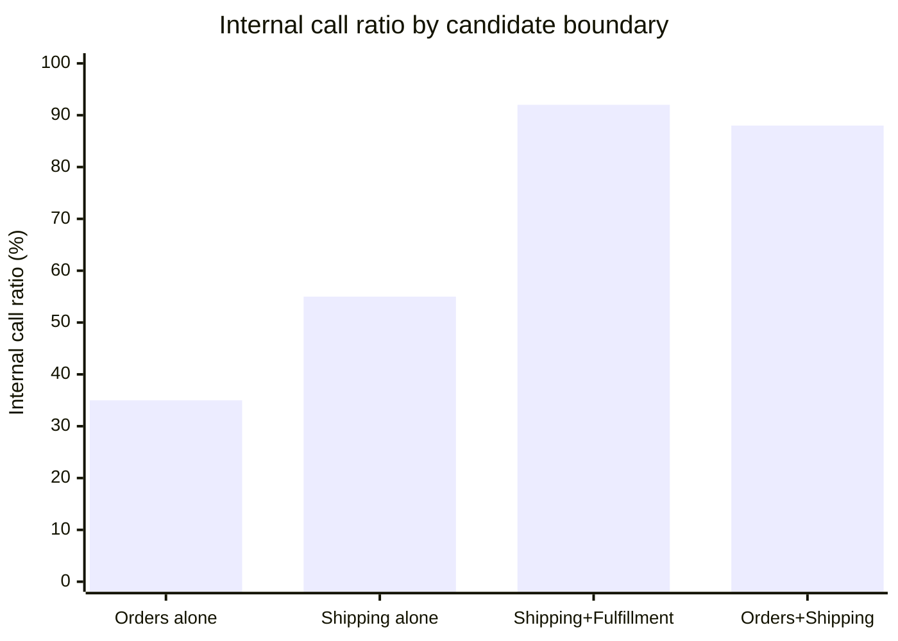

import Scenario from "../../../components/Scenario.astro";
import LevelIntro from "../../../components/LevelIntro.astro";
import Checkpoint from "../../../components/Checkpoint.astro";

<Scenario label="The problem">
  <Fragment slot="facts">
    

      
📦 <strong>Candidate A</strong> — Orders alone: shares <code>order_items</code> with Shipping, 3,000 calls/day from Shipping

      
📦 <strong>Candidate B</strong> — Shipping + Fulfillment together: 9,000 internal calls/day, 0 shared tables with anything outside

      
❓ Same modules, two different lines drawn around them — only one holds up

    

    

      A "candidate boundary" isn't one module — it's whatever set of modules you're proposing to extract together. The set matters as much as the modules in it.
    

  </Fragment>

L1 named the two numbers that matter — coupling out, cohesion in —
and the signals that reveal them (shared tables, call frequency,
co-change, vocabulary). This level turns that into an actual method:
draw a call graph of the monolith's modules, score candidate
boundaries against it, and read off which one is safe to extract
first.

**Given the two candidates above — same six modules to choose from, two different proposed groupings — which one would you bet on, and what single number would you check first to decide?**

</Scenario>

<LevelIntro
  items={[
    "Modeling the monolith as a call graph with weighted edges",
    "Scoring a candidate boundary: internal call ratio and external shared tables",
    "Reading the graph to find the boundary that's already there",
  ]}
/>

## Modeling the monolith as a graph

Before scoring anything, the monolith needs a shape. Every module
becomes a node; every call from one module into another becomes a
directed edge, weighted by how often it happens; every table two
modules both touch becomes a marked "shared data" edge, separate from
the call edges because it's a stronger and different kind of coupling
(a call can be replaced by an API; two modules silently sharing a
table can't be, without one of them moving first).

The dotted line is the one that matters most: a shared-table edge,
drawn deliberately different from the solid call edges, because it's
the one no service boundary can paper over without a real migration.

<Checkpoint question="In the graph above, Catalog calls Orders 20,000 times a day — the highest call count of any edge. Does that make Catalog+Orders the best candidate boundary to extract together?">

Not by itself. Call _frequency_ alone measures traffic, not the kind
of coupling that breaks a split. Catalog's calls into Orders are
read-only price lookups with no shared table and no shared writes —
exactly the kind of dependency an API (or even a cache) absorbs
cleanly. Orders and Shipping have a much lower call count but a
**shared table**, which is the coupling that actually resists being
split. High traffic on a clean interface is fine; low traffic through
a shared table is the red flag. The graph needs both signals read
together, not call count alone.

</Checkpoint>

## Scoring a candidate boundary

A candidate boundary is a _group_ of modules you're proposing to
extract as one service. Two numbers score it:

- **Internal call ratio** — of every call touching a module in the
  group, what fraction stays inside the group? `internal / (internal + external)`.
  High means the group is self-contained; low means extracting it
  drags the rest of the graph along on every request.
- **External shared tables** — how many tables does a module inside
  the group share with a module _outside_ the group? This should be
  zero for a clean split. Any non-zero count is a distributed
  transaction waiting to happen the day the group becomes its own
  service.

Read that chart against the shared-table count, not instead of it:
"Orders+Shipping" scores well on internal ratio (88%) precisely
_because_ it stops counting the Orders↔Shipping traffic as external —
but it still shares `order_items` with nothing left outside the
group to blame, so the shared table hasn't gone away, it's just been
absorbed into a bigger, harder-to-reason-about service. "Shipping +
Fulfillment" wins on both numbers at once: high internal ratio _and_
zero shared tables crossing the line — that's the difference between
gaming one metric and actually finding the seam.

<Checkpoint question="A team proposes bundling Orders, Shipping, AND Billing into one service to push the internal call ratio even higher than the two candidates above. Is a bigger bundle automatically a better boundary?">

No — a bundle that swallows enough of the monolith will always score
well on internal call ratio, because "internal" grows to include
whatever used to be external. That's gaming the metric, not solving
the coupling problem: the resulting service is really the monolith
again, just renamed, with all its original coupling still inside it
and none of the benefits (independent deploys, independent scaling,
one team owning one clear thing) a real split is supposed to buy.
The useful boundary is the _smallest_ group that gets external shared
tables to zero — not the largest group that gets internal ratio to
100%.

</Checkpoint>

## Reading the graph to find the boundary that's already there

The method, end to end:

1. Build the weighted call graph and mark shared-table edges.
2. Propose a candidate group (start from whatever's causing the most
   pain — that instinct isn't wrong, it just can't be the _only_
   input).
3. Score it: internal call ratio, external shared tables.
4. If external shared tables isn't zero, the boundary is in the wrong
   place — either grow the group to absorb the shared-table module,
   or resolve the sharing first (give each module its own table,
   sync via an event instead of a shared write) before extracting.
5. Once a group scores well, that's the first strangler-fig target —
   the mechanics of _how_ to cut it over live in `strangler-fig`; this
   method only answers _where_ to cut.

This is exactly what `web/strangler-fig` assumes has already
happened when it talks about "one route migrated per week" — the
route has to belong to a boundary that's actually self-contained, or
every migrated route drags a shared-table dependency back to the
system it just left.
