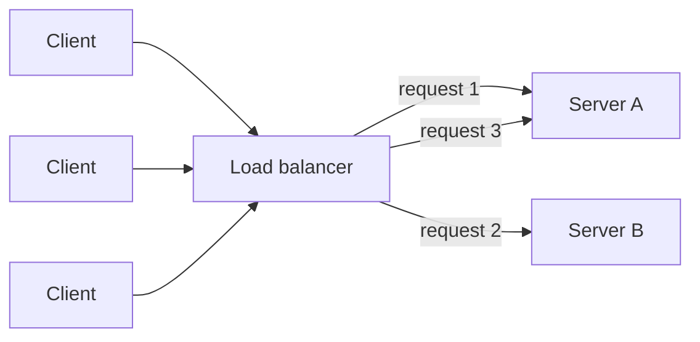

import Scenario from "../../../components/Scenario.astro";
import LevelIntro from "../../../components/LevelIntro.astro";

<Scenario label="A second server was added to handle the load. Now 4 in 10 users get logged out mid-checkout — on the exact server that used to work fine alone.">
  <Fragment slot="facts">
    

      
🖥️ <strong>Before</strong> — 1 server, CPU pinned at 100% during a ticket drop, requests queueing for seconds

      
➕ <strong>The fix that was tried</strong> — a second, identical server, traffic split between the two by DNS

      
🔓 <strong>What broke instead</strong> — 42% of logged-in users randomly signed out, because each server only remembers the sessions it personally created

    

  </Fragment>

TicketRush's checkout page runs on one server. During a popular
show's ticket drop, that one server's CPU pins at 100% and requests
start queueing for seconds at a time — the machine is simply out of
capacity, no bug involved. The team's fix: buy a second, identical
server and split incoming traffic between the two. Capacity roughly
doubles, CPU usage drops back to reasonable levels — and a new
problem appears that never existed before. Users log in successfully,
add tickets to their cart, and then get logged out mid-checkout,
seemingly at random. **Nothing about the login code changed. Why
would adding a second, identical server break something that worked
fine on one server alone?**

</Scenario>

<LevelIntro
  items={[
    "Vertical vs. horizontal scaling, and why horizontal wins past a point",
    "What a load balancer actually does",
    "Statelessness — the one property horizontal scaling requires",
  ]}
/>

## Two ways to get more capacity

A server running out of room has exactly two directions to grow:
**vertical** (make the one machine bigger) or **horizontal** (add
more machines and split the work between them).

| Approach                           | What it means                                                       | Ceiling                                                                                                | Failure behavior                                              |
| ---------------------------------- | ------------------------------------------------------------------- | ------------------------------------------------------------------------------------------------------ | ------------------------------------------------------------- |
| **Vertical scaling** (scale up)    | Buy a bigger machine — more CPU, more RAM                           | Hits a real ceiling — there's a biggest machine money can buy, and it costs more per unit past a point | One machine, one failure — it goes down, everything goes down |
| **Horizontal scaling** (scale out) | Add more machines running the same code, split traffic between them | Roughly linear — need more capacity, add another machine                                               | One machine can fail while the others keep serving traffic    |

TicketRush's first fix (a bigger single server) is vertical scaling —
it would have bought some headroom, but a single machine still caps
out eventually, and it's still a single point of failure for the
entire service. Adding a second server is horizontal scaling — and
it's what exposed the login bug, because horizontal scaling assumes
something about the servers that TicketRush's code was quietly
violating.

## What a load balancer actually does

Splitting traffic between two servers isn't automatic — something has
to sit in front of them, decide which server gets each incoming
request, and keep track of which servers are actually healthy enough
to receive traffic. That's a **load balancer**.

Clients no longer talk to "Server A" or "Server B" directly — they
talk to the load balancer, and it decides, per request, which server
actually handles it. This is also what makes a server's failure
survivable: if Server A stops responding to health checks, the load
balancer simply stops sending it traffic and routes everyone to
Server B until A recovers.

## The property horizontal scaling requires: statelessness

**If the load balancer can send any request to any server, what
happens to something a server was holding only in its own memory?**
That's exactly what broke TicketRush. On one server, "remember this
user is logged in" was implemented as an in-memory session stored on
that one machine — fine, because every request from that user always
landed on the same, only server. With two servers behind a load
balancer, a user's login request might land on Server A (which
creates the session, in A's memory only) while their very next
request — add to cart — lands on Server B, which has never heard of
that session and treats them as logged out.

A server is **stateless** when it holds nothing in its own memory
that a different server would need in order to handle that same
user's next request — any request-specific data lives somewhere all
servers can reach (a shared database, a shared cache like Redis), not
on one machine. A **stateful** server, like TicketRush's original
in-memory session, works by accident on one machine and breaks the
moment a second one is added, because it silently assumed "the next
request always comes back to me."

## Key terms

- **Vertical scaling** — increasing one machine's capacity (more CPU,
  RAM, disk).
- **Horizontal scaling** — adding more machines and distributing work
  across them.
- **Load balancer** — the component that sits in front of multiple
  servers, decides which one handles each incoming request, and
  routes around servers that fail health checks.
- **Statelessness** — a server holds no request-specific data in its
  own memory between requests; anything that needs to persist lives
  in a shared store every server can reach.
- **Sticky session** — a load balancer workaround that pins a given
  client to the same server for the life of a session, papering over
  statefulness instead of fixing it (L2 covers why this is a
  trade-off, not a real fix).

## What this unit covers

L2 works through how a load balancer actually decides which server
gets each request (the algorithms), why sticky sessions are a
band-aid rather than a solution, and how health checks keep a failed
server out of rotation. L3 implements a round-robin and a
least-connections load balancer, a stateless session store, and
verifies both against a simulated multi-server failure.
