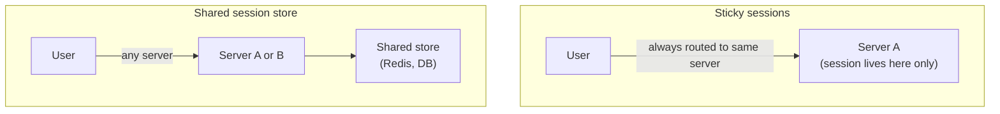

import LevelIntro from "../../../components/LevelIntro.astro";
import Checkpoint from "../../../components/Checkpoint.astro";

L1 named the problem: TicketRush's in-memory sessions broke the
moment a second server joined, because the load balancer could send a
user's next request to a server that never met them. This level works
through the algorithms a load balancer actually uses to choose a
server, the two real ways to deal with the session problem, and how a
failed server gets removed from rotation before it takes anyone down
with it.

<LevelIntro
  items={[
    "The load balancing algorithms — round robin, least connections, weighted",
    "Sticky sessions vs. a shared session store, and the trade-off each makes",
    "Health checks — how a load balancer notices and reacts to a dead server",
  ]}
/>

## How does the load balancer pick a server?

**If there are 3 servers and a new request arrives, which one gets
it, and on what basis?** There's no single right answer — different
algorithms trade off simplicity against fairness under real,
uneven conditions:

| Algorithm                | Rule                                                                                                           | Weak point                                                                                       |
| ------------------------ | -------------------------------------------------------------------------------------------------------------- | ------------------------------------------------------------------------------------------------ |
| **Round robin**          | Cycle through servers in fixed order: A, B, C, A, B, C, ...                                                    | Assumes every request costs the same and every server is equally fast — neither is usually true  |
| **Least connections**    | Send the request to whichever server currently has the fewest active connections                               | Needs the load balancer to track live connection counts per server — more state to keep accurate |
| **Weighted round robin** | Like round robin, but a stronger server gets proportionally more requests (e.g. weight 2 gets twice the share) | The weights have to be set and kept up to date by a human, or they drift from reality            |

Round robin is the simplest and works well when every request is
roughly equal cost and every server is roughly equal capacity — which
is exactly true for TicketRush's two identical servers handling
similar checkout requests. It stops being a good fit the moment either
assumption breaks: a mixed fleet (one bigger server, one smaller one)
or requests with wildly different costs (a fast health check next to
a slow report export) can leave one server overloaded while another
sits idle, even though each got its "fair" one-third of requests.

**Would round robin have caused a problem for TicketRush even before
the session bug?** Not really — two identical servers, similar-cost
requests, is round robin's best case. The session bug in L1 would
have happened under least-connections or weighted round robin too;
it's not caused by the algorithm choice, it's caused by statefulness,
which is why the fix (L2's next section) is unrelated to which
algorithm is used.

<Checkpoint question="A service has one large server (handles 2x the traffic of a small one) and one small server behind a load balancer using plain round robin. What happens under sustained load?">

Plain round robin sends each server the same number of requests,
regardless of capacity — so the small server gets exactly as many
requests as the large one, even though it can only actually handle
half as much work per second. It ends up overloaded (high latency,
possibly dropped requests) while the large server has spare capacity
sitting unused. This is exactly the mismatch weighted round robin is
for: giving the large server a higher weight (say, 2) means it
receives twice the share of requests, matching allocation to actual
capacity instead of just request count.

</Checkpoint>

## Fixing statefulness: sticky sessions vs. a shared store

**L1 asked why adding a second server broke login. There are two
different ways to make it work again — do they solve the same
problem?**

**Sticky sessions** make the load balancer remember which server
first handled a given client (usually via a cookie) and route every
subsequent request from that client back to the same server. This
"fixes" TicketRush's symptom without touching the underlying cause —
the session still lives only in one server's memory; the load
balancer is just working around it by never sending that user
anywhere else. It's a real, commonly used option, but it comes with
costs: if that one server goes down, every user stuck to it loses
their session entirely (there's nowhere else the data exists), and
it undermines the whole point of horizontal scaling — traffic can no
longer be freely rebalanced across servers, because clients are now
pinned.

**A shared session store** removes the assumption entirely: no
server keeps session data in its own memory. Instead, every server
reads and writes session data to a shared, external store (a cache
like Redis, or a database) that all of them can reach. Now the load
balancer really can send any request to any server — Server B can
serve a user whose session was created on Server A, because both
read from the same place. This is what makes a server genuinely
**stateless**: nothing request-specific survives only in its process
memory.

**Is sticky sessions ever the right call, or is a shared store
strictly better?** Sticky sessions are simpler to add to an existing
stateful app (no new infrastructure, no data-store round trip on
every request) and can be a reasonable stopgap. A shared store is the
real fix because it makes servers actually interchangeable — any
server can be added, removed, or restarted without losing anyone's
session — which is exactly what horizontal scaling needs in order to
scale and fail over cleanly. The trade-off is an extra network hop to
the store on requests that need session data, and the store itself
becoming something that has to be made reliable.

<Checkpoint question="With sticky sessions (no shared store), Server A — which every checkout in progress happens to be pinned to — crashes. What happens to those users' sessions?">

They're gone. Sticky sessions don't replicate session data anywhere
else — they just make sure a given user's requests keep landing on
the one server that has it. When that server crashes, so does the
only copy of every session it was holding; there's no other server to
fail over to that has the same data, because none of them do. This is
the real cost sticky sessions carry that a shared store doesn't: a
shared store's data survives any one server's crash, because it never
lived only in that server's memory in the first place.

</Checkpoint>

## Health checks: keeping a dead server out of rotation

A load balancer that keeps sending requests to a crashed server is
actively making things worse — every request routed there fails. A
**health check** is the load balancer periodically pinging each
server (often a lightweight `GET /health` endpoint) and removing any
server that stops responding correctly from the rotation, then adding
it back once it starts passing checks again.

| Health check outcome          | Load balancer's reaction                                       |
| ----------------------------- | -------------------------------------------------------------- |
| Server responds `200 OK`      | Stays in (or rejoins) the rotation, eligible for new requests  |
| Server times out or errors    | Removed from rotation — no new requests sent until it recovers |
| Server recovers, passes again | Re-added to rotation                                           |

This is also why TicketRush's original single-server setup had no
recovery option at all: with one server, a failed health check has
nowhere to route to — the whole service is down. With two or more
servers, one failing health check just means the others absorb its
share of traffic, which is the actual resilience benefit of
horizontal scaling, separate from the extra capacity.

## Failure modes at this level

- **Choosing round robin for an uneven fleet or uneven request
  costs.** It only performs well when servers and requests are
  roughly equal — otherwise one server ends up overloaded while
  others idle, even though request counts look "fair."
- **Treating sticky sessions as a permanent fix instead of a
  stopgap.** It papers over statefulness rather than removing it, and
  loses data outright on the server it was pinned to going down.
- **Health checks that only test "is the process up," not "can it
  actually serve requests."** A server that's up but can't reach its
  own database will pass a bare TCP check and keep receiving traffic
  it can't actually handle — the check needs to exercise a real
  dependency, not just confirm the port is open.
- **Forgetting the shared store itself needs to survive.** Moving
  state out of each server's memory into one shared store fixes the
  original problem but creates a new single point of failure if that
  store isn't made reliable (replicated, backed up) in its own right.
