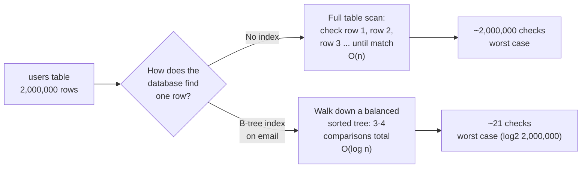
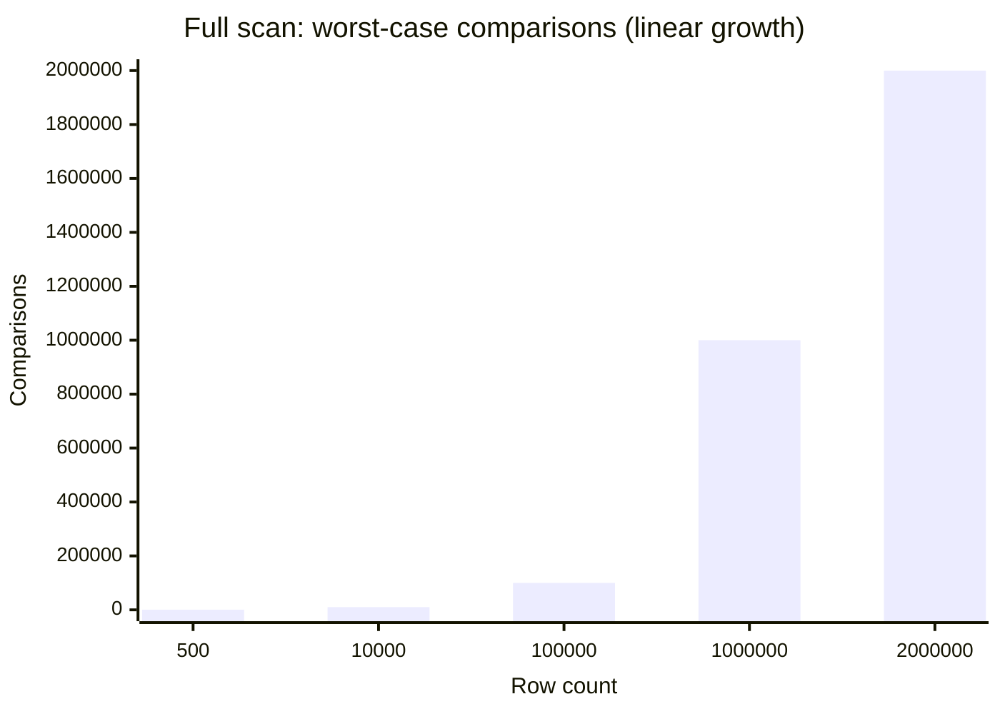
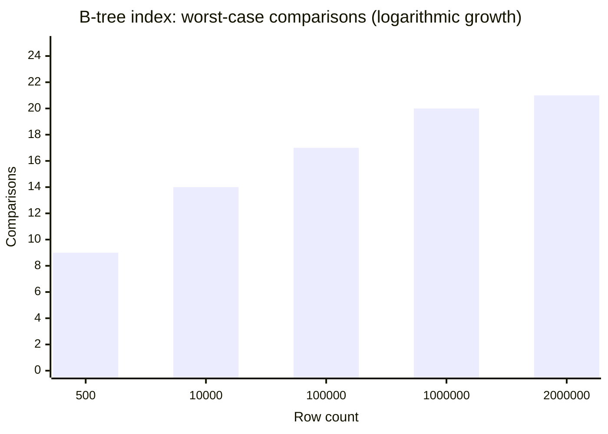

## Why "4,000x more rows" became "200x slower," not 4,000x slower

**If a full scan's cost grows in direct proportion to row count, why
did going from 500 to 2,000,000 rows (4,000x more data) only make
the login query 200x slower, not 4,000x slower?** Because the
opening scenario's "2ms" already included the users table being
small enough to sit almost entirely in memory or a warm disk cache —
some of that slowdown is scan cost, some is the table outgrowing
what fits in cache. But the scan itself is still the dominant,
avoidable cost, and it's the one an index removes:

The gap isn't small-vs-large — it's **linear vs. logarithmic**.
Doubling the table doubles a full scan's cost, but only adds _one
more comparison_ to a B-tree lookup. That's the entire reason the
same unchanged query degrades as a table grows: nothing about the
query is wrong, the table simply outgrew the point where "just check
every row" was cheap enough not to notice.

**These two charts share the same x-axis on purpose** — same five
row counts, same "worst case to find one row" question, deliberately
drawn on two different y-axis scales because putting them on one
linear axis would flatten the B-tree bars to invisible slivers next
to 2,000,000. Read them side by side: the full scan's bars grow in
a straight line with the row count; the B-tree's bars barely move at
all across the same four-thousand-x growth in data.

## B-tree vs. hash index: two different trades

**If a B-tree already turns O(n) into O(log n), why does a second
index type — hash — exist at all?** Because a B-tree pays for one
extra capability that a hash index doesn't need to support, and a
hash index is faster at exactly the thing it's willing to give up:

|                                                  | B-tree index                        | Hash index                                                                                                   |
| ------------------------------------------------ | ----------------------------------- | ------------------------------------------------------------------------------------------------------------ |
| Exact-match lookup (`email = ?`)                 | O(log n)                            | O(1) average                                                                                                 |
| Range query (`age > 30`, `price BETWEEN`)        | Supported — the tree is kept sorted | **Not supported** — hashing scatters values, order is gone                                                   |
| Sorted output (`ORDER BY` on the indexed column) | Free — already sorted               | Not usable                                                                                                   |
| Typical use                                      | The default choice for most columns | Equality-only lookups where range/order will never matter (e.g. a session-token cache keyed by opaque token) |

**Why can't a hash index just also support ranges if it's faster?**
Because the speed itself is the reason it can't: a hash function
deliberately scrambles input order so that similar values land in
unrelated buckets (this is what makes lookups O(1) — no searching, just
compute the bucket). That same scrambling destroys the "values near
each other in the data are near each other in the index" property
range queries depend on. It's not an implementation gap; it's the
direct cost of the mechanism that makes hash lookups fast.

## When an index quietly doesn't get used

**If the `email` column has an index, does every query touching
`email` automatically get fast?** No — a few common patterns silently
defeat an index even though it exists:

- **A leading wildcard search** — `WHERE email LIKE '%@example.com'`
  can't use a sorted index, because a match could start anywhere in
  the string; `WHERE email LIKE 'alice%'` _can_, because the sorted
  order still narrows the search from the front.
- **Applying a function to the indexed column** — `WHERE LOWER(email) = ?`
  looks up the _function's output_, not the raw stored value, so a
  plain index on `email` doesn't match unless the database was told
  to index the expression itself.
- **Low selectivity** — an index on a boolean `is_active` column
  barely narrows anything when 95% of rows share the same value; the
  database may reasonably decide a full scan is cheaper than following
  an index into millions of matching rows anyway.

## Failure modes at this level

- **Assuming "add an index" is free.** Every index adds disk space
  and slows down writes to that column (the index itself has to be
  updated on every insert/update/delete) — indexing every column
  "just in case" trades write performance for a read benefit most of
  those columns will never need.
- **Indexing a column that's never looked up alone.** An index on
  `last_name` doesn't help a query that always filters by
  `last_name AND birth_year` together — the right index usually
  matches the actual query pattern, not just "this column seems
  important."
- **Expecting a hash index to make range queries fast.** It's not a
  slower version of a B-tree for ranges — it structurally cannot
  answer them at all, order is lost at build time, not lookup time.
