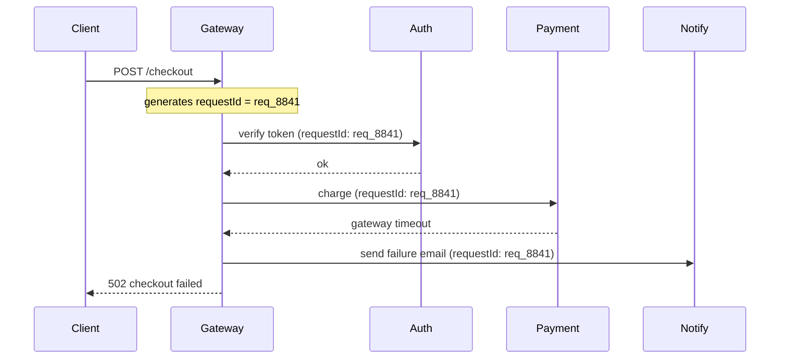

import Scenario from "../../../components/Scenario.astro";
import LevelIntro from "../../../components/LevelIntro.astro";
import Checkpoint from "../../../components/Checkpoint.astro";

<Scenario label="Four services touch one checkout request. Which one broke it?">
  <Fragment slot="facts">
    

      
🧭 <strong>The request's path</strong> — gateway → auth → payment → notification, four separate log streams

      
🆔 <strong>What's missing</strong> — nothing ties one request's four log lines together; each service logs in isolation

      
🔍 <strong>The search</strong> — grepping four services' logs by approximate timestamp, hoping to spot the right lines by eye

    

  </Fragment>

A single checkout request passes through four services: an API
gateway, an auth service, a payment service, and a notification
service. Each one logs independently, with its own timestamps, in its
own structured format. When the payment service logs an error, an
engineer still has to guess which gateway request and which auth
check it belonged to — by eyeballing approximate timestamps across
four separate log streams and hoping nothing else was happening at
the same moment. **What single piece of data, attached to every log
line from every service, would turn "four separate log streams" into
"one request's story, in order"?**

</Scenario>

<LevelIntro
  items={[
    "Correlation IDs and how a trace ID/span ID propagate across services",
    "What a span actually is, and how spans form a tree",
    "Cardinality — why a metric label can quietly become a cost problem",
  ]}
/>

## Correlation IDs: one thread through many logs

**How do you turn four independent log streams into one connected
story?** By generating one ID at the very first point a request
enters the system — the API gateway — and passing it along on every
downstream call, so every service includes it in every log line it
writes for that request:

Every box in that diagram logs independently, but every log line
carries the same `requestId`. Now the query from L1 — "show me every
`error`-level log where..." — can be "show me every log line, from
every service, where `requestId = req_8841`," and the four scattered
lines from the Scenario become one ordered story.

**Tracing** is this same idea formalized and made hierarchical.
Instead of one flat `requestId`, a trace has a **trace ID** (the
whole request, like `requestId` above) and each unit of work within
it — a database query, an outbound HTTP call, a function that does
real work — gets its own **span**, with a start time, an end time,
and a reference to its **parent span**. Spans nest the same way
function calls nest: the gateway's span is the parent of the payment
service's span, which might itself be the parent of a span for the
call to the payment gateway. A trace viewer renders this as a
timeline, so "where did the time go" is a picture, not a
spreadsheet — this is exactly the "260ms notify" row from L1's trace
example, now attached to a real parent/child structure instead of a
flat list.

<Checkpoint question="If the payment service forwards a call to the notification service but forgets to pass along the trace ID, what happens to the notification service's logs for that request?">

They become orphaned — structured and readable on their own, but with
no field connecting them back to the same checkout request that
triggered them. An engineer searching by trace ID would see the
gateway, auth, and payment spans, and then the trail would simply
stop, even though the notification service really did run and really
did log something. The trace ID is only as complete as every hop in
the chain that forwards it — one service that drops it breaks the
story at exactly that point, the same way one broken link breaks a
chain regardless of how solid the other links are.

</Checkpoint>

## Metrics: from an event to a number

A log line is a discrete record of one thing that happened. A
**metric** is different: it's a number, tracked over time, usually
without any per-request detail attached. Three common shapes cover
most cases:

- **Counter** — only goes up: total requests served, total errors.
- **Gauge** — goes up or down: current queue depth, active
  connections right now.
- **Histogram** — a distribution of values, so you can ask for a
  percentile: request latency, payload size. This is where "p99
  checkout latency: 340ms" from L1 comes from — not an average, but
  "99% of requests were at or below this."

Metrics are cheap to store and fast to query precisely _because_
they throw away per-request detail — a counter doesn't remember which
requests it counted, only the total. That trade-off is deliberate:
metrics answer "how much / how often," logs and traces answer "which
one, and why."

## Cardinality: why "just add a label" isn't free

**If metrics are cheap, why not attach a label for every field —
`userId`, `requestId` — to every metric, the way structured logs do?**
Because a metric is stored per unique combination of its label
values, and that combination count is its **cardinality**. A counter
with no labels is one number. A counter labeled by `statusCode` (a
handful of values) is a handful of numbers. A counter labeled by
`userId` — potentially millions of distinct values — becomes millions
of separate time series, most of them a single data point that's
essentially never queried in aggregate again:

| Label added            | Approx. distinct values | Resulting time series |
| ---------------------- | ----------------------- | --------------------- |
| _(none)_               | 1                       | 1                     |
| `statusCode`           | ~10                     | ~10                   |
| `statusCode` + `route` | ~10 × ~40               | ~400                  |
| + `userId`             | ~10 × ~40 × millions    | millions              |

This is why `userId` and `requestId` belong on **logs and traces**,
which are built to hold per-event detail, and not on **metrics**,
which are built to be cheap precisely by staying low-cardinality. It
is a common, expensive mistake to add "just one more label" to a
metric without checking how many distinct values it can take.

<Checkpoint question="A team adds an `endpoint` label to their request-count metric, and separately a `sessionId` label to the same metric. One of these is routine; the other will likely cause a cardinality blow-up. Which is which, and why?">

`endpoint` is routine — a service typically has a bounded, small
number of distinct routes (tens, maybe low hundreds), so the metric
stays a manageable number of time series and the label is genuinely
useful for aggregation ("errors per endpoint"). `sessionId` is the
dangerous one: it's effectively unbounded, a new distinct value for
every user session, which means the metric backend has to create and
store a new time series for nearly every session that ever occurs —
turning one counter into an unbounded, ever-growing set of counters
that never gets queried in aggregate the way the low-cardinality
labels do. Per-session detail belongs in logs or traces, not as a
metric label.

</Checkpoint>
