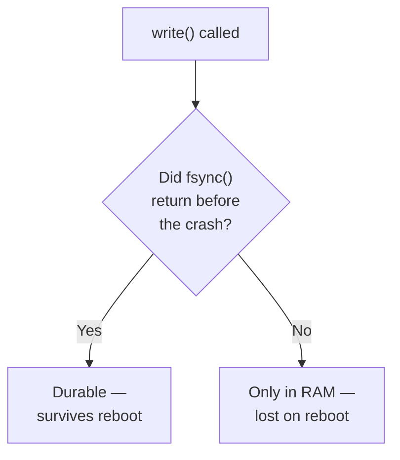

import Scenario from "../../../components/Scenario.astro";

<Scenario label="The problem">
  <Fragment slot="facts">
    

      

        ⚡ <strong>RAM</strong> — volatile, gone the instant
        power drops
      

      

        💾 <strong>Disk</strong> — non-volatile, keeps its
        contents with no power at all
      

      

        ⏳ <strong>The gap</strong> — `write()` can return
        "success" while the data is still only in RAM
      

    

    

      

        

          After fsync() returns
        

        Durable — survives a crash the very next instant
      

      

        

          After write() only
        

        Optimistic — gone if the crash lands before the OS flushes it
      

    

  </Fragment>

A payments service calls `write()` on the transaction it just processed. No
error comes back. It tells the caller "saved." One second later, the power
fails. **When the machine boots back up, is that transaction still there?**
The honest answer is: it depends on one call the code may or may not have
made — and a successful `write()` alone doesn't answer the question.

</Scenario>

## First: where can a datum live?

| Place                                | Survives closing the program? | Survives power loss? | Beginner model                                |
| ------------------------------------ | ----------------------------- | -------------------- | --------------------------------------------- |
| Variable/object in process memory    | No                            | No                   | A note on a whiteboard inside one running app |
| OS page cache                        | Maybe                         | No                   | A fast outgoing tray the OS has not delivered |
| File or database bytes after `fsync` | Yes                           | Yes                  | The note has reached durable storage          |
| Fsynced write-ahead log entry        | Yes                           | Yes                  | A safe receipt the database can replay later  |

A file is the simple case: bytes with a name on disk. A database is a
more organized system that still uses files underneath, with extra rules
for transactions, recovery, and search. This unit starts with the simple
memory-vs-disk question, then shows why real databases need stronger
machinery to make "saved" mean "survives a crash."

- **RAM is volatile** — its contents depend on continuous power; the instant power is lost (a crash, a reboot, an unplugged machine), everything in it is gone. **Disk (SSD/HDD) is non-volatile** — it retains its contents with no power at all, which is the entire reason it's used for anything meant to survive a crash.
- A program's in-memory data structures (a variable, an in-memory cache, an unflushed buffer) live in RAM and vanish on crash. A program's _persisted_ data — anything explicitly written to disk (a file, a database's data files) — survives, because disk doesn't depend on the process or the power staying on.
- "Writing to disk" is not instantaneous or atomic by default: the OS and disk hardware both buffer writes for performance, meaning a `write()` call returning successfully doesn't guarantee the data is physically on disk yet — it might still be sitting in a buffer that a crash would lose.
- **`fsync`** (and equivalents) is the explicit instruction "don't return until this data is actually durable on disk, not just handed to a buffer" — it's slower than a normal write specifically because it waits for that guarantee, and skipping it is a common, subtle source of "the database says it saved my data, but it's gone after a crash."
- **A crash between write and fsync is exactly the gap where "the program remembered" and "the program forgot" get decided** — this unit is about understanding that gap precisely, not treating persistence as an all-or-nothing property.
- Fsyncing on every single write is correct but slow — real systems batch multiple pending writes behind one `fsync` call (**group commit**), trading a slightly larger window of at-risk data for much higher throughput. That trade-off is a deliberate dial, not a bug.
- Databases build strong durability guarantees (the "D" in ACID) on top of this exact mechanism — a write-ahead log fsynced before acknowledging a transaction as committed is the concrete technique that makes "the database said it saved it" actually trustworthy.
- The practical question this unit answers: when your program says "saved," what specifically has to be true on disk, right now, for that claim to survive the machine losing power in the next instant?

| Term                  | One-line meaning                                                     |
| --------------------- | -------------------------------------------------------------------- |
| Volatile              | Contents depend on continuous power (RAM)                            |
| Non-volatile          | Contents survive with no power at all (disk)                         |
| Page cache            | The OS's in-RAM buffer that a plain `write()` typically only reaches |
| `fsync`               | Blocks until the OS confirms the disk itself has the data            |
| Durability            | The guarantee that acknowledged data survives a crash                |
| Write-ahead log (WAL) | A small, sequential, fsynced log that backs a "committed" claim      |
| Group commit          | Batching several writes behind one shared `fsync` call               |

Key terms: volatile vs. non-volatile, page cache, `fsync`, durability, write-ahead log, group commit, torn write, crash consistency.
