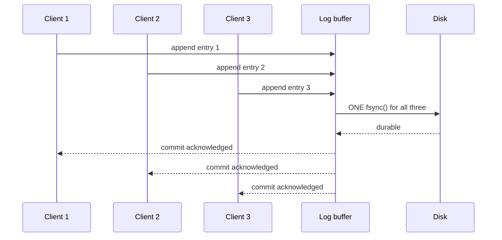

import Scenario from "../../../components/Scenario.astro";

<Scenario label="The problem">
  <Fragment slot="facts">
    <div class="not-prose flex flex-col gap-2 text-sm text-slate-700 dark:text-slate-300">
      <div class="flex items-center gap-1.5">
        <span>🏧</span> <strong>t = 0</strong> — ATM calls `write()` on the
        $200 withdrawal
      </div>
      <div class="flex items-center gap-1.5">
        <span>✅</span> <strong>t = 0.1s</strong> — `write()` returns,
        no error, receipt prints
      </div>
      <div class="flex items-center gap-1.5">
        <span>🔌</span> <strong>t = 1s</strong> — power fails, `fsync()`
        was never reached
      </div>
    </div>
  </Fragment>

An ATM debits $200 from an account, calls `write()` on that record, gets no
error back, and prints a receipt. One second later a breaker trips and the
machine loses power. **The bank's ledger never actually called `fsync`
before the crash — so what does the account balance say when the machine
reboots?** This unit is about the exact mechanical answer to that question,
not a hand-wave about "the data might be gone."

</Scenario>

## What does write() actually guarantee?


A normal `write()` call only guarantees the data reached the **OS page cache** — a fast, in-RAM buffer the kernel maintains specifically so writes don't block on slow physical disk I/O. That's a real, useful optimization, and it's also exactly the gap: page cache is RAM, so it's just as volatile as any other RAM. A crash after `write()` returns but before the OS actually flushes that page to the disk loses the data, even though the program's `write()` call succeeded and returned no error. This is precisely the gap the ATM fell into above.

## Where does fsync fit, and why is it slow?

```python
function save_important_data(file, data):
    file.write(data)     # data is now in the OS page cache — fast, but NOT yet durable
    file.fsync()         # blocks until the data is physically confirmed durable on disk
    return "safe to tell the caller this is saved"
```

`fsync` is the boundary: everything before it is only "probably fine" (survives normal operation, doesn't survive a crash); everything the call successfully returns from is durable, specifically because the OS won't return from `fsync` until the disk itself confirms the write. This is also why `fsync` is measurably slower than a plain `write` — it's not free, it's the actual cost of a genuine durability guarantee, and skipping it is a common way systems appear to work correctly until the first real crash exposes the gap.

## What happens if the crash lands mid-write, with no fsync at all?

| When the crash happens                              | Is the data recoverable after reboot?                                |
| --------------------------------------------------- | -------------------------------------------------------------------- |
| Before `write()` is called                          | No — the data was never written anywhere durable                     |
| After `write()`, before `fsync()`                   | No — still only in the volatile OS page cache                        |
| After `fsync()` returns successfully                | Yes — physically confirmed durable before the crash                  |
| Mid-way through a multi-byte write, no fsync at all | Undefined — possibly a torn/partial write, worse than "just missing" |

The last row is why real systems don't just add `fsync` and call it solved — a crash mid-write can leave a file in a **partially written**, internally inconsistent state, which is a distinct and often worse failure than simply losing the whole update. This is exactly the problem write-ahead logging exists to solve.

## How do databases make "committed" actually mean something?

```python
function commit_transaction(db, transaction):
    log_entry = serialize(transaction)
    append_to_log(log_entry)   # sequential, append-only — cheap to fsync
    fsync(log_file)            # durability boundary: this IS the commit point
    acknowledge_commit_to_client()
    # The actual data-file update can happen later, asynchronously —
    # if a crash happens before that, the log is replayed on restart
    # to reconstruct the change, because the log itself already survived.
    apply_to_data_files(transaction)  # can be deferred safely
```

The trick: instead of making every committed transaction fsync a potentially large, scattered data-file write (slow), the database fsyncs a small, sequential log entry (fast) and treats _that_ as the actual durability boundary — the promise made to the client ("your transaction is committed") is backed by the log surviving a crash, not by the full data file being fully updated yet. Applied to the ATM: if the withdrawal had gone through a WAL, "committed" would mean the log entry was fsynced — which is exactly the step that was skipped.

## What if fsyncing every single commit is too slow?

An `fsync` typically costs low single-digit milliseconds on an SSD (more on spinning disk) — fine for one transaction a second, ruinous for ten thousand. **Group commit** is the answer: instead of one `fsync` per transaction, the database buffers several pending commits and issues **one shared `fsync`** for the whole batch, then acknowledges all of them at once.



This isn't free — it's a genuine trade-off, not a free lunch:

| Batch size      | fsync calls per second (at 5ms/fsync) | Max data-loss window on crash |
| --------------- | ------------------------------------- | ----------------------------- |
| 1 (no batching) | ~200                                  | ~5ms of writes                |
| 10              | ~200 (but 10× the commits)            | ~5–10ms of writes             |
| 100             | ~200 (but 100× the commits)           | ~5–50ms of writes             |

Throughput scales up sharply with batch size because the fixed ~5ms `fsync` cost gets shared across more commits — but every commit sitting in an unflushed batch is, by definition, not yet durable, so a bigger batch also means a bigger window of recent commits a crash could still take back. The interactive demo below lets you drag both the batch size and the `fsync`/write latencies yourself and watch the exact trade-off move.

## What about the directory entry, not just the file's contents?

Creating a brand-new file durably can require fsyncing the **containing directory**, not just the file — on some filesystems, a crash right after creating a new file can lose the directory entry that points to it, even if the file's own bytes were fsynced correctly. It's a genuinely separate durability boundary from the one covered above: the file's contents and the directory's record that the file exists are two different pieces of metadata the OS can persist independently, and a program that only fsyncs the file has quietly assumed the second one for free.
