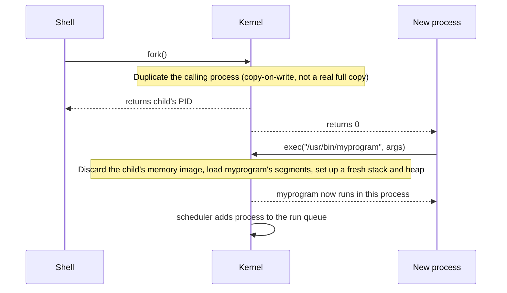

## The shape of a process's memory

Every process's virtual address space is organized into the same regions, conventionally drawn like this — low addresses at the bottom, high addresses at the top:

```
high addresses
┌─────────────────────────┐
│          stack           │  function calls, local variables
│            ↓              │  grows downward
│                           │
│        (free space)       │
│                           │
│            ↑              │  grows upward
│           heap            │  malloc/new/dynamic allocations
├─────────────────────────┤
│         data/bss          │  global & static variables
├─────────────────────────┤
│           text            │  compiled code (read-only)
└─────────────────────────┘
low addresses
```

The stack and heap deliberately grow _toward_ each other from opposite ends of the free space between them. That gap is why a program can run for a long time without either one being sized up front — but it's also exactly what makes a **stack overflow** possible: enough nested function calls (usually unbounded recursion) and the stack pointer eventually collides with the heap, or simply runs past the space the OS reserved for it.

## How a program actually starts running

On Unix-like systems (Linux, macOS), starting a program is a two-step handoff, classically called **fork + exec**:



Pseudocode for the same sequence, as the shell sees it:

```
function run_program(path, args):
    child_pid = fork()          # OS duplicates the calling process
    if child_pid == 0:
        # this is the child — it's currently running a copy of the shell
        exec(path, args)         # replace this process's entire memory image
        # exec() never returns on success — the process IS myprogram now
    else:
        # this is the parent (the shell)
        wait(child_pid)          # block until the child exits
```

`fork()` and `exec()` are separate on purpose. `fork()` alone is useful without `exec()` — a server can `fork()` to handle a request in a child process running the _same_ code, no new program involved. `exec()` alone would need something to already be running to call it. Splitting process creation from program loading is what lets a shell do things like redirect the child's file descriptors _between_ the fork and the exec, before the new program's code ever runs.

## Why virtual memory is what makes isolation possible

A process's pointers are all virtual addresses — numbers meaningful only through that process's own page table. When process A reads the pointer `0x7fff1000`, the MMU looks up A's page table, finds the physical RAM page it maps to, and reads that. Process B's `0x7fff1000` goes through B's own page table and lands somewhere else in physical RAM entirely — usually nowhere at all, from A's perspective. Neither process can express a pointer that reaches into the other's physical memory, because addresses are never physical from a process's point of view; they're always mediated through a private mapping only the kernel controls.

This is also why a `NULL` pointer dereference reliably crashes instead of reading garbage: address `0x0` is deliberately left unmapped in a process's page table specifically so any access to it faults immediately, loud and fast, instead of silently reading whatever used to be at physical address zero.
