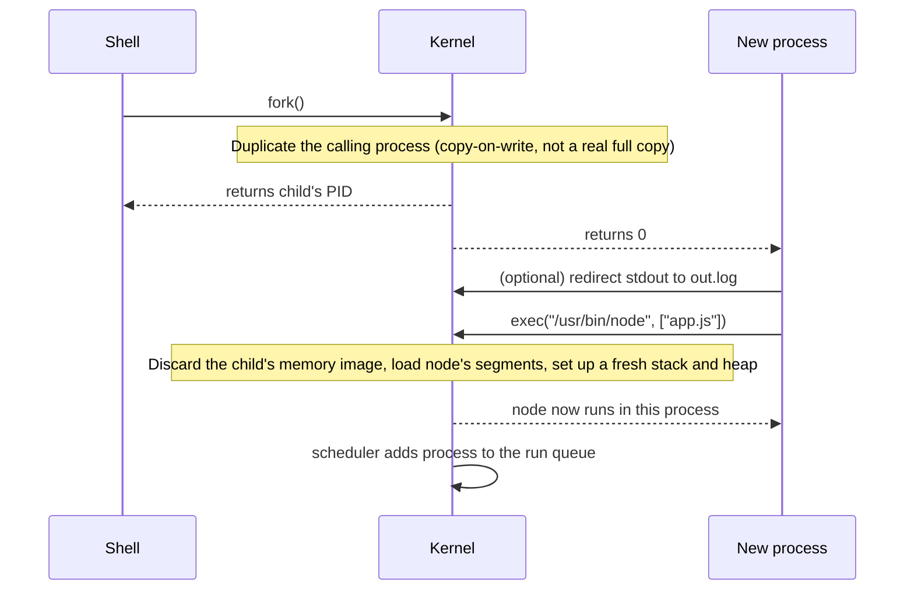
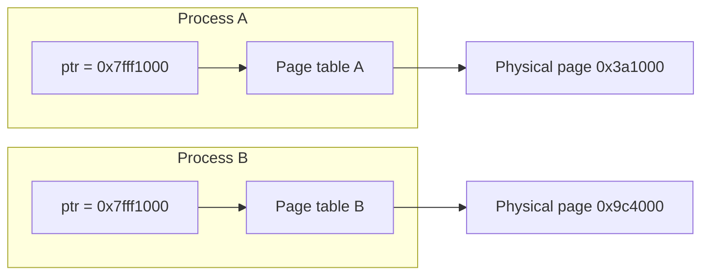

import Scenario from "../../../components/Scenario.astro";
import LevelIntro from "../../../components/LevelIntro.astro";
import Checkpoint from "../../../components/Checkpoint.astro";

L1 named the parts of a process — memory regions, PIDs, system calls. This level goes one layer deeper: how a process actually gets created, and why its isolation is structurally guaranteed rather than just conventional.

<LevelIntro
  items={[
    "The stack/heap/data/text layout, and why it can overflow",
    "How fork + exec split process creation into two steps",
    "Why virtual addresses can't leak across processes",
  ]}
/>

## What has to be true for a program to become a process?

A `.exe`, a `node script.js`, a `python app.py` — before any of them run, they're just bytes sitting on disk. Something has to give that program a private slab of memory, a place to keep its call stack, and a name the rest of the OS can refer to it by. **What shape does that memory actually take, and who decides it?**

Every process's virtual address space is organized into the same regions, conventionally drawn like this — low addresses at the bottom, high addresses at the top:

```
high addresses
┌─────────────────────────┐
│          stack           │  function calls, local variables
│            ↓              │  grows downward
│                           │
│        (free space)       │
│                           │
│            ↑              │  grows upward
│           heap           │  malloc/new/dynamic allocations
├─────────────────────────┤
│         data/bss          │  global & static variables
├─────────────────────────┤
│           text            │  compiled code (read-only)
└─────────────────────────┘
low addresses
```

The stack and heap deliberately grow _toward_ each other from opposite ends of the free space between them. That gap is why a program can run for a long time without either one being sized up front — but it's also exactly what makes a **stack overflow** possible: enough nested function calls (usually unbounded recursion) and the stack pointer eventually collides with the heap, or simply runs past the space the OS reserved for it.

<Checkpoint question="A function recurses without a base case. Based on the memory layout above, which region actually runs out first, and what does that predict about the kind of error you'd see compared to, say, a bug that allocates too many objects with `new`?">

The stack runs out, not the heap — each recursive call pushes a new frame (return address, arguments, locals) and nothing ever pops until a call returns, so the stack pointer keeps growing toward the free space until it either collides with the heap or runs past the region the OS reserved. That's a structurally different failure from over-allocating with `new`: excess heap allocation grows a bounded-but-large region and typically shows up as out-of-memory or GC pressure, while runaway recursion is a stack-specific exhaustion — the classic symptom is a "stack overflow" or "maximum call stack size exceeded" error rather than a generic out-of-memory failure, because the two regions are tracked and limited separately.

</Checkpoint>

## How does a shell turn `node app.js` into a running process without becoming that process itself?

<Scenario label="The problem">
  <Fragment slot="facts">
    <div class="not-prose flex flex-col gap-2 text-sm text-slate-700 dark:text-slate-300">
      <div class="flex items-center gap-1.5">
        <span>🐚</span> <strong>Shell</strong> — must survive after the
        program launches
      </div>
      <div class="flex items-center gap-1.5">
        <span>▶️</span> <strong>Program</strong> — must run as its own,
        separately killable process
      </div>
      <div class="flex items-center gap-1.5">
        <span>🔀</span> <strong>Redirection</strong> — `node app.js >
        out.log` must only affect the program's output, never the shell's
      </div>
    </div>
  </Fragment>

You type `node app.js > out.log` and hit enter. The shell needs to: create
a brand-new process, load an entirely different program's code and memory
into it, redirect _only that new process's_ stdout to a file, and then
keep running itself so you get your prompt back afterward. **One call
that does all of this at once can't cleanly redirect output for the
child without also redirecting the shell's own output** — so how does a
shell manage to change only the child's file descriptors, and never its
own?

</Scenario>

On Unix-like systems (Linux, macOS), starting a program is a two-step handoff, classically called **fork + exec** — and the split between the two steps is the answer to the question above. Windows uses different process-creation APIs, so the exact calls are not universal. The shared idea is universal enough for this unit: the OS creates an isolated process, gives it resources, loads a program into it, and schedules it.



Pseudocode for the same sequence, as the shell sees it:

```python
function run_program(path, args):
    child_pid = fork()          # OS duplicates the calling process
    if child_pid == 0:
        # this is the child — it's currently running a copy of the shell
        redirect_stdout("out.log")   # only the child's fd table changes
        exec(path, args)              # replace this process's entire memory image
        # exec() never returns on success — the process IS node now
    else:
        # this is the parent (the shell)
        wait(child_pid)          # block until the child exits
```

`fork()` and `exec()` are separate on purpose, and the redirect line above is exactly why: it runs in the child, after the duplication, but before the child's identity is replaced by the new program. That window is the only place a shell can touch the child's file descriptors without touching its own. `fork()` alone is also useful without `exec()` on its own — a server can `fork()` to handle a request in a child process running the _same_ code, no new program involved.

| Step         | What it duplicates / replaces              | Returns to parent   | Returns to child                               |
| ------------ | ------------------------------------------ | ------------------- | ---------------------------------------------- |
| `fork()`     | Copies the calling process (COW)           | Child's PID         | `0`                                            |
| `exec(path)` | Replaces the _child's_ entire memory image | (parent unaffected) | Never returns on success — child IS `path` now |

<Checkpoint question="If a shell only ever had one combined 'launch this program' call instead of separate fork() and exec() steps, could it still redirect just the child's stdout to a file without touching its own? Why or why not?">

No — it couldn't, at least not without a completely different mechanism. The redirect only works because it happens in the narrow window after `fork()` has already produced a second, independent process (with its own file descriptor table) but before `exec()` has replaced that process's identity. A single combined call would have no such window: there'd be no separately-addressable child process yet to modify before the new program starts running, so any change to "the process's" stdout would apply to whichever process the call was made from. This is exactly why Unix keeps the two steps separate rather than offering one atomic "run this program" primitive.

</Checkpoint>

## Why does isolation hold even when two processes use the identical pointer value?

A process's pointers are all virtual addresses — numbers meaningful only through that process's own page table. When process A reads the pointer `0x7fff1000`, the MMU looks up A's page table, finds the physical RAM page it maps to, and reads that. Process B's `0x7fff1000` goes through B's own page table and lands somewhere else in physical RAM entirely — usually nowhere at all, from A's perspective. Neither process can express a pointer that reaches into the other's physical memory, because addresses are never physical from a process's point of view; they're always mediated through a private mapping only the kernel controls. This is the mechanical answer to L1's two-tabs scenario: `counter` in tab A's process and `counter` in tab B's process are two different virtual addresses (or the same virtual address mapped to two different physical pages) — there was never a shared "counter" to race over.

This is also why a `NULL` pointer dereference reliably crashes instead of reading garbage: address `0x0` is deliberately left unmapped in a process's page table specifically so any access to it faults immediately, loud and fast, instead of silently reading whatever used to be at physical address zero.



Same virtual address, two independent page tables, two unrelated physical pages — this diagram is the entire mechanism behind "processes can't read each other's memory."
