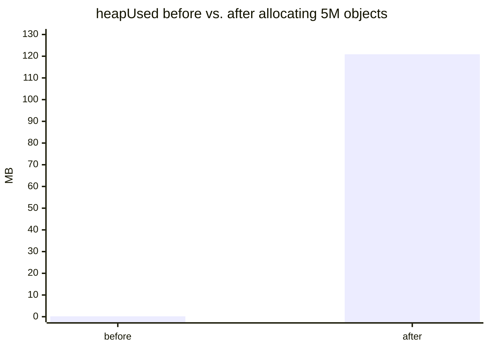

L1 and L2 covered the shape of a process and the fork+exec launch sequence conceptually. **This level proves each concept by actually observing it** — every example here was run and its real output captured, not hand-waved. Three languages appear on purpose: JS/Bun for the everyday fork+exec and memory-growth demos (they're what most of this project's examples already use), Python for `os.fork()` itself (JS has no direct syscall access, and `fork()`'s copy-on-write behavior is the whole point of this section), and C for a real segmentation fault (a managed runtime catches its own stack overflow before the OS has to — proving an actual kernel-level fault needs a language with raw pointers).

## Proving process isolation: separate PIDs, separate memory

Every process gets a distinct PID and its own address space, even when it's running code spawned by another process:

```js
// pids.mjs
import { spawn } from "node:child_process";

console.log("parent pid:", process.pid);

const child = spawn("node", ["-e", "console.log('child pid:', process.pid)"]);
child.stdout.on("data", (d) => process.stdout.write(d));
child.on("exit", (code) => console.log("child exited with", code));
```

Running it with `bun run pids.mjs`:

```
parent pid: 61241
child pid: 61278
child exited with 0
```

Two different PIDs, two separate address spaces, even though the child's code came from a string literally embedded in the parent's source. `spawn()` here is Node/Bun's wrapper around the same fork+exec mechanism from L2 — the child doesn't share the parent's heap or stack; it gets its own, freshly laid out by the kernel.

**That proves separate PIDs. It doesn't yet prove separate memory** — for that, JS's `spawn()` is the wrong tool, because it always execs a brand-new program; it never lets you inspect the moment right after `fork()`, before `exec()` replaces anything. Python's `os.fork()` exposes that raw moment directly:

```python
# fork_isolation.py
import os

counter = 0
pid = os.fork()

if pid == 0:
    # child: this is a full (copy-on-write) duplicate of the parent's memory
    counter = 999
    print(f"child  pid={os.getpid()} counter={counter}")
else:
    # parent: waits for the child, then checks its OWN counter
    os.waitpid(pid, 0)
    print(f"parent pid={os.getpid()} counter={counter}")
```

```
$ python3 fork_isolation.py
child  pid=84213 counter=999
parent pid=84210 counter=0
```

This is L1's two-tabs scenario, reproduced on purpose: `counter` starts as `0` in one process, `fork()` duplicates that process, the child sets its own copy to `999`, and the parent's copy is completely unaffected — because after `fork()` returns, the two processes are backed by different physical pages the instant either one writes (this is the "copy-on-write" L2 mentioned: the pages start out _shared_ for efficiency, and only get physically copied the moment one side writes to them). There is no shared `counter` anywhere for the two processes to race over — the isolation isn't a lock or a convention, it's a structural fact about how `fork()` sets up memory.

## Proving the stack exists: overflowing it on purpose

L2's memory diagram claimed the stack grows with every function call and has a real, finite size. Unbounded recursion proves it:

```js
// stack.mjs
function recurse(depth) {
  return 1 + recurse(depth + 1);
}

try {
  recurse(0);
} catch (err) {
  console.log("Crashed:", err.constructor.name, "-", err.message);
}
```

```
Crashed: RangeError - Maximum call stack size exceeded.
```

Every call to `recurse` pushes a new stack frame (the return address, `depth`, and any other locals) without ever popping one, since each call happens before the previous one returns. The runtime doesn't let this grow forever — it tracks the stack's size and throws once it hits a limit, rather than actually letting the process's stack region collide with the heap or run off the end of its allocated space. This is a controlled failure specifically so a runaway recursion produces a catchable error instead of a raw segfault.

**But is that runtime guard actually standing in for something the kernel would otherwise do?** The next section answers that with a language that has no such guard.

## Proving a real segfault: what the runtime's catch was standing in for

C has no stack-limit check baked into the language — a runaway recursion in C walks straight into unmapped memory and lets the kernel handle it:

```c
/* segfault.c */
#include <stdio.h>

long recurse(long depth) {
    /* no base case reachable for any real input -- deliberately unbounded,
     * same shape as stack.mjs's recurse(), just without a runtime guard */
    return 1 + recurse(depth + 1);
}

int main(void) {
    printf("starting recursion...\n");
    fflush(stdout);
    long result = recurse(0);
    printf("never reached: %ld\n", result);
    return 0;
}
```

```
$ gcc -O0 -o segfault segfault.c
$ ./segfault
starting recursion...
Segmentation fault (core dumped)
$ echo $?
139
```

`139` is `128 + 11` — signal 11 is `SIGSEGV`. No `RangeError`, no catchable exception, no message about "maximum call stack size": the process's stack pointer walked past the last page the kernel had mapped for this process's stack region, the CPU's MMU raised a page fault on that access, the kernel looked up the faulting address in this process's page table, found no valid mapping, and delivered `SIGSEGV` — whose default action is to kill the process outright. This is exactly the segfault mechanism L1 described in the abstract ("the OS refusing an access to a virtual address that has no valid mapping") and L2's `NULL`-dereference note, just triggered by the stack running out instead of a bad pointer. JS's `RangeError` in the previous section is the runtime doing this same accounting itself, in software, specifically so it can hand back a catchable error instead of letting the process actually reach this point.

## Proving the heap grows: watching it happen

```js
// heap.mjs
function mb(bytes) {
  return (bytes / 1024 / 1024).toFixed(1) + "MB";
}

console.log("before:", mb(process.memoryUsage().heapUsed));

const bigArray = new Array(5_000_000).fill(0).map((_, i) => ({ i, sq: i * i }));

console.log("after: ", mb(process.memoryUsage().heapUsed));
console.log("kept alive so it isn't GC'd:", bigArray.length);
```

```
before: 0.2MB
after:  120.9MB
kept alive so it isn't GC'd: 5000000
```

`bigArray` isn't a fixed-size stack local — it's 5 million heap-allocated objects, referenced through a variable that itself lives on the stack (or in V8's equivalent). The `.map()` callback's closure, the array's backing storage, and every `{ i, sq }` object it creates all come from the heap, which is exactly why `heapUsed` jumps by over 100MB: this is dynamic allocation happening in real time, not a simulation of it.

## Proving the memory regions are real: reading them from the kernel

On Linux (including under WSL), `/proc/self/maps` is the kernel's own record of a process's virtual memory regions — not a diagram, the actual page table's contents as text:

```js
// maps.mjs
import { readFileSync } from "node:fs";

const maps = readFileSync("/proc/self/maps", "utf8");
const lines = maps
  .split("\n")
  .filter((l) => l.includes("[heap]") || l.includes("[stack]"));
for (const line of lines) console.log(line);
```

```
324d8000-324f9000 rw-p 00000000 00:00 0                                  [heap]
7fffec4aa000-7fffec4fd000 rw-p 00000000 00:00 0                          [stack]
```

Two address ranges, each labeled by the kernel with exactly the region name from L2's diagram, each with permissions `rw-` (readable, writable, not executable — code shouldn't live in either of these regions) and `p` (private — copy-on-write, not shared with another process). The heap's address (`0x324d8000`) is nowhere near the stack's (`0x7fffec4aa000`) — they really are two separate regions with a large gap between them, exactly as sketched. Notice the same `p` flag from `fork_isolation.py`'s COW behavior shows up here too — it's not a special case for `fork()`, it's how every private memory region in a process is marked.



## Failure modes and what they actually mean

**Stack overflow from recursion, not from a "bug" in the traditional sense.** Neither `stack.mjs` nor `segfault.c` above is a mistake in the code's logic — `recurse` is correctly implemented for what it does in both. The failure is architectural: any recursive function without a base case (or with a base case that's unreachable for some input) will eventually exhaust the stack, and the depth at which that happens depends on how much each frame costs (how many locals, how many arguments), not on the code being "wrong."

**A managed runtime's catch vs. an actual kernel fault.** JS catches its own stack limit in software before the OS has to — `segfault.c` shows what was actually being deferred: without that software guard, the _kernel_ is what stops the recursion, via `SIGSEGV`, because the next page past the stack has no valid mapping. Both are the same underlying limit; only who enforces it, and how gracefully, differs.

**Memory that "leaks" is memory the heap never releases.** `bigArray` in the heap example stays at 120MB for as long as something still references it. If nothing ever drops that reference (a global, a still-running closure, an event listener that's never removed), the garbage collector has no basis to reclaim it — from the OS's point of view, that's a process legitimately using its allocated pages; "leak" is a claim about the _program's_ logic (it doesn't need this memory anymore) that the OS and the GC have no way to verify on their own.

**Not every process actually needs a large heap or stack.** A process that never recurses deeply and never allocates dynamically can run fine with a tiny fraction of the address space actually backed by real memory — virtual address space is nearly free to reserve; only the pages a process actually touches get backed by physical RAM (this is why `/proc/self/maps` shows address _ranges_, not memory that's necessarily all resident).

## Beyond this worked example

Every proof above ran on one machine, with default OS limits, and a single fork/child. That's a case, not the whole territory — worth actually working through, not just reading:

- What happens to `fork_isolation.py`'s output if the child calls `os.fork()` _again_ before exiting — does the grandchild see the parent's original `counter`, the first child's `999`, or something else? Trace through the page-table/COW mechanics from L2 to reason about it before running it.
- `segfault.c` was compiled with `-O0` (no optimization). Would a highly-optimized build (`-O3`) still segfault the same way, or could the compiler's tail-call handling change how many real stack frames `recurse` actually consumes per call? What would you change in the code to make the answer independent of optimization level?
- Every example here assumed the default `ulimit -s` stack size. If a process's stack limit were raised to something enormous (`ulimit -s unlimited`), does that make stack overflow impossible, or just move where it happens — and what does that imply about treating a stack-size bump as a "fix" for unbounded recursion in a real service?
