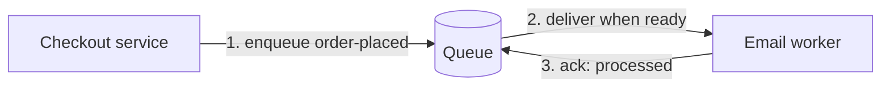
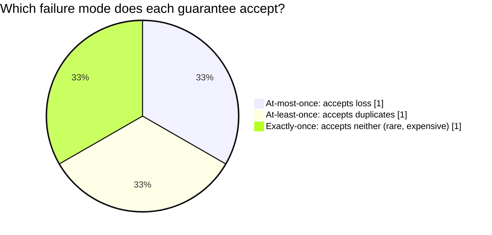

import Scenario from "../../../components/Scenario.astro";
import LevelIntro from "../../../components/LevelIntro.astro";

<Scenario label="The order confirmation email went out three times — and once, it never went out at all">
  <Fragment slot="facts">
    

      
📞 <strong>The direct call</strong> — checkout service calls the email service synchronously; if email is slow, checkout is slow too

      
💥 <strong>What happens when email is down</strong> — the call times out, checkout retries the whole request, and the order gets placed twice

      
📧 <strong>What happens when the network blips</strong> — the email actually sent, but the response never came back, so the caller retries — three emails, one order

    

  </Fragment>

Checkout calls the email service directly, over HTTP, and waits for a
response before it tells the customer "order placed." One night, the
email service is slow under load. Checkout's request to it times out,
so checkout's own retry logic fires — and resends the entire order
creation request. The order gets created twice. On another night, the
email actually sends successfully, but the response gets lost on the
way back; the caller, seeing no response, retries — and the customer
gets three copies of the same confirmation email. Both bugs come from
the same design choice: two systems are talking directly, in real
time, with no space between "I sent this" and "you received this."
**What would have to sit between checkout and email so a slow or
flaky email service stops being checkout's problem — and so a retry
doesn't turn into a duplicate?**

</Scenario>

<LevelIntro
  items={[
    "Why a queue decouples producers from consumers",
    "The three delivery guarantees: at-most-once, at-least-once, exactly-once",
    "Why 'exactly-once delivery' is usually really 'at-least-once delivery + idempotent processing'",
  ]}
/>

## A queue is a buffer with a promise attached

A **message queue** sits between a producer (checkout) and a consumer
(the email worker). The producer writes a message and moves on
immediately — it doesn't wait for the message to be processed, only
for the queue to confirm it accepted the message. The consumer reads
messages at its own pace, whenever it's ready, and processes each one
independently of when it arrived:

That gap between steps 1 and 2 is the entire point. Checkout's
response time to the customer no longer depends on whether the email
service is fast, slow, or temporarily down — checkout only waits for
the queue, which is a much smaller and more reliable promise to keep.
If the email worker crashes mid-shift, messages simply wait in the
queue until a worker (the same one restarted, or a new one) comes
back and reads them. Nothing is lost, and checkout was never blocked
waiting to find out.

## The promise a queue makes is not "exactly once"

Decoupling producer from consumer solves the blocking problem, but it
doesn't automatically solve the duplication and loss problem from the
Scenario — it just relocates it to a well-defined boundary: what does
the queue guarantee about how many times a consumer sees each
message?

| Guarantee         | What it means                                           | What can go wrong                                      |
| ----------------- | ------------------------------------------------------- | ------------------------------------------------------ |
| **At-most-once**  | A message is delivered zero or one times, never more    | A message can be silently lost — no retry on failure   |
| **At-least-once** | A message is delivered one or more times, never zero    | The same message can arrive twice (or more)            |
| **Exactly-once**  | A message is delivered — and processed — precisely once | Extremely hard to guarantee end-to-end; usually a myth |

Most production queues (SQS, RabbitMQ, Kafka in its default mode)
offer **at-least-once** delivery, because it's the only one of the
three that never silently drops a message — and losing a message is
almost always worse than seeing it twice, provided the consumer can
handle "twice" safely. That last clause is doing a lot of work, and
it's the subject of the rest of this unit.

## "Exactly-once" is usually a division of labor

**If exactly-once is so hard, how do systems that advertise it
actually work?** In almost every real system, "exactly-once" is not
one mechanism — it's at-least-once delivery from the queue, combined
with **idempotent processing** on the consumer side: the consumer is
built so that processing the same message twice has the same effect
as processing it once. The queue keeps its easier promise (never
lose a message); the consumer keeps its own promise (never double
the _effect_ of a message it's already handled). Put together, the
customer only ever sees one confirmation email, even if the queue
quietly delivered that message twice.

That reframing — stop trying to make delivery exactly-once, make
processing idempotent instead — is the single idea this unit spends
the most time on, starting in L2.
