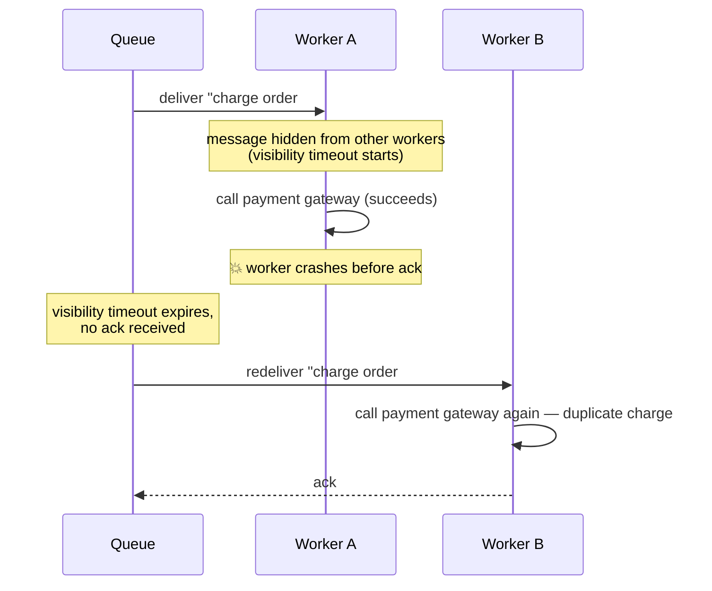
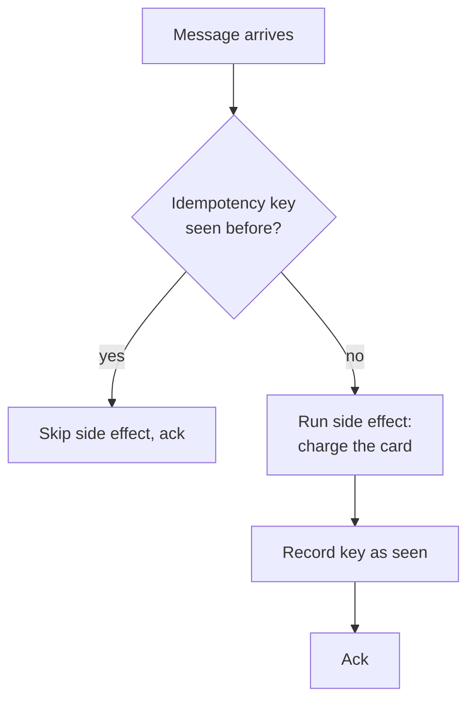
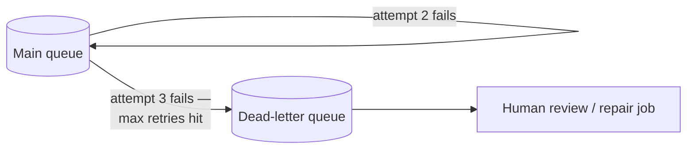

import Scenario from "../../../components/Scenario.astro";
import LevelIntro from "../../../components/LevelIntro.astro";
import Checkpoint from "../../../components/Checkpoint.astro";

<Scenario label="The worker crashed after charging the card, but before telling the queue it was done">
  <Fragment slot="facts">
    

      
💳 <strong>What the worker did</strong> — read the "charge card" message, called the payment gateway, the charge succeeded

      
💀 <strong>What happened next</strong> — the worker process crashed before it could tell the queue "I'm done with this message"

      
🔁 <strong>What the queue does</strong> — having heard nothing back, it assumes the worker died mid-task and redelivers the same message to another worker

    

  </Fragment>

A worker pulls a "charge $89.00 to order #4471" message off the queue,
calls the payment gateway, and the charge succeeds. Before the worker
can tell the queue "I finished processing that message," the worker
process crashes — an out-of-memory kill, a deploy, a network
partition, it doesn't matter which. The queue, having received no
confirmation, assumes the message was never actually handled and
redelivers it to the next available worker. That worker calls the
payment gateway again, with the exact same order ID. **The queue did
exactly what it promised — at-least-once delivery, nothing lost. So
where, specifically, does the responsibility for "the customer was
charged twice" actually sit, and what has to change to fix it?**

</Scenario>

<LevelIntro
  items={[
    "Ack/nack and visibility timeouts: how a queue decides a message needs redelivery",
    "Idempotency keys: making a duplicate message a no-op",
    "Ordering, dead-letter queues, and backpressure",
  ]}
/>

## Ack, nack, and the visibility timeout

**How does a queue decide a message was "never handled" and needs
redelivery, if the worker that was handling it just silently died?**
It can't ask the dead worker — so it uses a timer instead. When a
consumer reads a message, most queues don't delete it immediately;
they make it temporarily invisible to other consumers for a
**visibility timeout** (SQS's term; RabbitMQ and Kafka have direct
equivalents) and wait for one of two signals:

- **Ack** (acknowledge) — the consumer finished processing and tells
  the queue to delete the message for good.
- **Nack** (negative-acknowledge) — the consumer explicitly says "I
  couldn't process this," and the queue makes it visible again
  immediately instead of waiting out the timer.

If neither signal arrives before the visibility timeout expires — the
exact situation in the Scenario, a worker that died mid-task — the
queue assumes the worst and redelivers the message to another
consumer:

This is the mechanism, in full, that produces every duplicate a
queue-based system will ever see: a message was delivered, the
_effect_ of processing it happened, but the _acknowledgment_ didn't
make it back in time. The queue has no way to distinguish "the worker
died before doing anything" from "the worker died after doing
everything except sending the ack" — so, true to at-least-once,
it always redelivers rather than risk silently losing the message.

<Checkpoint question="A worker nacks a message immediately because a downstream dependency is down, rather than letting the visibility timeout expire naturally. What's the practical benefit of nacking explicitly instead of just doing nothing and waiting for the timeout?">

Nacking makes the redelivery happen immediately instead of waiting
out the full visibility timeout (often 30 seconds to several
minutes), so a genuinely-failed message gets retried much sooner —
and other consumers aren't left idle for that whole window while a
message that's already known to have failed sits invisible in the
queue for no reason. The end state is the same either way (the
message comes back), but nacking turns "the queue eventually notices
nothing happened" into "the worker actively reports what happened,"
which is strictly more information and strictly faster.

</Checkpoint>

## Idempotency keys: making the duplicate a no-op

**Given that redelivery is a permanent feature of at-least-once
delivery, not a bug to be eliminated, where does the fix actually
belong?** Not in the queue — in the consumer. The consumer needs a way
to recognize "I have already fully processed this exact message"
and, on seeing it again, skip the side effect while still acking
normally. The standard mechanism is an **idempotency key**: a stable
identifier — the message's own ID, or a business key like
`orderId + operation` — checked against a store of keys already
processed before the side effect runs:

The dedupe store has to survive exactly as long as redelivery can
plausibly happen — if it's an in-memory `Set` that resets when the
worker restarts, it protects against nothing, since the worker
restarting is precisely the scenario that triggers redelivery in the
first place. In practice this means a small database table or a
cache like Redis, with a time-to-live comfortably longer than the
queue's maximum redelivery window. L3 builds this as real code,
including the race condition that shows up when two workers check the
same key at nearly the same instant.

## Ordering, dead-letter queues, and backpressure

Three more properties round out how a queue behaves under real load,
each answering a different failure mode than duplication:

- **Ordering.** A standard queue makes no promise that messages come
  out in the order they went in — two workers pulling concurrently
  will naturally interleave. A FIFO (or partitioned, as in Kafka)
  queue trades some throughput for guaranteeing order, but only
  _within_ a given ordering key (e.g. all messages for one
  `orderId`) — global ordering across every producer rarely scales.
- **Dead-letter queue (DLQ).** A message that fails processing
  repeatedly — a permanently malformed payload, a bug that throws
  every time — would otherwise retry forever, burning worker time on
  a message that can never succeed. After a configured number of
  redelivery attempts, the queue routes it to a separate DLQ instead,
  where it waits for a human or a repair job rather than looping.
- **Backpressure.** If producers write messages faster than
  consumers can process them, the queue's depth grows without bound.
  A queue on its own doesn't fix this — it only buys time — so real
  systems pair it with monitoring on queue depth/consumer lag and a
  plan for scaling consumers or shedding load before the buffer
  becomes the outage.

<Checkpoint question="A team sets their DLQ's max-retry count to 1 — a message that fails even once is immediately moved to the DLQ. What's the risk of setting it that low, compared to something like 5?">

Setting it to 1 stops treating retries as a defense against
_transient_ failures — a payment gateway that times out once under a
brief load spike, or a downstream service mid-deploy for two seconds,
would get exiled to the DLQ on the very first hiccup, even though a
second attempt moments later would very likely have succeeded on its
own. A low retry count is appropriate for permanent failures
(malformed data that will never parse), but conflates them with
transient ones, pushing normal, self-resolving blips into a queue
that's supposed to be reserved for messages that genuinely need human
attention.

</Checkpoint>
