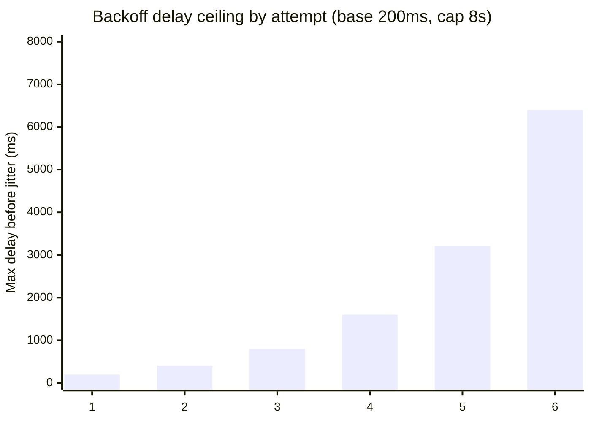

import Scenario from "../../../components/Scenario.astro";
import LevelIntro from "../../../components/LevelIntro.astro";
import Checkpoint from "../../../components/Checkpoint.astro";

<Scenario label="Code review: this consumer 'handles duplicates' — does it, really?">
  <Fragment slot="facts">
    <div class="not-prose flex flex-col gap-2 text-sm text-slate-700 dark:text-slate-300">
      <div class="flex items-center gap-1.5"><span>📝</span> <strong>The PR's claim</strong> — "added a Set to track processed order IDs, so duplicates are now handled"</div>
      <div class="flex items-center gap-1.5"><span>⚠️</span> <strong>What the reviewer notices</strong> — the Set is a plain in-memory JS <code>Set</code>, local to one worker process</div>
      <div class="flex items-center gap-1.5"><span>🔀</span> <strong>What isn't tested</strong> — two workers processing the same redelivered message at nearly the same instant</div>
    </div>
  </Fragment>

A pull request adds duplicate protection to the payment worker: a
`processedOrderIds` `Set`, checked before charging a card and updated
right after. The author's test — send the same message twice through
one worker, in sequence — passes, and the PR is titled "fix: handle
duplicate messages." A reviewer points out two problems before
approving it: first, this worker runs as three replicas behind the
same queue, so a message redelivered to a _different_ replica sees an
empty `Set` and charges the card anyway; second, even on a single
replica, nothing stops two near-simultaneous deliveries from both
passing the "have I seen this?" check before either one finishes
recording that it has. **What does an idempotency check actually need
to be safe against concurrent, distributed workers — not just
sequential calls on one process?**

</Scenario>

<LevelIntro
  items={[
    "A real idempotent consumer backed by shared, atomic dedupe storage",
    "A retrying producer with exponential backoff and jitter",
    "Dead-letter routing, and the exact race condition the Scenario's PR missed",
  ]}
/>

## The dedupe store has to be shared and atomic

The reviewer's two objections both point at the same root cause: an
in-memory `Set` is neither **shared** (each replica has its own) nor
**atomic** (check-then-set is two separate operations, so two
concurrent calls can both pass the check before either one records
the result). A correct dedupe store needs both properties. Below is a
minimal, realistic implementation backed by a key-value store with an
atomic "set if not already present" operation — the same primitive
Redis's `SET key value NX` or a SQL `INSERT ... ON CONFLICT DO
NOTHING` provides:

```ts
// idempotent-consumer.ts

interface DedupeStore {
  // Atomically records `key` as seen. Returns true if this call was
  // the one that recorded it (i.e. it was NOT already present),
  // false if another caller already recorded it first. Must be a
  // single atomic operation — not a separate "has" then "set".
  markIfNew(key: string, ttlMs: number): Promise<boolean>;
}

// A simple in-memory stand-in for tests and for the exercises below.
// A real deployment would back this with Redis (SET NX PX) or a
// unique-constrained SQL table — never a bare in-process Set, exactly
// per the Scenario's review comment.
class InMemoryDedupeStore implements DedupeStore {
  private seen = new Map<string, number>(); // key -> expiresAt

  async markIfNew(key: string, ttlMs: number): Promise<boolean> {
    const now = Date.now();
    const expiresAt = this.seen.get(key);
    if (expiresAt !== undefined && expiresAt > now) {
      return false; // already seen and not yet expired
    }
    this.seen.set(key, now + ttlMs);
    return true;
  }
}

interface ChargeMessage {
  messageId: string;
  orderId: string;
  amountCents: number;
}

interface PaymentGateway {
  charge(orderId: string, amountCents: number): Promise<{ chargeId: string }>;
}

const DEDUPE_TTL_MS = 24 * 60 * 60 * 1000; // must exceed max possible redelivery window

async function processChargeMessage(
  message: ChargeMessage,
  store: DedupeStore,
  gateway: PaymentGateway,
): Promise<{ charged: boolean }> {
  // The idempotency key is the message's own ID: the queue guarantees
  // a redelivered message keeps the same ID, so this is stable across
  // however many times the queue chooses to deliver it.
  const isNew = await store.markIfNew(message.messageId, DEDUPE_TTL_MS);
  if (!isNew) {
    // Someone (this worker, or a concurrent replica) already claimed
    // this message. Skip the side effect but still ack — the work is
    // either done or in flight, not this call's responsibility.
    return { charged: false };
  }

  await gateway.charge(message.orderId, message.amountCents);
  return { charged: true };
}
```

The key move is that `markIfNew` is a **single atomic call**, not
"check, then decide, then set." Two replicas racing to process the
same redelivered message both call `markIfNew` with the same key; the
underlying store guarantees exactly one of those calls gets `true`
back, no matter how close together they arrive — that's what "atomic"
buys, and it's the exact property a plain `Set.has()` /
`Set.add()` pair doesn't have once two calls can interleave between
them.

<Checkpoint question="If DEDUPE_TTL_MS were set to 60 seconds, but the queue's visibility timeout is 5 minutes, what failure could slip through?">

A message could be redelivered _after_ the dedupe key already
expired and was evicted from the store — the queue's own redelivery
window (5 minutes) outlasts the window during which the consumer
still remembers having handled the message (60 seconds). At that
point the consumer sees what looks like a brand-new message and
charges the card again, defeating the entire mechanism. The dedupe
TTL has to comfortably exceed every plausible redelivery window, not
just the common case — this is exactly why the code comment above
calls it out.

</Checkpoint>

## A retrying producer: backoff and jitter, not a tight loop

Idempotency handles the consumer side of "seen twice, no problem."
The producer side has its own failure mode: what should happen when
_writing_ to the queue itself fails — a network blip, the queue
temporarily rejecting writes under load? Retrying immediately in a
tight loop is the worst option available: it adds load to a system
that's already struggling, and if many producers retry in lockstep,
they create a synchronized thundering herd the moment the queue
recovers. **Exponential backoff with jitter** fixes both problems —
each retry waits longer than the last, and a random component spreads
retries out so they don't all land on the same millisecond:

```ts
// retrying-producer.ts

interface QueueClient {
  enqueue(message: unknown): Promise<void>;
}

interface BackoffOptions {
  maxAttempts: number;
  baseDelayMs: number;
  maxDelayMs: number;
}

function computeBackoffDelayMs(
  attempt: number, // 1-indexed: first retry is attempt 1
  options: BackoffOptions,
): number {
  const exponential = options.baseDelayMs * 2 ** (attempt - 1);
  const capped = Math.min(exponential, options.maxDelayMs);
  // Full jitter: a random value between 0 and the capped delay, so
  // concurrent producers retrying after the same failure don't all
  // wake up on the same tick.
  return Math.random() * capped;
}

async function enqueueWithRetry(
  client: QueueClient,
  message: unknown,
  options: BackoffOptions,
  sleep: (ms: number) => Promise<void> = (ms) =>
    new Promise((resolve) => setTimeout(resolve, ms)),
): Promise<void> {
  let lastError: unknown;

  for (let attempt = 1; attempt <= options.maxAttempts; attempt++) {
    try {
      await client.enqueue(message);
      return;
    } catch (err) {
      lastError = err;
      if (attempt === options.maxAttempts) break;
      await sleep(computeBackoffDelayMs(attempt, options));
    }
  }

  throw new Error(
    `enqueue failed after ${options.maxAttempts} attempts: ${String(lastError)}`,
  );
}
```



The chart shows the _ceiling_ each attempt can wait up to — jitter
then picks a random point under that ceiling for the actual delay, so
no two producers retrying from the same failure converge on the exact
same wait. Note this retry logic lives entirely on the **producer**
side, protecting the write into the queue; it's a completely separate
mechanism from the queue's own redelivery-to-consumers behavior
covered in L2 — a system can need both, working independently at
different boundaries.

## Dead-letter routing as an explicit decision, not a default

L2 introduced the DLQ conceptually; here's the routing decision made
concrete as a function a consumer would actually call after a failed
processing attempt, distinguishing a retryable failure from a
permanent one instead of treating every failure identically:

```ts
// dlq-routing.ts

interface ProcessingFailure {
  attemptNumber: number;
  error: Error;
}

type RoutingDecision =
  { action: "retry" } | { action: "dead-letter"; reason: string };

const MAX_ATTEMPTS = 5;

// Errors that will never succeed no matter how many times they're
// retried — a malformed payload, a validation failure — should be
// dead-lettered immediately rather than burning through all 5
// attempts first.
class PermanentError extends Error {}

function decideRouting(failure: ProcessingFailure): RoutingDecision {
  if (failure.error instanceof PermanentError) {
    return {
      action: "dead-letter",
      reason: `permanent: ${failure.error.message}`,
    };
  }
  if (failure.attemptNumber >= MAX_ATTEMPTS) {
    return {
      action: "dead-letter",
      reason: `exceeded ${MAX_ATTEMPTS} attempts: ${failure.error.message}`,
    };
  }
  return { action: "retry" };
}
```

This is a small function, but the distinction it draws — is this
error a fact about the message (never going to succeed), or a fact
about the current moment (a transient outage that will very likely
clear)? — is exactly the gap the L2 checkpoint on max-retry-count-of-1
was pointing at: a system that can't tell the two apart either wastes
attempts on unfixable messages or gives up too early on fixable ones.

<Checkpoint question="Suppose PermanentError gets thrown for a message that actually just hit a temporary database outage, because a developer mis-categorized the exception. What's the practical consequence, compared to the same mis-categorization the other direction (a genuinely permanent error thrown as a plain Error)?">

Mis-categorizing a transient failure as `PermanentError` sends a
perfectly recoverable message straight to the DLQ after one attempt,
where it sits until a human notices and manually reprocesses it — an
availability cost (a real order doesn't get charged/fulfilled on
time) but not a correctness cost, since a human can just retry it
once the outage clears. The other direction — a genuinely permanent
error thrown as a plain `Error` — is worse: the message retries all
the way to `MAX_ATTEMPTS`, guaranteed to fail every single time,
burning worker capacity and delaying the DLQ arrival (and the human
attention it needs) by however long those wasted retries take. Same
bug, but the two directions fail differently: one wastes time before
correctly escalating, the other wastes time and still escalates late.

</Checkpoint>

This unit's worked examples cover one shape of the problem — a
single message type, one payment gateway, one dedupe store. What
would change if the message needed to update _two_ independent
systems (charge a card **and** decrement inventory) where only one
might fail? That's no longer solvable with idempotency alone; it's
the outbox pattern and distributed-transaction trade-offs, a natural
next problem once this one is solid.
