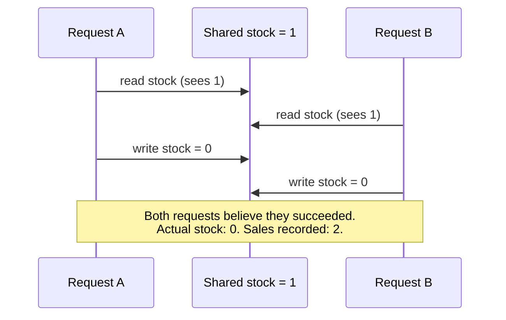

## Time-of-check to time-of-use

**If "check stock, then decrement it" is correct on its own, where
exactly does the bug live?** It lives in the gap between the check and
the use — the moment where request A has already read the shared value
but hasn't yet written its update, and request B reads the same
(now-stale) value in that window. This pattern has a name:
**time-of-check to time-of-use (TOCTOU)**. The sequence diagram below
is the oversold-item bug from L1, laid out step by step.

Neither request did anything wrong by itself. Request A's read, check,
and write are each individually correct. So is Request B's. The bug
only exists in the interleaving — B's read landing in the gap after
A's read but before A's write.

## Closing the gap: two different strategies

**Once you see the gap, there are two structurally different ways to
close it — what are they?**

| Strategy       | What it does                                                                                                                | When it fits                                                                                                                                             |
| -------------- | --------------------------------------------------------------------------------------------------------------------------- | -------------------------------------------------------------------------------------------------------------------------------------------------------- |
| Make it atomic | Collapse the check and the update into one indivisible operation, so no other request can read a value that's already stale | The check and the update touch the same single resource, and the datastore itself can express the condition (e.g. "decrement only if greater than zero") |
| Use a lock     | Let one operation claim exclusive access to the critical section, forcing every other operation to wait its turn            | The critical section spans multiple resources or an operation that can't be expressed as a single atomic step                                            |

Atomicity is usually the cheaper fix when it's available — it doesn't
make anyone wait, it just makes the operation itself uninterruptible.
Locks are more general (they work no matter how complicated the
critical section gets) but they cost throughput: every request that
arrives while the lock is held has to sit and wait.

## Why "just add an if-check" doesn't fix it

**If the original code already had `if (stock > 0)` before
decrementing, why didn't that check prevent the bug?** Because the
check ran, and passed, for both requests — the check itself was never
wrong, it just wasn't protected from being read twice before either
write landed. Adding more checks, retries, or even a delay before the
write doesn't close the gap; it just changes its size. The only fixes
that actually work are the two in the table: remove the gap by making
the operation atomic, or make everything else wait outside the gap
with a lock.

## The generalizable lesson

**Is this specific to inventory counts?** No — the same shape shows up
anywhere multiple operations read a shared value, decide something
based on it, and write back a change: bank balances, seat bookings,
rate limiters, unique-username checks, incrementing an ID counter.
Every one of these is a TOCTOU gap waiting to be exploited by
unlucky (or, in security contexts, deliberately induced) timing, and
every one of them is fixed the same two ways.
