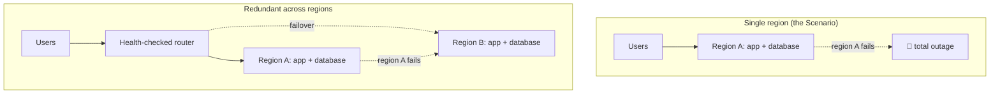

import Scenario from "../../../components/Scenario.astro";
import LevelIntro from "../../../components/LevelIntro.astro";

<Scenario label="The checkout service had no bugs on the day it went down for six hours.">
  <Fragment slot="facts">
    

      
🌎 <strong>Where it ran</strong> — one AWS region, one database, one everything

      
🔻 <strong>What happened</strong> — that region's control plane failed for six hours

      
💸 <strong>The result</strong> — zero checkouts anywhere in the world for six hours, with no other copy of the system to fall back to

    

  </Fragment>

The checkout service ran entirely inside one AWS region: one set of
servers, one database, one load balancer. It had passed every code
review, every test suite, every load test. Then, on an ordinary
Tuesday, that region's control plane failed — not the company's code,
the region itself. For six hours, there was no other running copy of
the system anywhere on the planet, so there was nothing to fail over
to. Every customer, everywhere, saw the same error page. **The team
had spent months hardening the application. Nobody had asked what
happens when the ground the application stands on disappears.**

</Scenario>

<LevelIntro
  items={[
    "Why redundancy has to exist above the level of a single machine or region",
    "The four terms that define how well a system survives an outage",
    "Active-passive vs. active-active, and what each one costs",
  ]}
/>

## The shape of the problem

A single copy of a system, however well-built, has a single point of
failure that no amount of application-level code quality can fix: the
region it runs in. **Redundancy** means running more than one
independent copy of a system — ideally in more than one region — so
that the failure of one copy doesn't take down the whole thing.
**Failover** is the act of shifting traffic away from a failed copy
and onto a healthy one. **Disaster recovery (DR)** is the broader
plan for restoring service after a large-scale failure — a full
region loss, not just one server crashing.

## Key terms

- **RTO (Recovery Time Objective)** — how long the system is allowed
  to be down before service is restored. A 6-hour outage against a
  5-minute RTO is a failed disaster recovery plan, even if the system
  eventually came back.
- **RPO (Recovery Point Objective)** — how much data the system is
  allowed to lose, measured as a span of time. An RPO of 30 seconds
  means: after failover, at most the last 30 seconds of writes may be
  gone.
- **Active-passive** — one region serves all live traffic; a second
  region stands by, ready to take over, but does no work until a
  failover happens.
- **Active-active** — more than one region serves live traffic at the
  same time; if one fails, the others simply absorb its share.

## Active-passive vs. active-active

|                 | Active-passive                            | Active-active                                             |
| --------------- | ----------------------------------------- | --------------------------------------------------------- |
| Normal-day cost | Standby region mostly idle                | Every region fully utilized                               |
| Typical RTO     | Minutes (failover has to happen)          | Seconds to none (already serving)                         |
| Complexity      | Lower — one region is the source of truth | Higher — must handle concurrent writes in multiple places |
| Best fit        | Most business systems                     | Systems where even a short failover gap is unacceptable   |

Redundancy is not free, and more redundancy is not automatically
better — it's a deliberate trade against cost and complexity, sized
to how bad an outage would actually be for that specific system.

## What this unit covers

L2 works through how a failover actually happens mechanically — health
checks, replication modes, and why RTO and RPO are driven by different
parts of the system. L3 implements a health-check-driven failover
router, an RPO exposure calculator, and a multi-region availability
calculator, and applies all three back to the Scenario's six-hour
outage.
