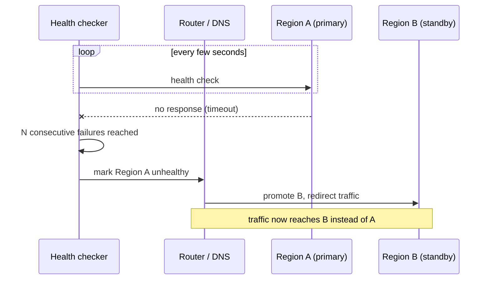
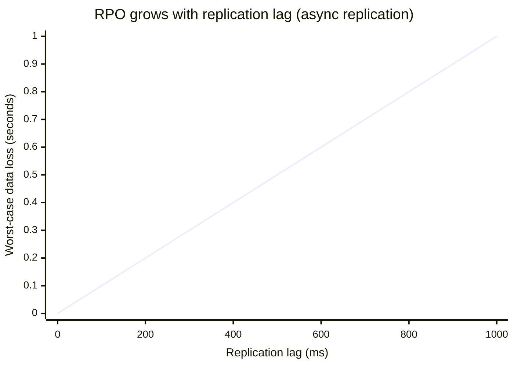

import LevelIntro from "../../../components/LevelIntro.astro";
import Checkpoint from "../../../components/Checkpoint.astro";

L1 named RTO, RPO, active-passive, and active-active. This level works
through the actual mechanics: how a router decides a region is down,
how replication mode determines how much data can be lost, and why a
lower RTO and a lower RPO are usually bought with different kinds of
engineering effort.

<LevelIntro
  items={[
    "The three-step mechanics of a failover: detect, decide, redirect",
    "Why replication mode — not the failover mechanism — sets the RPO",
    "Split-brain, and why an odd-numbered quorum prevents it",
  ]}
/>

## Detect, decide, redirect

**A region "goes down." Concretely, what has to happen before traffic
actually reaches a healthy region instead?** Three distinct steps,
each with its own failure modes:

1. **Detect** — something has to notice Region A stopped responding.
   This is never instant: a single missed health check could be a
   blip, so real systems require several consecutive failures before
   declaring a region down, trading detection speed for avoiding
   false alarms.
2. **Decide** — once Region A is marked unhealthy, something has to
   decide Region B should now take over. In active-passive, this
   usually means "promoting" the standby (for a database, this can
   mean turning a read replica into a writable primary).
3. **Redirect** — traffic actually has to start reaching Region B.
   This can be DNS record updates (slow — clients and resolvers cache
   old records), a global load balancer with health-aware routing
   (faster), or an anycast IP that reroutes at the network layer
   (fastest, but not always available).

**Every one of those three steps takes time, and RTO is the sum of
all three** — not just "how fast is the failover mechanism." A
sophisticated router that redirects instantly is still bottlenecked by
a slow detector, and a fast detector is still bottlenecked by clients
holding a stale DNS record for its full TTL.

<Checkpoint question="A team cuts their DNS TTL from 300 seconds to 10 seconds and calls their RTO problem solved. Are they right?">

Only partly. Lowering the DNS TTL shrinks how long clients hold onto a
stale record after failover — that's a real improvement to the
_redirect_ step. But it does nothing for the _detect_ step (how many
consecutive failed health checks are required before Region A is even
declared down) or the _decide_ step (how long it takes to promote
Region B, which for a database can mean waiting for replayed
transaction logs to catch up). RTO is the sum of detect + decide +
redirect; fixing one term doesn't fix the total unless the other two
were already fast.

</Checkpoint>

## What actually sets the RPO

**If the failover mechanism above is fast, does that mean no data is
lost?** No — RPO isn't decided by how fast failover happens, it's
decided entirely by how far behind the standby's copy of the data was
_at the moment of failure_, which is a property of replication, not
of the router.

| Replication mode | How it works                                                            | Typical RPO                                          | Cost                                                                 |
| ---------------- | ----------------------------------------------------------------------- | ---------------------------------------------------- | -------------------------------------------------------------------- |
| Asynchronous     | Primary acknowledges a write immediately; replicas catch up afterward   | Seconds to minutes (whatever the lag was at failure) | Low latency on writes                                                |
| Synchronous      | Primary waits for the replica to confirm before acknowledging the write | Near zero                                            | Higher write latency, and writes stall if the replica is unreachable |
| Semi-synchronous | Primary waits for _at least one_ of several replicas to confirm         | Near zero, with more availability than full sync     | Latency between the two above                                        |

Asynchronous replication is the common default because it keeps
writes fast — but it means that at the exact instant Region A fails,
whatever writes hadn't yet reached Region B are gone. That gap is the
RPO, and it's a direct consequence of the replication lag at the
moment of failure, not of anything the failover router does.

<Checkpoint question="A system uses synchronous replication and a failover router that takes 90 seconds to detect and redirect around a failed region. What's the approximate RPO, and what's the approximate RTO?">

RPO is near zero — synchronous replication means the primary never
acknowledged a write the replica hadn't already confirmed, so there's
essentially no un-replicated data to lose regardless of how the
failure happened. RTO is roughly 90 seconds — that number comes
entirely from the router's detect-decide-redirect mechanics, which is
a separate concern from replication mode. This is the core point:
RPO and RTO are set by two different subsystems (replication vs.
failover mechanics), so improving one doesn't automatically improve
the other.

</Checkpoint>

## Split-brain: the failure mode redundancy itself can cause

**Can adding a second region ever make things worse instead of
better?** Yes — if Region A isn't actually dead, just unreachable from
the health checker (a network partition), and Region B gets promoted
to primary anyway, both regions now believe they're the writable
primary. Clients writing to either one produce two diverging copies of
the data — this is **split-brain**, and reconciling it after the fact
can be worse than the original outage.

The standard defense is a **quorum**: a failover decision requires
agreement from a majority of an odd number of independent voters (for
example, 3 or 5 monitoring nodes spread across separate failure
domains), not a single health checker's opinion. An odd number avoids
a tie; a majority requirement means a network partition can produce
at most one side with a majority, so at most one region can ever
legitimately promote itself — the minority side has no quorum and
correctly refuses to act as primary.

## Failure modes at this level

- **Assuming a fast failover mechanism means low RPO.** RPO is set by
  replication mode and lag at the moment of failure, not by how
  quickly the router reacts afterward.
- **Using a single health checker to decide failover.** One
  checker's view of "Region A is down" might just mean "Region A is
  unreachable from where I'm standing" — a network partition, not an
  actual outage — which is exactly the setup that causes split-brain.
- **Testing failover paths only during clean, deliberate drills.**
  Detect → decide → redirect is easy to test one step at a time; the
  interactions between slow detection, a stale DNS cache, and an
  in-flight replica promotion only show up under a real, messy
  failure.
- **Treating "RTO" and "RPO" as one combined number.** They're driven
  by different subsystems and usually require different investments
  to improve — quoting a single "our DR is 5 minutes" figure without
  separating the two hides which one actually needs work.
