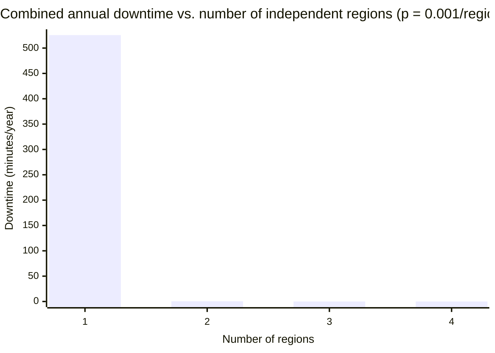

import LevelIntro from "../../../components/LevelIntro.astro";
import Checkpoint from "../../../components/Checkpoint.astro";

L2 covered the detect-decide-redirect mechanics of failover and why
replication mode — not the router — sets the RPO. This level builds
three small, real pieces: a health-check-driven failover router with
quorum-based detection, a function that turns replication-lag data
into an RPO exposure estimate, and a calculator for how availability
compounds across independent regions.

<LevelIntro
  items={[
    "A quorum-based health checker that avoids acting on a single voter's opinion",
    "A failover router built on top of it, with promote/demote state",
    "An RPO exposure calculator and a multi-region availability estimate",
  ]}
/>

## A quorum-based health checker

**A single health checker declaring "Region A is down" was L2's
split-brain risk. Here's a checker that requires majority agreement
from several independent voters before it will say so.**

```js
function quorumVerdict(voterReports) {
  // voterReports: array of booleans, one per independent voter,
  // true = "this voter can reach Region A".
  const total = voterReports.length;
  const reachable = voterReports.filter(Boolean).length;
  const quorum = Math.floor(total / 2) + 1;
  if (reachable >= quorum) return "healthy";
  if (total - reachable >= quorum) return "unhealthy";
  return "no-quorum"; // neither side has a majority — don't act
}
```

```js
quorumVerdict([true, true, true]); // "healthy" — 3/3 reachable
quorumVerdict([false, false, true]); // "unhealthy" — 2/3 unreachable, quorum reached
quorumVerdict([false, true]); // "no-quorum" — even split, 2 voters can't form a majority
```

With 3 voters, quorum is 2 — a single voter's disagreement (a network
blip local to just that one checker) can't flip the verdict on its
own, and `"no-quorum"` is a deliberate third outcome: when neither
side has a majority, the function refuses to declare a verdict rather
than guessing, which is exactly what prevents a network partition
from causing both regions to promote themselves.

**Why does this function return `"no-quorum"` instead of just picking
the majority side, even with an even number of voters?** Because
guessing is the split-brain risk in disguise — if two voters say
reachable and two say unreachable, treating that as "unhealthy" would
promote a standby against a primary that might be perfectly fine,
just partitioned from exactly those two voters. Refusing to act is
the safe default; this is also why quorum sizes are chosen odd in
practice (an odd total makes an even split impossible).

<Checkpoint question="With 5 voters instead of 3, how many would need to report the region unreachable before quorumVerdict returns 'unhealthy', and why does that make split-brain harder to trigger?">

Quorum with 5 voters is `Math.floor(5/2) + 1 = 3`, so at least 3 of
the 5 independent voters must agree the region is unreachable. That
makes split-brain harder to trigger because a network partition would
have to isolate at least 3 of the 5 voters from Region A specifically
— a much narrower, more specific failure than a single voter losing
connectivity. More independent voters, spread across separate failure
domains, shrink the set of partitions that can fool the quorum into a
wrong verdict.

</Checkpoint>

## A failover router built on top of it

**Given a trustworthy verdict, here's the router that actually
promotes a standby and tracks which region is currently primary.**

```js
class FailoverRouter {
  constructor(regions) {
    this.regions = regions; // e.g. ["region-a", "region-b"]
    this.primary = regions[0];
    this.consecutiveUnhealthy = 0;
    this.unhealthyThreshold = 3;
  }

  reportVerdict(verdict) {
    if (verdict === "unhealthy") {
      this.consecutiveUnhealthy++;
      if (this.consecutiveUnhealthy >= this.unhealthyThreshold) {
        this._failover();
      }
    } else if (verdict === "healthy") {
      this.consecutiveUnhealthy = 0;
    }
    // "no-quorum" is deliberately ignored — neither counted as a
    // failure nor a recovery, since it carries no reliable signal.
  }

  _failover() {
    const standby = this.regions.find((r) => r !== this.primary);
    if (!standby) return;
    this.primary = standby;
    this.consecutiveUnhealthy = 0;
  }
}
```

```js
const router = new FailoverRouter(["region-a", "region-b"]);
router.primary; // "region-a"

router.reportVerdict("unhealthy");
router.reportVerdict("unhealthy");
router.primary; // still "region-a" — threshold not yet reached

router.reportVerdict("unhealthy");
router.primary; // "region-b" — failed over after 3 consecutive unhealthy verdicts
```

Requiring `unhealthyThreshold` consecutive unhealthy verdicts, not
just one, is the same detect-step trade-off from L2: a single bad
verdict could be a transient blip, so the router waits for a pattern
before it acts — at the direct cost of adding that many detection
cycles to the RTO.

## Turning replication lag into an RPO exposure estimate

**L2 said RPO comes from replication lag at the moment of failure —
here's what that looks like as a real calculation, run over sampled
lag data instead of a single number.**

```js
function estimateRpoExposure(lagSamplesMs, writesPerSecond) {
  const worstLagMs = Math.max(...lagSamplesMs);
  const rpoSeconds = worstLagMs / 1000;
  const worstCaseLostWrites = Math.round(rpoSeconds * writesPerSecond);
  return { rpoSeconds, worstCaseLostWrites };
}
```

```js
estimateRpoExposure([50, 120, 80, 340, 90], 200);
// worstLagMs is 340 → rpoSeconds: 0.34, worstCaseLostWrites: 68
```

Using the **worst** sampled lag, not the average, matters: failover
can happen at any moment, including the unlucky moment lag briefly
spiked, so an RPO estimate built on average lag would understate the
real exposure. `worstCaseLostWrites` translates the abstract "0.34
seconds of RPO" into a concrete number — 68 writes — that's a much
easier thing to hold a design conversation about than a duration
alone.

<Checkpoint question="A team reports 'our average replication lag is only 20ms, so our RPO is basically zero.' Using estimateRpoExposure's logic, what's wrong with that claim?">

RPO exposure has to be sized to the worst observed lag, not the
average — a failure can happen at any moment, and if it happens during
a lag spike (as in the sample above, where one reading hit 340ms
against an average much closer to 20ms), that spike's writes are what
gets lost. Reporting the average makes replication look far safer
than the actual worst case the system has already demonstrated it can
produce. A defensible RPO claim is built from the tail of the lag
distribution, not its center.

</Checkpoint>

## How availability compounds across independent regions

**If one region has some annual failure probability on its own, how
much does adding a second, independent region actually help?**

```js
function combinedAnnualDowntimeMinutes(
  perRegionFailureProbability,
  numRegions,
) {
  // Assumes independent regions and that the system is down only if
  // every region is simultaneously down (active-active semantics).
  const combinedProbability = Math.pow(perRegionFailureProbability, numRegions);
  const minutesPerYear = 365 * 24 * 60;
  return combinedProbability * minutesPerYear;
}
```

```js
combinedAnnualDowntimeMinutes(0.001, 1); // 525.6 minutes/year (~99.9% single-region)
combinedAnnualDowntimeMinutes(0.001, 2); // 0.5256 minutes/year — three orders of magnitude better
combinedAnnualDowntimeMinutes(0.001, 3); // 0.0005256 minutes/year
```

Because the regions are independent, their failure probabilities
_multiply_, not add — going from one region to two doesn't roughly
halve downtime, it can cut it by three orders of magnitude, because
both regions would have to fail during the same overlapping window.
This is the mathematical reason multi-region redundancy is such a
disproportionately large availability win compared to, say, doubling
capacity within a single region.



The catch, made explicit so it isn't mistaken for a free lunch:
**"independent" is doing all the work in that assumption.** If both
regions depend on the same DNS provider, the same certificate
authority, or the same central identity service, a failure in that
shared dependency takes both regions down together — the probabilities
no longer multiply, because the failures are correlated, not
independent. **Try extending it yourself:** how would you change
`combinedAnnualDowntimeMinutes` if 10% of each region's failures were
actually caused by a shared dependency that takes every region down
at once, rather than each region failing for fully independent
reasons?

## What generalizes and what doesn't

The core lesson — detection has to be quorum-based to avoid acting on
a partition, RPO is a property of replication lag rather than of the
router, and independent-region probabilities multiply rather than
add — applies to any redundant system: databases, message queues,
stateless services behind a load balancer. What's specific to this
worked example: the exact thresholds (3 consecutive unhealthy
verdicts, 5-voter quorum) and the 0.001 failure probability are
illustrative, not universal — a system with a stricter RTO needs a
lower threshold at the cost of more false positives, and a real
per-region failure probability should come from that provider's
actual historical data, not an assumed constant.

## Failure modes

| Failure mode                                                          | What it gets wrong                                                                                                                                  |
| --------------------------------------------------------------------- | --------------------------------------------------------------------------------------------------------------------------------------------------- |
| Acting on a single health checker's verdict                           | Exactly the split-brain setup from L2 — a network partition looks identical to a real outage from one checker's vantage point                       |
| Sizing RPO from average replication lag instead of worst-case         | Understates real exposure, since failure can land during a lag spike, not just during typical conditions                                            |
| Assuming regions are independent without checking shared dependencies | Correlated failures (shared DNS, shared identity provider) break the multiplication assumption and make actual downtime far worse than the estimate |
| Treating "no-quorum" the same as "unhealthy"                          | Turns an ambiguous, no-signal moment into a false failover, which is itself a source of unnecessary outages                                         |
