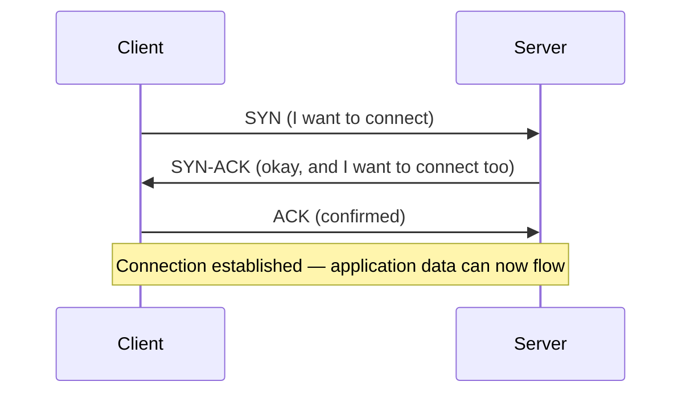

## Addresses and ports: reaching the right program on the right machine

**If an IP address identifies a machine, how does a message reach the
right program running on it?** A **port** is a number (0–65535) that
identifies a specific program's endpoint on that machine — an IP address
gets a message to the right computer, a port gets it to the right
program listening there:

```text
192.168.1.10:443   → this machine, the program listening on port 443 (HTTPS)
192.168.1.10:5432  → the SAME machine, a completely different program (PostgreSQL)
```

A single machine can run many programs simultaneously, each bound to its
own port — the OS routes incoming data to whichever program is listening
on the port a packet was addressed to.

## The three-way handshake: establishing a connection before any data flows

**Does a TCP connection just start sending data immediately?** No — TCP
establishes a connection first, via a three-step exchange, before either
side sends any application data:



This handshake is why TCP is called **connection-oriented** — both sides
agree the connection exists and negotiate initial sequence numbers before
any application-level message is exchanged. Contrast this with UDP, which
has no handshake at all: a UDP packet is sent with no guarantee it
arrives, no guarantee of order, and no established "connection" — useful
when speed matters more than reliability (live video, some game
networking), but the wrong choice when a chat message absolutely must
arrive intact and in order.

## Streams don't preserve message boundaries — framing has to

**Given that TCP only guarantees an ordered byte stream, how does an
application actually recover discrete messages from it?** By defining an
explicit **framing scheme** — a rule for how to find message boundaries
inside the raw bytes. Two common approaches:

```text
Newline-delimited: each message ends with '\n'
  '{"a":1}\n{"b":2}\n'  →  two messages, split on '\n'

Length-prefixed: each message is preceded by its own byte length
  '\x00\x00\x00\x07{"a":1}'  →  read 4 bytes for length (7),
                                  then read exactly 7 bytes as the message
```

Whichever scheme is chosen, the receiving side needs to **buffer**
incoming bytes across multiple `data` events until a complete message
boundary is actually found — never assume a single `data` event contains
exactly one message, because TCP makes no such promise.

## Why the localhost test never caught this

**If a framing bug is this fundamental, why did local testing pass?**
Because on localhost, the "network" is the machine's own loopback
interface — negligible latency, no real packet fragmentation, and small
test messages that comfortably fit in a single buffer flush. All of the
actual conditions that cause TCP to split or coalesce data happened not
to occur during testing, which made an incorrect assumption look correct
purely by coincidence of the test environment, not because the assumption
was actually safe.

| Signal                                                                    | What it should prompt                                                             |
| ------------------------------------------------------------------------- | --------------------------------------------------------------------------------- |
| Code reads exactly one message per `data`/`read` event, with no buffering | An assumption worth explicitly verifying, not trusting by default                 |
| All testing happens on localhost with small payloads                      | The exact conditions under which a framing bug would stay invisible               |
| A parse error appears only in production, never locally                   | A strong signal the issue is message-boundary-related, not a data-correctness bug |

## The generalizable lesson

**Is the fix "always use a well-known framing library" and stop
there?** That's a reasonable practical default, but the actual
transferable skill is recognizing _which_ layer of a system is
responsible for preserving structure — TCP guarantees byte order and
delivery, nothing about message boundaries — and never assuming a lower
layer provides a guarantee it explicitly doesn't make, whether the
system in question is a raw socket, a message queue, or any other stream
of bytes passed between two programs.
