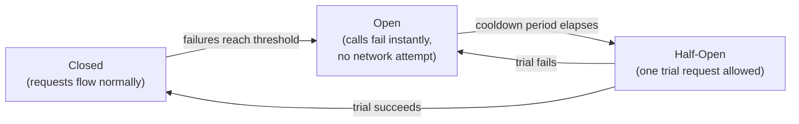

## Four techniques, four different parts of the same problem

**If a timeout already stops a call from hanging forever, why are
retries and circuit breakers needed too?** Because each technique
addresses a different part of what can go wrong when a dependency
degrades — a timeout alone doesn't decide what to do _after_ a call
fails, or protect a dependency that's already struggling from being
hit with the exact same failed request over and over:

| Technique          | What it actually solves                                                                                                                            |
| ------------------ | -------------------------------------------------------------------------------------------------------------------------------------------------- |
| Timeout            | Caps how long any single call can hold a resource, regardless of whether the dependency eventually responds                                        |
| Retry with backoff | Recovers from a brief, transient failure without giving up on the very first attempt                                                               |
| Circuit breaker    | Stops sending requests to a dependency that's clearly failing, protecting both the caller's resources and the struggling dependency from more load |
| Backpressure       | Lets an overloaded system signal upstream to slow down, instead of silently queuing until it collapses                                             |

**Would a timeout alone have fully solved the Scenario's outage?**
Partially — a timeout would stop each individual request from waiting
forever, freeing the resource sooner. But without a circuit breaker,
the order service would keep sending new requests to the still-slow
inventory service, each one still consuming a resource for the
duration of the timeout — better than hanging forever, but still
wasteful if the dependency is going to keep failing.

## The states a circuit breaker actually moves through

**Does a circuit breaker just permanently stop calling a failing
dependency once it trips?** No — it's designed to periodically check
whether the dependency has recovered, moving through three distinct
states:

**Closed** is the normal state — requests flow through, and failures
are counted. Once failures cross a threshold, the breaker moves to
**Open** — no requests are sent to the dependency at all, and calls
fail immediately without even attempting the network call, freeing
the caller's resources instantly. After a cooldown period, the
breaker moves to **Half-Open** — it allows exactly one trial request
through to test whether the dependency has recovered. Success moves
back to Closed; failure moves back to Open, and the cooldown starts
again.

**Why not just retry forever until the dependency comes back?**
Because retrying forever against a dependency that's still down keeps
consuming the caller's own resources on calls very likely to fail —
the same resource-exhaustion problem from the Scenario, just caused
by the caller's own retry logic instead of a single hanging call.

## Failure modes at this level

- **Setting a timeout so long it doesn't actually prevent resource
  exhaustion.** A 30-second timeout on a service expected to respond
  in milliseconds still lets a flood of slow requests exhaust a
  connection pool — the timeout value has to reflect the dependency's
  actual expected latency, not just be "some" timeout.
- **Retrying without backoff.** Immediately re-attempting a failed
  call, over and over with no delay, can actually make a struggling
  dependency's situation worse by adding more load right when it's
  least able to handle it.
- **Treating circuit breakers as optional polish.** Without one, a
  timeout limits how long each request waits, but the caller keeps
  spending resources on doomed requests to an obviously-failing
  dependency indefinitely.
