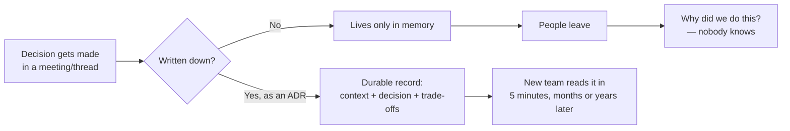
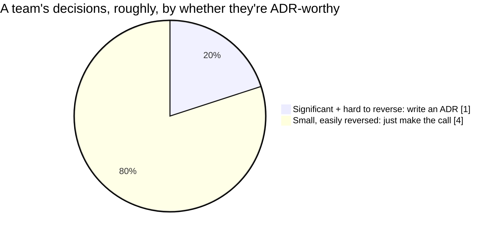

import Scenario from "../../../components/Scenario.astro";
import LevelIntro from "../../../components/LevelIntro.astro";

<Scenario label="Nobody in the room knows why the job queue runs on self-hosted RabbitMQ instead of SQS">
  <Fragment slot="facts">
    

      
🗓️ <strong>How old the decision is</strong> — the service has run this way for two and a half years

      
👋 <strong>Who made the call</strong> — the two engineers who chose it both left the company over a year ago

      
⏳ <strong>What's at stake now</strong> — a team is about to spend two sprints migrating to SQS, unless someone can explain why RabbitMQ was chosen in the first place

    

  </Fragment>

A new team inherits a job-queue service and wants to replace
self-hosted RabbitMQ with a managed SQS queue — it looks simpler,
cheaper, and closer to what the rest of the company already runs.
Before starting, someone asks the obvious question: **why is it
RabbitMQ, and not SQS, in the first place?** Nobody currently on the
team knows. The two engineers who built it left over a year ago.
There's no design doc, no meeting notes, nothing in the wiki — just
the code, which shows _what_ was built but says nothing about _why_
this and not the alternative. The team has two bad options: spend a
week reverse-engineering the original reasoning from old commit
messages and Slack archives, or skip that step and risk redoing a
migration that was already tried and rejected for a reason nobody
can now name. **What would have had to exist, at the time the
original decision was made, for this team not to be stuck guessing?**

</Scenario>

<LevelIntro
  items={[
    "What an Architecture Decision Record (ADR) is and what problem it solves",
    "The four-part shape most ADRs share: context, decision, consequences, status",
    "Which decisions are worth writing down, and which aren't",
  ]}
/>

## The code shows _what_; nothing shows _why_

A codebase is an excellent record of what a system currently does. It
is a terrible record of what was _considered and rejected_ — the
alternative architecture that looked promising for a week, the vendor
that got ruled out over a pricing detail, the constraint (a
compliance requirement, a team's Kafka inexperience) that made an
otherwise-reasonable option a bad one at the time. All of that
reasoning normally lives in people's heads, a Slack thread that
scrolls away, or a meeting nobody recorded — which means it survives
exactly as long as the people who were in the room stay at the
company.

An **Architecture Decision Record (ADR)** is a short, durable document
that captures one significant decision at the moment it's made: what
was decided, what problem it solved, what alternatives were on the
table, and what trade-offs were knowingly accepted. It's not a design
doc for the whole system — it's a single decision, written down once,
that outlives the people and the Slack thread that produced it.

## The four parts almost every ADR has

**If the point is "write the decision down," what actually has to go
in it for that to be useful later — a decision alone, or something
more?** A one-line "we chose RabbitMQ" is barely more useful than
nothing; it answers _what_ but not _why_, which is exactly the part
that goes missing first. Most ADR formats converge on four parts,
because each one answers a different question a future reader will
have:

| Section          | Question it answers                                       |
| ---------------- | --------------------------------------------------------- |
| **Context**      | What problem or constraint forced a decision at all?      |
| **Decision**     | What was actually chosen?                                 |
| **Consequences** | What trade-offs — good _and_ bad — came with that choice? |
| **Status**       | Is this still how things work, or has it since changed?   |

The **Consequences** section is the one teams most often skip, and
it's the one that would have saved the team in the Scenario the most
time — a record that says "chose RabbitMQ because the team already
ran it in production elsewhere and SQS's message-size limit didn't
fit our payloads" turns a week of archaeology into a five-minute
read.

## Not every decision earns an ADR

**Does every choice a team makes need one of these?** No — writing
one for every variable name or library minor-version bump would bury
the decisions that actually matter under noise nobody reads. The
rule of thumb: write an ADR when a decision is **significant** (it
shapes how other parts of the system get built) and **costly to
reverse** (undoing it later means real rework, not a five-minute
edit). Choosing a primary datastore, a queueing technology, or an
authentication approach usually qualifies; choosing a logging
library's exact minor version usually doesn't. L2 turns that
rule of thumb into a sharper test.

