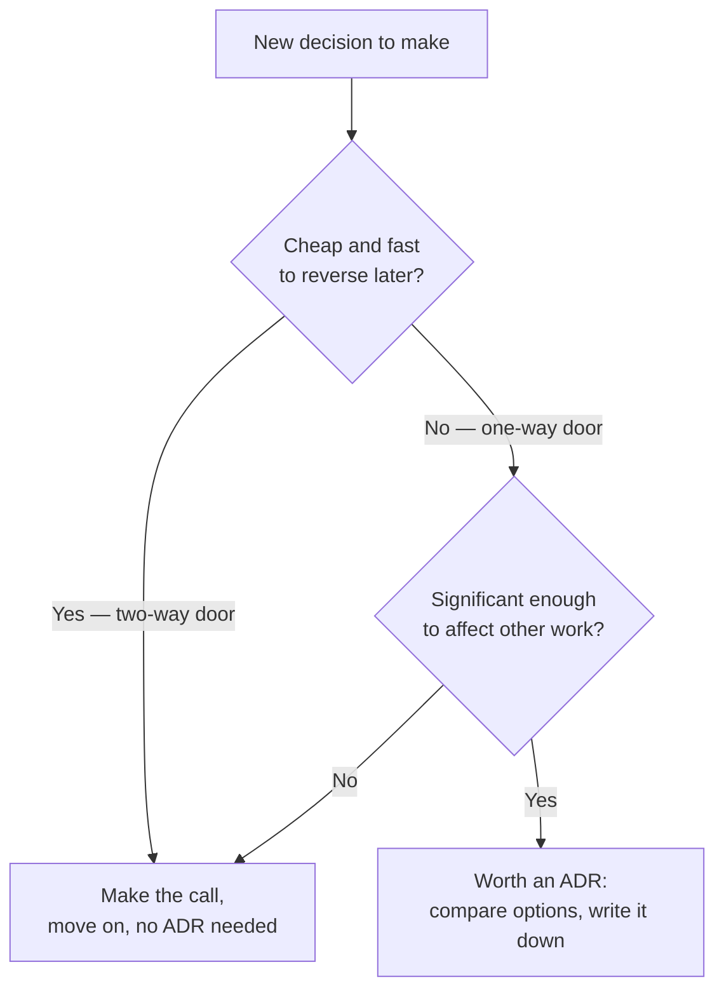

import Scenario from "../../../components/Scenario.astro";
import LevelIntro from "../../../components/LevelIntro.astro";
import Checkpoint from "../../../components/Checkpoint.astro";

<Scenario label="The same meeting, for the third time, arguing the same two options">
  <Fragment slot="facts">
    

      
🔁 <strong>What's happening</strong> — a team has debated "managed SQS vs. self-hosted RabbitMQ" in three separate meetings over six weeks

      
🗣️ <strong>Why it keeps recurring</strong> — each meeting restates the same points from memory, with nothing written down to build on from last time

      
😤 <strong>The cost</strong> — six weeks of calendar time and no decision, because "best option" was never pinned down as "best according to which criteria, weighted how"

    

  </Fragment>

A team keeps circling the same choice: a managed queue (SQS) or a
self-hosted one (RabbitMQ). Three meetings in, they're no closer —
each session re-litigates the same three points from memory, someone
new raises a concern nobody wrote down last time, and the meeting
ends with "let's revisit this next week." Six weeks of calendar time
have produced zero decisions. The problem isn't a lack of information
— everyone in the room roughly agrees on the facts (SQS costs less
per message but has a payload-size limit; RabbitMQ needs an operator
on-call but the team already runs it elsewhere). **What's actually
missing that would let this team convert "we all sort of agree on the
facts" into an actual decision, instead of restating the same facts a
fourth time?**

</Scenario>

<LevelIntro
  items={[
    "One-way vs. two-way doors: reversibility as the test for whether a decision needs an ADR at all",
    "A weighted decision matrix: turning 'it depends' into a comparable number",
    "Writing the Consequences section for a reader with none of today's context",
  ]}
/>

## Reversibility is the sharper version of "significant"

L1's rule of thumb — write an ADR for decisions that are significant
and costly to reverse — gets sharper with a single question: **if
this turns out to be wrong, how expensive is it to undo?** A decision
that's cheap to reverse (try a new logging format for a week; switch
it back if it's noisy) doesn't need the same ceremony as one that
isn't (migrate the primary datastore; that's months of work to
reverse, not minutes). This is often called the **one-way door /
two-way door** test: a two-way door, you can walk back through — make
the call quickly, learn from the outcome, adjust. A one-way door, you
can't — so the decision deserves more deliberate comparison, and a
written record of _why_, before anyone walks through it.

The queue choice in the Scenario is a one-way door — ripping out a
production queueing system and its operational tooling months later
is real, expensive rework — which is exactly why re-litigating it
from memory in meeting after meeting is so costly. A one-way-door
decision deserves a comparison method that survives between meetings,
not a fresh conversation each time.

<Checkpoint question="A team is deciding what naming convention to use for a new internal npm package. Using the one-way/two-way door test, does this decision need an ADR?">

Almost certainly not — renaming a package later, while mildly
annoying, is a mechanical, low-cost change (a rename commit, an
updated import), not a structural one that other systems get built
around. It's a two-way door: make a reasonable call, and if it turns
out wrong, walk back through it later at low cost. The test isn't
"is this decision debatable" — plenty of trivial decisions are
debatable — it's specifically "how expensive is it to reverse," and
this one is cheap.

</Checkpoint>

## Turning "it depends" into a number: the weighted decision matrix

**Given two options that are both reasonable on different axes — SQS
cheaper, RabbitMQ more familiar — how does a team actually compare
them instead of just trading anecdotes?** A **weighted decision
matrix** makes the comparison explicit: list the criteria that
actually matter, assign each one a weight reflecting how much it
matters _to this decision, right now_, score each option against
each criterion, and multiply weight by score to get a total.

| Criterion           | Weight | SQS score | SQS weighted | RabbitMQ score | RabbitMQ weighted |
| ------------------- | ------ | --------- | ------------ | -------------- | ----------------- |
| Operational cost    | 3      | 5         | 15           | 2              | 6                 |
| Team familiarity    | 2      | 2         | 4            | 5              | 10                |
| Message-size fit    | 4      | 2         | 8            | 5              | 20                |
| Vendor lock-in risk | 1      | 2         | 2            | 5              | 5                 |
| **Total**           |        |           | **29**       |                | **41**            |

RabbitMQ wins this particular matrix — not because it's objectively
"better," but because _this team's_ payloads are large (message-size
fit weighted heavily) and _this team_ already has RabbitMQ operating
experience. The matrix doesn't remove judgment — someone still picks
the criteria and the weights — but it converts an argument about
vague impressions into an argument about specific, visible numbers
that can be challenged one at a time ("why is familiarity only
weighted 2?") instead of re-argued wholesale every meeting.

```mermaid
xychart-beta
    title "Weighted score by criterion (SQS vs. RabbitMQ)"
    x-axis ["Cost", "Familiarity", "Size fit", "Lock-in"]
    y-axis "Weighted score" 0 --> 20
    bar [15, 4, 8, 2]
    bar [6, 10, 20, 5]
```

The unit's own interactive demo below lets you change the weights
yourself and watch the winner flip — the same matrix, with cost
weighted heavier instead of message-size fit, favors SQS instead.
That flip is the whole point: the "right" answer depends on which
criteria this specific team, at this specific time, actually cares
about most — which is exactly the thing an ADR needs to state
explicitly, not leave implied.

<Checkpoint question="Two people build the same decision matrix, using the same four criteria and the same scores per option, but disagree on the final recommendation. What's the most likely reason, given the matrix above?">

They likely assigned different weights to the criteria. The scores
(how well each option satisfies a given criterion) are close to
objective facts once the criteria are fixed, but the weights (how
much each criterion matters to this decision) are a judgment call —
and a matrix with the same scores but different weights can easily
produce a different winner, exactly like the interactive demo below
shows when cost is weighted more heavily than message-size fit. The
matrix doesn't eliminate disagreement; it relocates it to a single,
visible number (the weight) instead of a diffuse argument about the
whole decision.

</Checkpoint>

## Writing Consequences for someone who wasn't in the room

**The matrix produces a winner — but what should actually get written
down once the meeting ends?** Not just the winner. The Scenario's
team, and the team in L1's Scenario who inherited RabbitMQ with no
explanation, both needed the same thing: a **Consequences** section
honest about what was given up, not just what was gained. "We chose
RabbitMQ" tells a future reader nothing they couldn't get from
reading the infrastructure code. "We chose RabbitMQ because our
message sizes exceed SQS's 256KB limit and we already run RabbitMQ
in production elsewhere; the trade-off is an on-call operational
burden SQS wouldn't have needed" tells them exactly what circumstances
would have to change (message sizes shrinking, RabbitMQ operational
pain becoming unbearable) for the decision to be worth revisiting.
That last part — writing for a reader with none of today's shared
context, possibly years later — is the actual skill; L3 works through
a full ADR document built on exactly that discipline.
