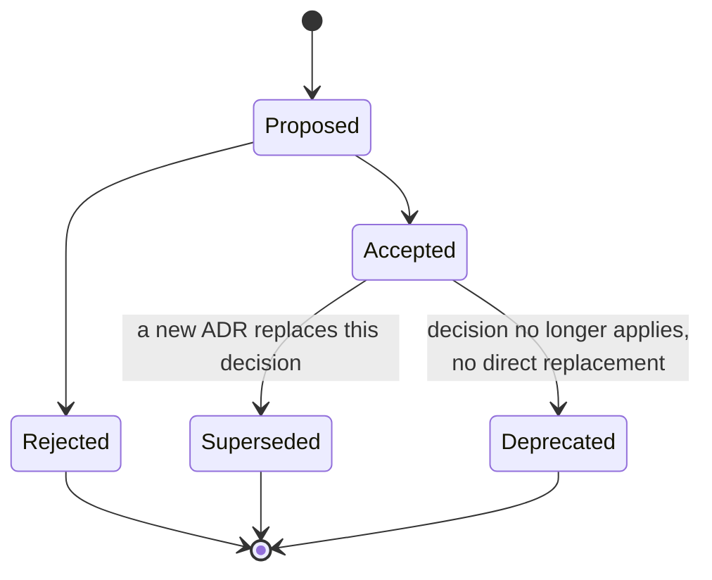

import Scenario from "../../../components/Scenario.astro";
import LevelIntro from "../../../components/LevelIntro.astro";
import Checkpoint from "../../../components/Checkpoint.astro";

<Scenario label="Code review, but for a document: the ADR says 'Accepted,' the system says otherwise">
  <Fragment slot="facts">
    <div class="not-prose flex flex-col gap-2 text-sm text-slate-700 dark:text-slate-300">
      <div class="flex items-center gap-1.5"><span>📄</span> <strong>What the ADR says</strong> — "Status: Accepted" — RabbitMQ is the job queue, decided 18 months ago</div>
      <div class="flex items-center gap-1.5"><span>🛠️</span> <strong>What actually happened since</strong> — six months ago, the team quietly migrated to SQS after a payload-size fix made it viable, but never updated the ADR</div>
      <div class="flex items-center gap-1.5"><span>🧑‍💻</span> <strong>The cost</strong> — a new engineer reads the ADR, builds a RabbitMQ-specific retry helper for a system that hasn't used RabbitMQ in six months</div>
    </div>
  </Fragment>

An ADR from 18 months ago says, in its Status field, "Accepted" —
RabbitMQ is the system of record for job queueing, and the
Consequences section explains why in detail. Six months ago, a fix
to how large payloads get chunked made SQS viable after all, and the
team quietly migrated — but nobody went back and updated the ADR's
status, or wrote a new one recording the switch. A new engineer, doing
exactly what L1 and L2 said to do — reading the ADR before building
on top of the queue — trusts a document that is now six months out of
date, and spends two days building a RabbitMQ-specific retry helper
for a system that hasn't touched RabbitMQ since spring. **An ADR that
goes stale without anyone noticing is arguably worse than no ADR at
all — a reader who finds nothing knows to go ask, but a reader who
finds a confident, wrong document has no reason to doubt it. What
would have to be true about how a team treats ADRs for this kind of
staleness to get caught before it costs someone two days?**

</Scenario>

<LevelIntro
  items={[
    "A full ADR document, written for a reader with none of today's context",
    "Two small tools: a weighted-score calculator and a stale-ADR flagger",
    "Superseding instead of silently editing, and why review cadence is the actual fix for the Scenario",
  ]}
/>

## A real ADR, end to end

L2 built the reasoning — reversibility, a weighted matrix, an honest
Consequences section. Here is that same RabbitMQ-vs-SQS decision
written as an actual ADR document, in the format most teams that use
this practice converge on (a numbered, append-only file per decision,
usually kept in the repo itself so it versions alongside the code it
describes):

```markdown
# ADR-014: Use self-hosted RabbitMQ instead of managed SQS for job queueing

## Status

Accepted — 2025-02-11

## Context

The order-fulfillment service needs a message queue to decouple order
creation from downstream processing (inventory, shipping, email — see
the `queues` unit for why this decoupling matters at all). Two options
were evaluated: Amazon SQS (managed) and self-hosted RabbitMQ.

Two constraints shaped this decision:

- Order payloads for bulk/wholesale orders can exceed 256KB (SQS's
  hard message-size limit) roughly 3% of the time, based on the last
  90 days of production order data.
- The infrastructure team already operates a RabbitMQ cluster for the
  notifications service, so on-call familiarity and tooling
  (dashboards, alerting, runbooks) already exist.

## Decision

We will use the existing RabbitMQ cluster, adding a new vhost for
order-fulfillment messages, rather than adopting SQS.

## Alternatives considered

| Option            | Weighted score (see decision matrix below) |
| ----------------- | ------------------------------------------ |
| RabbitMQ (chosen) | 41                                         |
| Amazon SQS        | 29                                         |

Weights: operational cost (3), team familiarity (2), message-size fit
(4 — the dominant factor given the 3% oversized-payload rate), vendor
lock-in risk (1).

## Consequences

**What we gain:** no payload-size workaround needed (no chunking, no
S3-offload hack for the 3% of oversized orders); the team can lean on
existing RabbitMQ operational experience and tooling from day one.

**What we give up:** an on-call operational burden SQS would not have
required — RabbitMQ needs patching, capacity planning, and cluster
monitoring that a managed queue handles for us. We are also forgoing
SQS's tighter native integration with the rest of our AWS-managed
stack.

**What would make us revisit this:** if the oversized-payload rate
drops meaningfully (e.g. a wholesale-order restructuring removes the
need for large payloads), the message-size argument weakens and SQS's
lower operational burden could tip the matrix the other way — see the
review-cadence note below.

## Related

Supersedes: none (first queueing decision for this service).
Superseded by: none yet.
```

Notice what's absent: there's no claim that RabbitMQ is "the right
choice" in the abstract, only that it's the right choice _given these
weights, this payload data, this team's existing operational
footprint, on this date_. That qualification is what lets a future
reader — the Scenario's new engineer, or the L1 Scenario's team
inheriting a decision from people who've left — evaluate whether the
reasoning still holds, instead of either blindly trusting or blindly
distrusting a decision they had no part in making.

<Checkpoint question="The ADR's Consequences section lists 'no payload-size workaround needed' under what we gain, and 'an on-call operational burden' under what we give up. Why does a good ADR need both sides, rather than just justifying the winning choice?">

An ADR that only lists the winning option's benefits reads as
advocacy, not a record — and it hides exactly the information a
future reader most needs, which is what to watch for if circumstances
change. Listing the operational burden explicitly is what lets a
later reader notice, correctly, "we've been paying that on-call cost
for two years and the payload-size problem it was solving no longer
exists" — the trigger for reopening a decision has to be visible in
the document, or nobody knows to look for it.

</Checkpoint>

## Tool: scoring a decision matrix in code

L2's matrix was worked by hand in a markdown table. Once a team is
comparing more than two options, or wants to try several weight
scenarios quickly (exactly what the interactive demo below lets you
do visually), scoring it in code removes arithmetic mistakes and
makes "what if we weight familiarity higher" a one-line change instead
of a re-copied table:

```ts
// decision-matrix.ts

interface Criterion {
  name: string;
  weight: number;
}

// scores[optionName][criterionName] = a score from 1-5
type ScoreTable = Record<string, Record<string, number>>;

interface RankedOption {
  option: string;
  totalScore: number;
}

function scoreDecisionMatrix(
  criteria: Criterion[],
  scores: ScoreTable,
): RankedOption[] {
  const options = Object.keys(scores);

  const ranked = options.map((option) => {
    const totalScore = criteria.reduce((sum, criterion) => {
      const score = scores[option][criterion.name];
      if (score === undefined) {
        throw new Error(
          `missing score for option "${option}", criterion "${criterion.name}"`,
        );
      }
      return sum + score * criterion.weight;
    }, 0);
    return { option, totalScore };
  });

  // Highest weighted score first — ties keep their original order.
  return ranked.sort((a, b) => b.totalScore - a.totalScore);
}
```

Run against the RabbitMQ-vs-SQS numbers from L2's table, this returns
`[{ option: "RabbitMQ", totalScore: 41 }, { option: "SQS", totalScore: 29 }]`
— the same result as the hand-worked table, but now it's one function
call away from re-running with different weights, which is exactly
what a team revisiting the ADR's "what would make us revisit this"
clause would want to do.

## Tool: flagging ADRs that look stale

The Scenario's actual failure — an ADR that says "Accepted" for a
decision that's quietly been overturned in practice — isn't a writing
problem, it's a **maintenance** problem. One partial mitigation: a
script that flags any ADR older than some threshold that's still
sitting in a non-terminal status, as a nudge to someone to actually
go check whether it's still accurate:

```ts
// stale-adr-flagger.ts

interface AdrRecord {
  id: string;
  title: string;
  status: "Proposed" | "Accepted" | "Superseded" | "Deprecated";
  decidedOn: Date; // the date recorded in the ADR's Status line
}

interface StaleFlag {
  id: string;
  title: string;
  ageDays: number;
}

// "Superseded" and "Deprecated" are terminal — by definition someone
// already revisited them, so they're never stale in this sense.
// "Proposed" and "Accepted" are the two statuses that can go stale:
// a Proposed decision nobody ever resolved, or an Accepted one nobody
// has re-checked in a long time.
const NON_TERMINAL_STATUSES: AdrRecord["status"][] = ["Proposed", "Accepted"];

function findStaleAdrs(
  records: AdrRecord[],
  now: Date,
  staleAfterDays: number,
): StaleFlag[] {
  const msPerDay = 24 * 60 * 60 * 1000;

  return records
    .filter((r) => NON_TERMINAL_STATUSES.includes(r.status))
    .map((r) => {
      const ageDays = Math.floor(
        (now.getTime() - r.decidedOn.getTime()) / msPerDay,
      );
      return { id: r.id, title: r.title, ageDays };
    })
    .filter((flag) => flag.ageDays >= staleAfterDays)
    .sort((a, b) => b.ageDays - a.ageDays);
}
```

This doesn't know that RabbitMQ quietly got replaced by SQS — no
script can infer that from a date alone — but it does guarantee
ADR-014 surfaces on a periodic report the moment it crosses, say, 12
months as "Accepted," prompting a human to actually check: is this
still true? That single check, run on a schedule instead of never, is
what would have caught the Scenario's staleness at month 12 instead
of leaving it for a confused new engineer at month 18.

<Checkpoint question="Why does findStaleAdrs exclude 'Superseded' and 'Deprecated' records from the staleness check entirely, rather than just giving them a longer staleAfterDays threshold?">

Staleness, as this tool defines it, means "a decision that's
presented as current but might not be anymore" — and a Superseded or
Deprecated ADR isn't presented as current at all; its status already
tells the reader outright that it no longer reflects reality, so
there's nothing to nudge a human to check. Giving those statuses a
longer threshold instead of excluding them would eventually start
flagging perfectly accurate historical records as if something were
wrong, when the actual problem the tool exists to catch — a stale
claim wearing a "still true" status — doesn't apply to them at all.

</Checkpoint>

## Supersede, don't silently edit

**Given a flagged, stale ADR, what should actually happen to it —
edit ADR-014 in place to say "SQS" now?** No — the fix is to write a
new ADR (say, ADR-031) that records the _new_ decision, its own
context and consequences, and sets its `Superseded by` field pointing
forward while ADR-014's `Status` flips to `Superseded` with a pointer
back. Editing the original in place would erase the very history an
ADR exists to preserve — a future reader would lose the fact that
RabbitMQ was ever chosen, and why, along with whatever conditions
eventually made it worth abandoning. An ADR is meant to be
**append-only**: once accepted, a decision's record doesn't change
retroactively, it gets superseded by a new record that explains what
changed and why.



This is also the actual fix underneath the flagger script above: the
script buys time by prompting a periodic human check, but the habit
that prevents the Scenario for good is treating "we changed our
minds" as itself a decision worth its own ADR — the same discipline
L1 and L2 applied to the original choice, applied again the moment
that choice stops holding.

This unit's worked example covers one decision, decided once, by one
team, with a clean two-option comparison. What changes when a
decision has to be made jointly by two teams who report to different
organizations and don't fully trust each other's numbers — does a
weighted matrix still work when the weights themselves are the
argument? That's a harder, more political version of the same
problem, and a natural next place to take this beyond what's shown
here.
