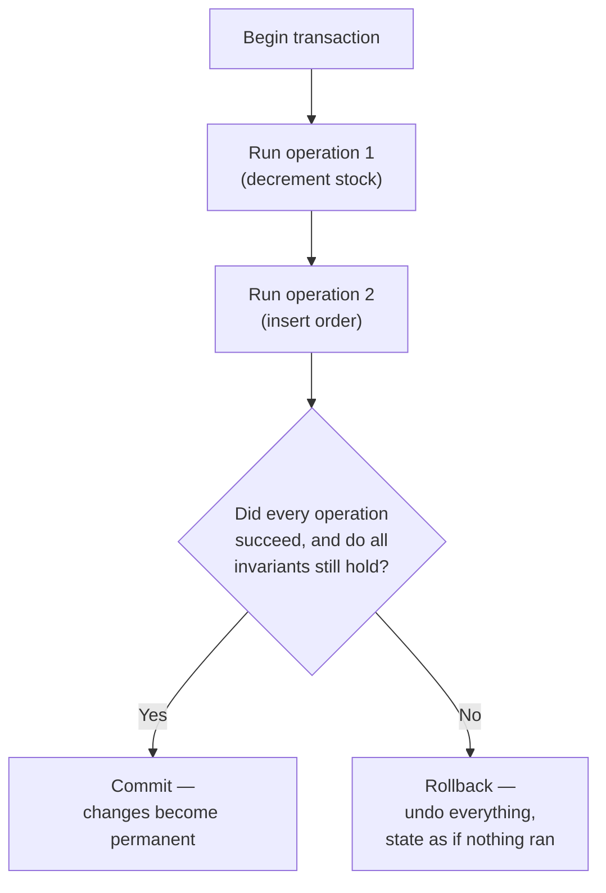

## The four letters, and what each one actually stops from happening

**If "transaction" just meant "a group of operations," what's actually
guaranteed about that group that isn't guaranteed about running the
operations separately?** Four specific things — this is what ACID
stands for:

| Property        | What it guarantees                                                                 | What breaks without it (stock/order example)                                         |
| --------------- | ---------------------------------------------------------------------------------- | ------------------------------------------------------------------------------------ |
| **A**tomicity   | Every operation in the transaction happens, or none of them do                     | Stock decrements, order insert fails — exactly L1's bug                              |
| **C**onsistency | Data-level rules (invariants) always hold before and after                         | One order tries to buy 15 items when only 10 are allowed to leave stock              |
| **I**solation   | A transaction in progress never sees another transaction's unfinished changes      | Two concurrent orders could both read "10 in stock" and both proceed to sell it      |
| **D**urability  | Once a transaction reports success, that result survives a crash immediately after | A crash right after "Order placed!" wipes out an order that was never actually saved |

Each property answers a different way the naive two-step version can
go wrong — atomicity alone wouldn't have caught a stock-goes-negative
bug, and consistency alone wouldn't have caught a mid-transaction crash
losing an already-reported success.

Read Consistency and Isolation as different questions. Consistency is
about rules that must be true even for one request by itself: stock
cannot become negative, an order must point to a real customer, a bank
balance cannot break its allowed limits. Isolation is about overlap:
what happens when two requests touch the same data at the same time.
Both matter, but they protect against different shapes of failure.

## A transaction's lifecycle: begin, operate, then commit or rollback

**If a transaction wraps multiple operations, what actually happens
between "begin" and the operations being visible to anyone else?**

Nothing is visible to the rest of the system until the commit step —
this is what makes isolation possible. And critically, the rollback
path isn't a special case bolted on afterward; it's the transaction
system's _default_ response to any failure, which is exactly why the
naive two-step version's bug (an unrolled-back stock decrement) simply
can't happen inside a real transaction.

The important timeline is simple:

| Moment         | What other requests can see                            |
| -------------- | ------------------------------------------------------ |
| Before begin   | Only the old, committed data                           |
| During work    | The transaction's private, not-yet-final changes       |
| After commit   | The completed changes, now permanent and visible       |
| After rollback | The original state, as if the failed attempt never ran |

## Without transactions vs. with transactions

| What happens                                       | Without a transaction                                                  | With a transaction                                                      |
| -------------------------------------------------- | ---------------------------------------------------------------------- | ----------------------------------------------------------------------- |
| Step 2 fails after step 1 succeeded                | Step 1's effect is left in place — partial state                       | Step 1's effect is rolled back — original state restored                |
| An invariant (e.g. stock ≥ 0) would be violated    | Nothing checks this automatically; it's up to every caller to remember | The transaction refuses to commit; rolls back instead                   |
| The process crashes right after reporting success  | Whatever wasn't yet flushed to durable storage is simply gone          | The write-ahead log already has the change; it's recoverable on restart |
| Two requests modify the same data at the same time | Each can read and act on the other's half-finished work                | Each is isolated from the other's in-progress changes                   |

## Why this generalizes past "orders and stock"

**Is this only relevant to e-commerce?** No — any system where a
single logical action requires more than one write faces the exact
same shape of problem: transferring money (debit one account, credit
another), updating a user's profile and an audit log together,
reserving a seat and charging a payment. The specific data changes, but
the question — "can this ever be left half-done?" — doesn't.
