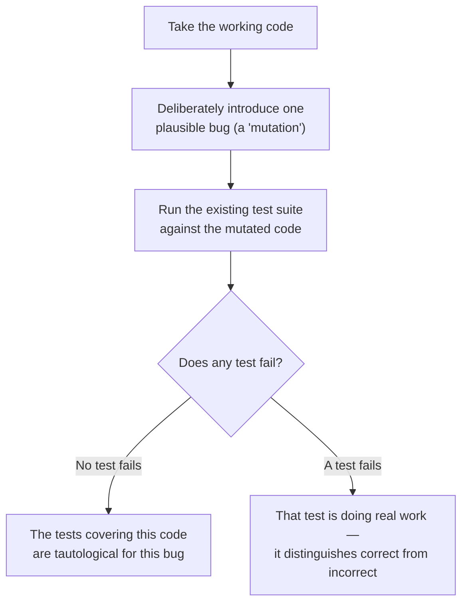

## The mutation thought experiment

**Is there a concrete way to check whether a test is actually doing work,
rather than just eyeballing whether the assertion "looks thorough"?**



This is the actual mechanism behind "mutation testing" as a practice, and
it's useful even done by hand: pick a small, realistic bug (flip a
comparison operator, off-by-one an index, swap a `&&` for `||`), apply it
to otherwise-correct code, and check whether any test notices. If nothing
fails, the tests were exercising that code path without verifying its
actual behavior.

## Boundary values are where weak assertions get exposed

**Why did the $100-exactly case expose the bug when a $150 order
wouldn't have?**

```text
subtotal = 150:
  Buggy (subtotal > 100):  150 > 100 → true  → 150 * 0.9 = 135
  Fixed (subtotal >= 100): 150 >= 100 → true → 150 * 0.9 = 135
  SAME RESULT — this input can't distinguish buggy from fixed

subtotal = 100:
  Buggy (subtotal > 100):  100 > 100 → false → 100 (no discount)
  Fixed (subtotal >= 100): 100 >= 100 → true  → 90 (discount applied)
  DIFFERENT RESULTS — only this input catches the bug
```

A test suite that only exercises values comfortably inside a range (like
150, far from the boundary) can look thorough — different amounts, all
passing — while never actually testing the boundary condition where an
off-by-one bug lives. The specific values chosen for a test matter as
much as the assertion itself; a test with a strong assertion but the
wrong input still won't catch the bug.

## Testing behavior, not implementation details

**If a strong assertion checks an exact expected value, does that mean
tests should check every internal detail of how a function works?** Not
quite — there's a difference between asserting on the function's actual
_output_ for a given input (a behavior, stable across refactors) and
asserting on _how_ it computed that output internally (an implementation
detail, likely to change). `expect(calculateOrderTotal(100)).toBe(90)`
tests behavior — it stays valid no matter how the function is
internally restructured, as long as the output is still correct. A test
that instead checked "the function calls a helper named `applyDiscount`
internally" would break on a harmless refactor that changed nothing about
correctness, which is its own kind of false signal — just in the
opposite direction from a tautological test.

| Kind of assertion        | Example                                    | Breaks on harmless refactor? | Catches the boundary bug? |
| ------------------------ | ------------------------------------------ | ---------------------------- | ------------------------- |
| Tautological             | `typeof result === 'number'`               | No                           | No                        |
| Implementation-coupled   | Checks internal function calls, not output | Yes                          | Maybe, incidentally       |
| Behavior-focused, strong | `calculateOrderTotal(100) === 90`          | No                           | Yes                       |

## The generalizable lesson

**Is the fix "always assert on exact values, never on general properties
like type or truthiness"?** Not universally — a general-property
assertion is sometimes genuinely the correct one, if the function's
actual contract is general (a function documented to "return some valid
ID" has no single correct exact value to assert on). The generalizable
skill is asking **what specific, plausible bug this test needs to catch**,
then writing the assertion and choosing the input that would actually
fail if that bug were present — not defaulting to whichever assertion is
easiest to write.
