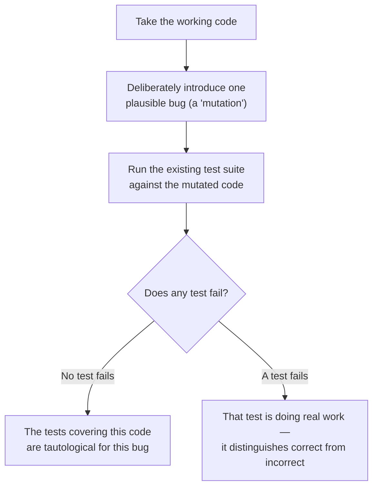

import LevelIntro from "../../../components/LevelIntro.astro";
import Checkpoint from "../../../components/Checkpoint.astro";

L1 showed one weak assertion that let a real bug ship, and the "would
this fail on a plausible bug" question that exposes it. L2 turns that
question into a repeatable check, shows exactly why the boundary value
is what exposed it, and works out how far "assert on the exact output"
should generalize.

<LevelIntro
  items={[
    "The mutation thought experiment",
    "Why boundary values expose weak assertions",
    "Behavior-focused vs. implementation-coupled assertions",
  ]}
/>

## The mutation thought experiment

**Is there a concrete way to check whether a test is actually doing work,
rather than just eyeballing whether the assertion "looks thorough"?**



This is the actual mechanism behind "mutation testing" as a practice, and
it's useful even done by hand: pick a small, realistic bug (flip a
comparison operator, off-by-one an index, swap a `&&` for `||`), apply it
to otherwise-correct code, and check whether any test notices. If nothing
fails, the tests were exercising that code path without verifying its
actual behavior.

## Boundary values are where weak assertions get exposed

**Why did the $100-exactly case expose the bug when a $150 order
wouldn't have?**

```text
subtotal = 150:
  Buggy (subtotal > 100):  150 > 100 → true  → 150 * 0.9 = 135
  Fixed (subtotal >= 100): 150 >= 100 → true → 150 * 0.9 = 135
  SAME RESULT — this input can't distinguish buggy from fixed

subtotal = 100:
  Buggy (subtotal > 100):  100 > 100 → false → 100 (no discount)
  Fixed (subtotal >= 100): 100 >= 100 → true  → 90 (discount applied)
  DIFFERENT RESULTS — only this input catches the bug
```

A test suite that only exercises values comfortably inside a range (like
150, far from the boundary) can look thorough — different amounts, all
passing — while never actually testing the boundary condition where an
off-by-one bug lives. The specific values chosen for a test matter as
much as the assertion itself; a test with a strong assertion but the
wrong input still won't catch the bug.

<Checkpoint question="A test suite for calculateOrderTotal runs the function against subtotals of 25, 75, and 200, all with strong exact-value assertions like toBe(25), toBe(75), and toBe(180). Does this suite catch the greater-than-vs-greater-than-or-equal-to bug at the $100 threshold?">

No. Every one of those assertions is strong (it checks an exact expected
value, not just a type), but none of the three inputs sits at the
boundary itself, so the buggy and fixed implementations return identical
results for all three — 25 stays 25, 75 stays 75, and 200 becomes 180
under both versions. A strong assertion only catches a bug if it's also
paired with an input that can actually distinguish the buggy behavior
from the correct one, and here none of the chosen inputs do that. The
suite would look thorough — three different amounts, all passing — while
never touching the one value, exactly 100, where the two implementations
disagree.

</Checkpoint>

## Testing behavior, not implementation details

**If a strong assertion checks an exact expected value, does that mean
tests should check every internal detail of how a function works?** Not
quite — there's a difference between asserting on the function's actual
_output_ for a given input (a behavior, stable across refactors) and
asserting on _how_ it computed that output internally (an implementation
detail, likely to change). `expect(calculateOrderTotal(100)).toBe(90)`
tests behavior — it stays valid no matter how the function is
internally restructured, as long as the output is still correct. A test
that instead checked "the function calls a helper named `applyDiscount`
internally" would break on a harmless refactor that changed nothing about
correctness, which is its own kind of false signal — just in the
opposite direction from a tautological test.

| Kind of assertion        | Example                                    | Breaks on harmless refactor? | Catches the boundary bug? |
| ------------------------ | ------------------------------------------ | ---------------------------- | ------------------------- |
| Tautological             | `typeof result === 'number'`               | No                           | No                        |
| Implementation-coupled   | Checks internal function calls, not output | Yes                          | Maybe, incidentally       |
| Behavior-focused, strong | `calculateOrderTotal(100) === 90`          | No                           | Yes                       |

<Checkpoint question="A refactor renames the internal helper applyDiscount to computeDiscountedTotal and inlines it, without changing any input/output behavior of calculateOrderTotal. Would a behavior-focused test suite (like the one built around toBe(90) at the boundary) need any changes because of this refactor?">

No. A behavior-focused assertion checks what `calculateOrderTotal`
returns for a given input, not how it gets there internally, so renaming
or inlining a helper function that the outside world never sees doesn't
touch anything the test actually asserts on. That's the whole point of
testing behavior over implementation: the test keeps passing through
refactors that genuinely don't change correctness, and it would only
start failing if the refactor accidentally changed what the function
returns — which is exactly the signal worth having, as opposed to a
test that fails on the rename itself and forces an update for no real
reason.

</Checkpoint>

## The generalizable lesson

**Is the fix "always assert on exact values, never on general properties
like type or truthiness"?** Not universally — a general-property
assertion is sometimes genuinely the correct one, if the function's
actual contract is general (a function documented to "return some valid
ID" has no single correct exact value to assert on). The generalizable
skill is asking **what specific, plausible bug this test needs to catch**,
then writing the assertion and choosing the input that would actually
fail if that bug were present — not defaulting to whichever assertion is
easiest to write.
