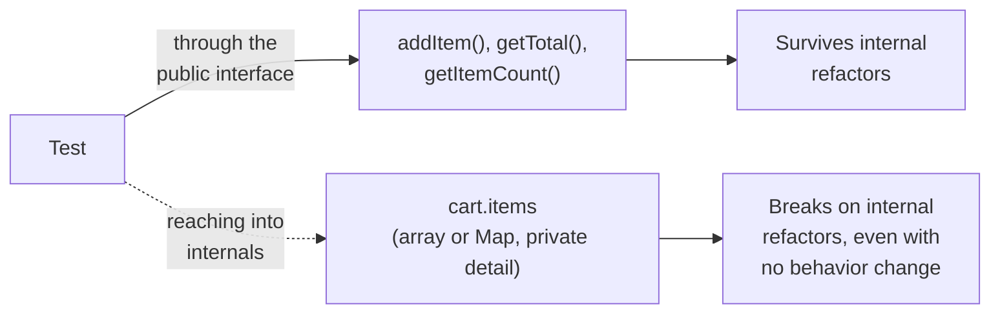

## Two things a test can point at

**If a test has to check something about the cart, what are its two
possible targets?** It can check the cart's _public interface_ — the
methods anything else in the codebase would actually call — or it can
reach into the cart's _internals_ — the specific data structure and
private fields the class happens to use right now.

Only one of these two targets is actually part of the cart's contract
with the rest of the codebase. The other is free to change any time the
class's author wants, for reasons that have nothing to do with whether
the cart still works correctly.

## Given-When-Then

**How does this distinction show up in how a test is actually written?**
A behavior-based test is structured around three questions, phrased
entirely in terms of what the system does, never how:

| Part  | Question it answers            | Example                                     |
| ----- | ------------------------------ | ------------------------------------------- |
| Given | What's the starting state?     | Given a cart with two Widgets already added |
| When  | What action happens?           | When a third Widget is added                |
| Then  | What's the observable outcome? | Then getItemCount() returns 3               |

Notice "Then" never mentions how the count is computed or stored — only
what a caller would observe by using the public interface. An
implementation-coupled version of the same test might instead assert
`cart.items.length === 3` or `cart.items[0].quantity === 3`, both of
which describe internal storage, not behavior.

## Why implementation-coupled tests still feel natural to write

**If reaching into internals is the wrong target, why do
implementation-coupled tests get written so often?** Because they're
usually easier to write in the moment — the internal state is right
there, already familiar from writing the implementation, while
figuring out the right public-interface assertion sometimes takes a
little more thought. That shortcut is exactly what creates the L1
scenario: the easier test to write today is the one that breaks
tomorrow for no real reason.

## What BDD tests protect you from, and what they don't

|                                | Testing through the public interface             | Testing through internals                                   |
| ------------------------------ | ------------------------------------------------ | ----------------------------------------------------------- |
| Survives an internal refactor  | Yes, as long as behavior is unchanged            | No — breaks even when behavior is identical                 |
| Catches an actual behavior bug | Yes — that's exactly what it's designed to check | Yes, but often indirectly, mixed in with unrelated failures |
| Tells you what actually broke  | Clearly — the behavior itself failed             | Ambiguous — did behavior break, or just internal structure? |

## The generalizable lesson

**Does this only apply to shopping carts?** No — the same shape
applies to any class or module with both a public interface and
private internal state: a parser, a cache, a queue, a validator. The
diagnostic question is always the same: does this assertion describe
what the code does, or does it describe how the code currently happens
to do it?
