import Scenario from "../../../components/Scenario.astro";

<Scenario label="Two manual checks, both passed, one regression shipped anyway">
  <Fragment slot="facts">
    

      
🛒 <strong>Checkout</strong> — manually clicked through today, discount math looked right

      
💸 <strong>Refund tool</strong> — manually clicked through weeks ago, never re-checked since

      
🚢 Change shipped — both checks "passed"

    

    

      9 days later: a support ticket. The refund tool has been silently
      wrong since the day it shipped. Nobody re-checked it, because
      nothing about the change looked related to refunds.
    

  </Fragment>

A developer fixes a bug in a shared pricing function, manually clicks
through checkout with a couple of test discounts, sees correct totals,
and ships it. Everything they checked passed. Nine days later, a support
ticket arrives: the refund tool — a completely different part of the
product, built on the same shared function — has been quietly issuing
wrong refunds since the moment the "fix" shipped.

**If every manual check that was actually performed passed, how did a
real regression ship anyway?**

</Scenario>

- A manual check verifies **one specific run, for the inputs you happened to try, at the moment you tried them**. It says nothing about every other input, and nothing about whether it still works after the next change — it's a snapshot, not a guarantee.
- **Automated tests are that same check, made repeatable and cheap to run again** — the value isn't that a computer runs it instead of a human, it's that "did I break this" becomes a question you can ask thousands of times for free, instead of a question that costs real manual effort every time, which means in practice it mostly doesn't get asked.
- This is a **regression** problem specifically: code that worked yesterday silently stops working today because of an unrelated change elsewhere — manual testing only catches this if someone happens to manually re-check the exact thing that broke, which gets less and less likely as a codebase grows.
- Three properties a good automated test has that a manual check structurally can't: **repeatability** (runs identically every time, not subject to a tired human skipping a step), **speed** (a full suite running in seconds means it actually gets run before every change, not just before releases), and **specificity** (a failing test points at what broke, where "someone reported it's broken" doesn't).

```mermaid
xychart-beta
    title "What each property is worth, at a glance (0 = manual check, 10 = automated test)"
    x-axis ["Repeatability", "Speed", "Specificity"]
    y-axis "Relative strength" 0 --> 10
    bar [2, 1, 2]
    bar [10, 9, 9]
```

| Property      | Manual check                      | Automated test                        |
| ------------- | --------------------------------- | ------------------------------------- |
| Repeatability | Depends on a human doing it again | Runs identically, every time          |
| Speed         | Minutes to hours                  | Often seconds for a whole suite       |
| Specificity   | "Something's broken", vaguely     | Names the exact assertion that failed |

- The core trade being made: **upfront cost** (writing the test takes real time now) for **compounding savings** (every future change gets checked against it for free, forever, until the behavior deliberately changes) — the math only favors testing once code is expected to be touched more than a handful of times, which is most real code.
- This unit is about the _case_ for automated testing — the specific test-writing techniques (unit vs. integration, mocking, test doubles, coverage) are their own later units. The goal here is the underlying argument: why "it worked when I checked it" and "it works" are different claims, and why the gap between them grows, not shrinks, as a codebase ages.
