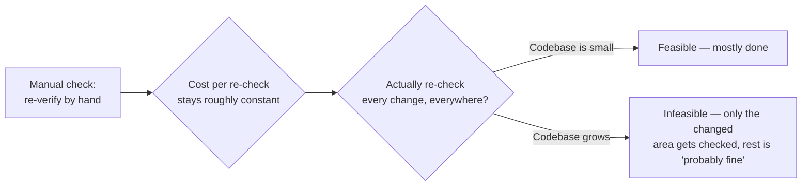
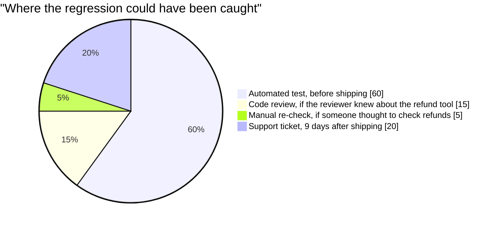

import Scenario from "../../../components/Scenario.astro";

<Scenario label="The regression nobody thought to check">
  <Fragment slot="facts">
    <div class="not-prose flex flex-col gap-1.5 text-sm text-slate-700 dark:text-slate-300">
      <div class="flex items-center gap-1.5"><span>✍️</span> Change touched: <strong>1 shared function</strong> (pricing.mjs)</div>
      <div class="flex items-center gap-1.5"><span>👀</span> Manually re-checked: <strong>1 caller</strong> (checkout — the one the developer knew about)</div>
      <div class="flex items-center gap-1.5"><span>🕳️</span> Not re-checked: <strong>the refund tool</strong> — a caller the developer didn't know existed</div>
    </div>
    <div class="not-prose mt-3 rounded border border-amber-300 bg-amber-50 p-1.5 text-xs dark:border-amber-800 dark:bg-amber-950">
      Nobody skipped a step on purpose. The gap is structural: you can only
      manually re-check what you know to look at.
    </div>

  </Fragment>

The developer who "fixed" the pricing function did check something — they
just couldn't check a caller they didn't know existed. **If manual
checking isn't lazy or careless here, what exactly is it missing, and
why does that gap get worse as a codebase grows rather than better?**

</Scenario>

## The shape of the problem: a fixed check against a growing surface



The failure isn't that anyone decides to stop caring about quality — it's that the _cost_ of manually re-verifying everything stays roughly constant per check while the _number of things that could have been affected_ by any given change grows with the codebase. At some size, exhaustive manual re-verification before every change becomes physically impossible within any reasonable time budget, and "probably fine, didn't touch that file" quietly becomes the actual practice, whether or not anyone said so out loud.

## A concrete regression, traced

**Given the scenario above — one shared function, two callers, one checked — what does the actual decision the shipping process makes look like?**

```python
function ship_change(change, codebase):
    directly_tested = manually_check(change.touched_files)
    # Nobody manually re-checks files the developer didn't think to touch —
    # there's no way to know in advance which of the untouched files
    # actually depend on the behavior that changed.

    indirectly_affected = find_dependents(change, codebase)  # often invisible to the developer
    if not automated_tests_exist_for(indirectly_affected):
        return "shipped — indirectly_affected untested, breakage discovered later, if at all"
    else:
        return run(automated_tests_for(indirectly_affected))  # catches it now, cheaply
```

The `indirectly_affected` set is exactly the part manual testing structurally can't cover reliably: it requires the developer to correctly predict every place their change's effects propagate to, in a codebase they may not fully hold in their head — an automated test suite doesn't need that prediction, because it just re-runs every check that already exists, regardless of whether anyone remembered this particular file was affected.

## Three properties, compared directly

| Property      | Manual check                                                             | Automated test                                                                    |
| ------------- | ------------------------------------------------------------------------ | --------------------------------------------------------------------------------- |
| Repeatability | Depends on a human remembering every step, every time, correctly         | Runs the exact same steps every time, unaffected by fatigue or memory             |
| Speed         | Minutes to hours per full pass, so it's reserved for "important" moments | Often seconds for a full suite — cheap enough to run on every single change       |
| Specificity   | "Something's broken" (found by a user or QA) points vaguely at symptoms  | A failing test names the exact assertion and file, pointing at the cause directly |

The speed property is the one with compounding effects: something that costs seconds gets run constantly (before every commit, on every PR); something that costs an hour gets run rarely (before a release, if at all) — and the gap between "constantly" and "rarely" is exactly the window where regressions accumulate silently.

## Where the same bug actually got caught, and what it cost

**In the scenario, the regression was eventually found by a support ticket — 9 days after shipping. What would it have cost to catch it at each earlier point instead?**



The slices aren't about probability of occurring — they're about how much of the total "catching this" opportunity each stage actually represents. An automated test written once, the moment the dependency was discovered, would have covered this exact case on every future change to `pricing.mjs`, forever — none of the other three stages offer that.

## The cost/benefit that makes this worth the upfront time

Writing a test costs real time once. Not writing one costs nothing today, but costs (rediscovering the bug, debugging it, fixing it, re-verifying the fix, and every future regression of the same bug going undetected until someone re-checks manually) every subsequent time the code path is touched — the trade only loses if the code is genuinely touched once and never again, which is the exception in real, actively-developed systems, not the rule.
