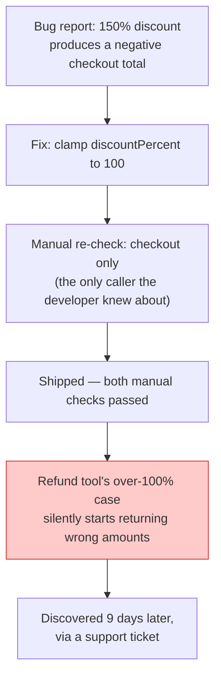

import Scenario from "../../../components/Scenario.astro";
import LevelIntro from "../../../components/LevelIntro.astro";
import Checkpoint from "../../../components/Checkpoint.astro";

<Scenario label="One function, two unrelated call sites, one silent regression">
  <Fragment slot="facts">
    <div class="not-prose flex flex-col gap-1.5 text-sm text-slate-700 dark:text-slate-300">
      <div class="flex items-center gap-1.5"><span>🛒</span> <code>checkout.mjs</code> — <code>applyDiscount(100, 20)</code> → expects <strong>$80</strong></div>
      <div class="flex items-center gap-1.5"><span>💸</span> <code>refunds.mjs</code> — <code>applyDiscount(price, feePercent)</code>, where <code>feePercent</code> can legitimately exceed <strong>100</strong> by design</div>
      <div class="flex items-center gap-1.5"><span>🔧</span> The "fix": clamp <code>discountPercent</code> to 100 — looks safe from checkout's point of view</div>
    </div>
    <div class="not-prose mt-3 rounded border border-rose-300 bg-rose-50 p-1.5 text-xs dark:border-rose-800 dark:bg-rose-950">
      The clamp silently breaks refunds — a file the fixing developer never
      opened, testing a case they never knew existed.
    </div>

  </Fragment>

Both call sites were manually verified when they were first built —
checkout was clicked through in a browser, refunds were tested with a
sample order. Both checks passed. Both checks are now permanently in
the past.

**Before reading the "fix" below: what would you need to know about
`applyDiscount`'s callers — not just its current behavior — to safely
change it?**

</Scenario>

<LevelIntro
  items={[
    "A worked regression, from shared function to silent breakage",
    "The test that would have caught it, and why it catches it",
    "Common failure modes that make a test suite untrustworthy",
  ]}
/>

## The setup: one function, two unrelated call sites

```js
// pricing.mjs — used by both the checkout page and the admin refund tool
function applyDiscount(price, discountPercent) {
  return price - price * (discountPercent / 100);
}

// checkout.mjs
const total = applyDiscount(100, 20); // $100 item, 20% off -> $80

// refunds.mjs
const refundAmount = applyDiscount(originalPrice, restockingFeePercent);
```

## The change, and what a manual re-check would (and wouldn't) catch

Months later, a developer working exclusively on the checkout page notices `applyDiscount` doesn't handle discounts over 100% gracefully (a data-entry bug elsewhere was producing `discountPercent: 150`, resulting in a negative price) and "fixes" it:

```js
// pricing.mjs — the "fix," from the checkout developer's point of view
function applyDiscount(price, discountPercent) {
  const clamped = Math.min(discountPercent, 100);
  return price - price * (clamped / 100);
}
```

The developer manually re-clicks through checkout with a normal 20% discount and a deliberately broken 150% discount — both now look correct. They ship it. Nobody manually re-checks the refund tool, because nothing about this change _looked_ related to refunds — it's in a completely different part of the product, and the developer making the change had no reason to think about it.

But the refund tool used `restockingFeePercent` values that could legitimately exceed 100 in a specific case (a partial refund with an added penalty modeled as a percentage over 100, by design, in that codebase's existing logic) — the clamp silently breaks a currently-correct, intentional behavior in a file the developer never opened.

## The test that catches it, before shipping

```js
// pricing.test.mjs
import { describe, it, expect } from "some-test-runner";
import { applyDiscount } from "./pricing.mjs";

describe("applyDiscount", () => {
  it("applies a normal discount", () => {
    expect(applyDiscount(100, 20)).toBe(80);
  });

  it("supports discountPercent above 100 for the refund tool's penalty modeling", () => {
    // This test exists specifically BECAUSE the refund tool depends on
    // this behavior — a manual checkout re-check would never think to
    // exercise this case, since it has nothing to do with checkout.
    expect(applyDiscount(100, 150)).toBe(-50);
  });
});
```

Running this suite after the "fix" fails the second test immediately, with the exact function and expected-vs-actual value named — not "something's wrong with refunds," discovered days later by a confused support ticket, but "this specific assertion, in this specific file, broke, right now, before it shipped." The test doesn't require the checkout developer to have known refunds depended on this behavior — it only requires that someone, at some point, wrote down the dependency once, and the suite remembers it forever afterward.

<Checkpoint question="The second test in pricing.test.mjs asserts applyDiscount(100, 150) equals -50 — the exact behavior the 'fix' was trying to remove, from checkout's point of view. Why does this test still belong in the suite instead of being deleted alongside the clamp?">

Because that behavior is genuinely correct and intentional for the refund
tool's callers, even though it looks like a bug from checkout's narrower
point of view. The test isn't protecting 'the current implementation' —
it's protecting a specific caller's documented dependency on a specific
input/output pair. Deleting the test because one caller doesn't need it
would just recreate the original failure: someone reasoning about
`applyDiscount` from only one caller's perspective and silently breaking
the other one. The test's job is to represent the refund tool's needs even
when nobody working on checkout is thinking about them.

</Checkpoint>

## Where the fix went wrong, traced



## Failure modes

- **Writing tests that assert nothing meaningful.** `expect(applyDiscount(100, 20)).toBe(applyDiscount(100, 20))` passes trivially and provides zero protection — it's testing the function against itself, not against a known-correct expected value. A test's value comes entirely from the expected value being independently correct, not from the test merely existing.
- **Testing implementation details instead of behavior.** A test that asserts `applyDiscount` internally calls a specific helper function, rather than asserting its actual input/output behavior, breaks every time the implementation is refactored even when the behavior is unchanged — this trains people to distrust or delete failing tests rather than trust them, which defeats the entire purpose.
- **Flaky tests that fail intermittently for reasons unrelated to correctness** (timing assumptions, shared mutable state between tests, relying on real network calls) erode exactly the trust the "automated tests are repeatable" argument depends on — a test suite people have learned to re-run until it passes is no longer providing a real signal, it's theater.
- **Only testing the case you already know about.** The refund tool's `discountPercent: 150` case only got a test because someone already knew it mattered — automated testing doesn't discover which behaviors matter on its own; it makes a known-important behavior permanently checked once someone identifies it. This is why testing pairs with the audience-awareness-style discipline of actually understanding a function's full set of callers before "fixing" it, not a replacement for that understanding.

<Checkpoint question="Of the four failure modes listed, which one would a passing test suite fail to warn you about at all, and why is that the most dangerous kind?">

Testing implementation details instead of behavior — because that failure
mode doesn't necessarily show up as a broken test today; it shows up
later, as a test that breaks during an unrelated, behavior-preserving
refactor, teaching the team to distrust or silence failing tests. The
other three failure modes (assertions that prove nothing, flaky tests, and
only testing known cases) tend to announce themselves fairly quickly —
either the test never fails, or it fails unpredictably, both of which are
noticeable. Implementation-coupled tests look completely healthy right up
until the moment someone tries to improve the code underneath them, which
is exactly when trust in the suite quietly erodes.

</Checkpoint>

## Beyond `applyDiscount`: the same reasoning, a harder case

The pricing scenario is one worked example — a case, not the whole
territory. **What changes if the shared function isn't `applyDiscount`
but something with three real callers instead of two — say, a
`formatCurrency` helper used by checkout, refunds, and a nightly
financial-reconciliation report?** The reasoning doesn't change: each
caller can have its own legitimate edge case the others don't share
(the reconciliation report might need negative amounts formatted
differently than a customer-facing total), and a developer fixing a
bug for one caller still can't be expected to remember callers they've
never opened. What changes is the cost of getting it wrong — a broken
reconciliation report might not surface as a "bug" at all, just
silently wrong numbers in a report nobody double-checks by hand,
which is arguably worse than a loud support ticket. The fix is the
same at any number of callers: a test per known-important behavior,
written once, checked forever — not a developer trying to hold every
caller in their head before every change.
