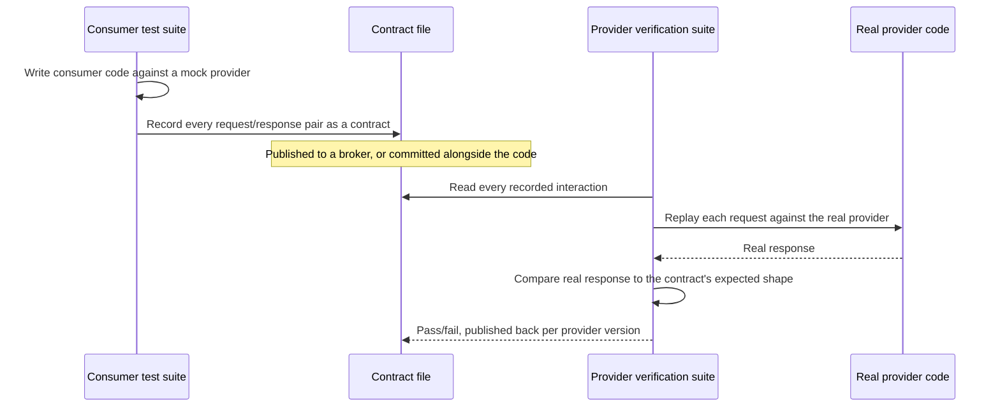

import LevelIntro from "../../../components/LevelIntro.astro";
import Checkpoint from "../../../components/Checkpoint.astro";

L1 established the gap: a hand-written mock only reflects what someone
believed the provider's response looked like at the moment they wrote
it, and nothing re-checks that belief as the provider changes. This
level builds the actual mechanism that keeps both sides honest without
either team running the other's service.

<LevelIntro
  items={[
    "What a contract file actually contains",
    "Why the consumer writes it, not the provider",
    "The two-sided verification workflow, and where it sits in the pyramid",
  ]}
/>

## What's actually in a contract?

**If a contract isn't code and isn't documentation, what is it?** It's
a data file — usually JSON — listing every interaction the consumer
cares about, each one pairing an exact request with the exact response
shape the consumer expects back:

```json
{
  "consumer": "order-summary-frontend",
  "provider": "order-service",
  "interactions": [
    {
      "description": "a request for an existing order",
      "request": { "method": "GET", "path": "/orders/123" },
      "response": {
        "status": 200,
        "body": { "id": "123", "totalAmount": 4999, "status": "paid" }
      }
    }
  ]
}
```

This isn't a spec written from imagination — it's generated by actually
running the consumer's own test code against a mock provider, recording
the request it made and the response shape it asserted on. That's the
difference from a hand-written mock: the contract is a byproduct of a
real test, not a separate guess someone has to remember to update.

## Why consumer-driven, not provider-defined?

A provider team could instead publish an abstract OpenAPI-style spec
and ask every consumer to conform to it. **What goes wrong with that,
compared to letting each consumer write its own contract?** An abstract
spec has to cover every field any consumer might ever want, which means
the provider can never safely remove or rename a field without checking
against every consumer by hand — exactly the coordination problem
contract testing exists to avoid.

Consumer-driven flips it: each consumer's contract only lists what
_that consumer_ actually reads. If the order-summary frontend never
looks at a `shippingAddress` field, its contract never mentions it —
and the provider is free to change or drop it, as long as every
contract that _does_ depend on it still passes. The provider's real
obligation is exactly the union of what its actual consumers use, not
an abstract ideal.

<Checkpoint question="Two consumers both call GET /orders/:id. Consumer A's contract only checks the id and status fields; consumer B's contract also checks totalAmount. Can the provider safely rename totalAmount to amount?">

No — not without updating consumer B's contract and getting it
re-verified. Consumer A's contract would still pass unchanged (it never
looked at that field), but consumer B's contract encodes a real
dependency on the exact name `totalAmount`, and renaming it would fail
B's provider verification the moment it runs. This is exactly what a
contract is for: it tells the provider precisely which fields are safe
to change and which aren't, per consumer, instead of one team having to
guess.

</Checkpoint>

## The two-sided verification workflow



Both suites run at unit-test speed — no live network call between the
two services, no shared environment. The **consumer test** only ever
talks to a mock built from the contract itself, so it can run entirely
inside the consumer's own CI. The **provider verification test** only
ever talks to the provider's real code (in-process or against a local
instance), replaying interactions the contract already recorded — it
never needs the consumer's code at all. Neither side is testing against
the other side's test double; each is testing against the shared
artifact both sides agree describes the truth.

<Checkpoint question="In the workflow above, does the provider verification test ever need the frontend's actual JavaScript code to run?">

No — that's the entire point of exchanging a contract file instead of
running a real end-to-end test. The provider verification suite only
needs the contract's recorded interactions (a list of requests and
expected responses) and the provider's own real implementation. The
consumer's code, framework, and language are irrelevant to the
provider's half of the check — which is also why contract testing
works cleanly across teams using completely different tech stacks.

</Checkpoint>

## Where this sits in the test pyramid

`test-pyramid` argues for fewer expensive integration/e2e tests and
more fast unit tests. Contract testing is the concrete technique that
makes shrinking the top of the pyramid safe, by replacing one slow,
flaky cross-service test with two fast, independent ones plus a shared
artifact:

|                                                                        | Full end-to-end test                    | Contract test (both sides)             |
| ---------------------------------------------------------------------- | --------------------------------------- | -------------------------------------- |
| Needs both services running live                                       | Yes                                     | No                                     |
| Speed                                                                  | Slow (network calls, real infra)        | Unit-test speed                        |
| Flakiness                                                              | High (shared environment, timing, data) | Low (no live network between services) |
| Catches a field-shape mismatch                                         | Yes, if the test path exercises it      | Yes, deterministically, every run      |
| Catches cross-cutting issues (auth flow, ordering across calls, infra) | Yes                                     | No — out of scope, see L3              |
| Runs independently per team, per CI pipeline                           | No — needs coordination                 | Yes                                    |

Contract testing doesn't eliminate the need for _any_ end-to-end tests
— it eliminates the need for the ones whose only job was catching
"does the response shape still match what the consumer expects,"
which turns out to be a large share of what cross-service e2e suites
actually exist to catch. L3 covers what it still can't replace.
