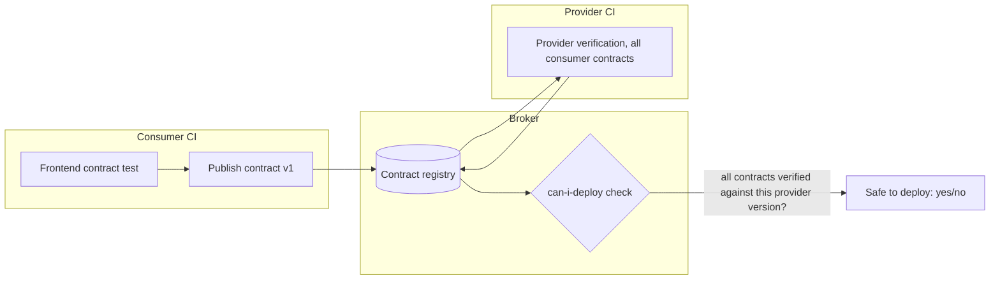

import Scenario from "../../../components/Scenario.astro";
import LevelIntro from "../../../components/LevelIntro.astro";
import Checkpoint from "../../../components/Checkpoint.astro";

<Scenario label="Same rename, this time caught before it ships">
  <Fragment slot="facts">
    <div class="not-prose flex flex-col gap-2 text-sm text-slate-700 dark:text-slate-300">
      <div class="flex items-center gap-1.5"><span>📄</span> <strong>Contract</strong> — generated once, from the consumer's own test</div>
      <div class="flex items-center gap-1.5"><span>🔁</span> <strong>Provider CI</strong> — replays it against real handler code on every build</div>
      <div class="flex items-center gap-1.5"><span>🐛</span> <strong>The rename</strong> — <code>total</code> → <code>totalAmount</code>, same as L1's Scenario</div>
      <div class="flex items-center gap-1.5"><span>❌</span> <strong>This time</strong> — provider verification fails in CI, before deploy</div>
    </div>
  </Fragment>

L1's Scenario showed the field rename reaching production because
nothing connected the frontend's mock to the real API. This level
builds that connection for real: a consumer test that generates an
actual contract file, and a provider verification test that replays it
against real handler code. **If the same `total` → `totalAmount` rename
happened here, at what point would it get caught — and by whose test
suite?**

By the provider's own CI, the moment someone tries to ship the rename
— not by a user noticing a broken order total in production. That's
the difference this level makes concrete.

</Scenario>

<LevelIntro
  items={[
    "A consumer test that generates a real contract file",
    "A provider verification test that fails, then a fix that passes",
    "What contract testing still can't catch, and the broker/versioning problem",
  ]}
/>

## The consumer: a fetch wrapper and its contract test

`getOrder(id)` is the only place the frontend talks to the order
service. This is the function whose behavior the contract needs to
pin down:

```js
// order-client.js
async function getOrder(baseUrl, id) {
  const res = await fetch(`${baseUrl}/orders/${id}`);
  if (!res.ok) {
    throw new Error(`order fetch failed: ${res.status}`);
  }
  return res.json();
}

module.exports = { getOrder };
```

The consumer test doesn't call the real order service — it runs a tiny
mock HTTP server that only knows how to answer the exact interactions
being recorded, then writes those interactions out as a contract file:

```js
// order-client.contract.test.js
const http = require("http");
const fs = require("fs");
const { getOrder } = require("./order-client");

const interactions = [];

function startMockProvider(expectedPath, responseBody) {
  return http.createServer((req, res) => {
    interactions.push({
      description: `a request for ${expectedPath}`,
      request: { method: "GET", path: expectedPath },
      response: { status: 200, body: responseBody },
    });
    if (req.url === expectedPath) {
      res.writeHead(200, { "Content-Type": "application/json" });
      res.end(JSON.stringify(responseBody));
    } else {
      res.writeHead(404);
      res.end();
    }
  });
}

async function runConsumerContractTest() {
  const expectedOrder = { id: "123", totalAmount: 4999, status: "paid" };
  const server = startMockProvider("/orders/123", expectedOrder);
  await new Promise((resolve) => server.listen(0, resolve));
  const port = server.address().port;

  const order = await getOrder(`http://localhost:${port}`, "123");

  // this is the actual assertion the consumer cares about --
  // it's what makes it into the contract as the "expected" shape
  if (
    order.id !== "123" ||
    order.totalAmount !== 4999 ||
    order.status !== "paid"
  ) {
    throw new Error("consumer assertion failed against mock provider");
  }

  server.close();

  const contract = {
    consumer: "order-summary-frontend",
    provider: "order-service",
    interactions,
  };
  fs.writeFileSync(
    "order-service.contract.json",
    JSON.stringify(contract, null, 2),
  );
  return contract;
}

module.exports = { runConsumerContractTest };
```

Running `runConsumerContractTest()` produces `order-service.contract.json`:

```json
{
  "consumer": "order-summary-frontend",
  "provider": "order-service",
  "interactions": [
    {
      "description": "a request for /orders/123",
      "request": { "method": "GET", "path": "/orders/123" },
      "response": {
        "status": 200,
        "body": { "id": "123", "totalAmount": 4999, "status": "paid" }
      }
    }
  ]
}
```

This file is the artifact both teams now share — checked into the
repo, or published to a broker (more on that below). Notice what it
does _not_ contain: nothing about how the order is stored, computed,
or persisted on the provider's side. It only records the one thing the
consumer actually depends on — request in, response shape out.

## The provider: a real handler, and a verification test that fails

The provider's own implementation, written independently of the
contract:

```js
// order-service.js
const orders = {
  123: { id: "123", total: 4999, status: "paid" }, // <- field is `total`, not `totalAmount`
};

function handleGetOrder(id) {
  const order = orders[id];
  if (!order) return { status: 404, body: null };
  return { status: 200, body: order };
}

module.exports = { handleGetOrder };
```

The provider verification test doesn't know or care how the consumer's
code works — it only replays every interaction recorded in the
contract against this real handler, and checks the real response
matches what the contract expects:

```js
// order-service.verify.test.js
const fs = require("fs");
const { handleGetOrder } = require("./order-service");

function deepEqual(a, b) {
  return JSON.stringify(a) === JSON.stringify(b);
}

function verifyContract(contractPath) {
  const contract = JSON.parse(fs.readFileSync(contractPath, "utf8"));
  const failures = [];

  for (const interaction of contract.interactions) {
    const id = interaction.request.path.split("/").pop();
    const actual = handleGetOrder(id);

    if (actual.status !== interaction.response.status) {
      failures.push(
        `${interaction.description}: expected status ${interaction.response.status}, got ${actual.status}`,
      );
      continue;
    }
    if (!deepEqual(actual.body, interaction.response.body)) {
      failures.push(
        `${interaction.description}: response body did not match contract\n` +
          `  expected: ${JSON.stringify(interaction.response.body)}\n` +
          `  actual:   ${JSON.stringify(actual.body)}`,
      );
    }
  }

  return { passed: failures.length === 0, failures };
}

module.exports = { verifyContract };
```

Running `verifyContract("order-service.contract.json")` against the
provider above **fails**:

```text
passed: false
failures: [
  "a request for /orders/123: response body did not match contract
    expected: {\"id\":\"123\",\"totalAmount\":4999,\"status\":\"paid\"}
    actual:   {\"id\":\"123\",\"total\":4999,\"status\":\"paid\"}"
]
```

This is the exact mismatch from L1's Scenario — but instead of reaching
production, it fails a test in the provider's own CI pipeline, before
the code ships. The fix is a one-line change to the provider's data
shape:

```js
const orders = {
  123: { id: "123", totalAmount: 4999, status: "paid" }, // fixed
};
```

Re-running `verifyContract(...)` now returns `{ passed: true, failures: [] }`
— the provider has proven, independently and without ever running the
consumer's code, that it satisfies every interaction the consumer
actually depends on.

<Checkpoint question="The provider verification test never imports or runs any of the frontend's JavaScript. How is it still able to catch a bug that only shows up in the frontend's rendered page?">

Because the contract already captured the one thing that mattered —
the exact response shape the frontend's code asserts on — at the
moment the consumer test ran. The provider verification test doesn't
need to re-derive what the frontend expects; it just needs to check its
own real response against that already-recorded expectation. This is
the whole value of the contract as a shared artifact: it lets the
provider verify correctness for a consumer it never has to execute.

</Checkpoint>

## What this still doesn't catch

Contract testing is not a replacement for every end-to-end test — it
replaces specifically the ones whose only job was "does the response
shape still match." A few things stay entirely out of scope:

| Failure mode                                                      | Why contract testing misses it                                                                                                                                                                                         |
| ----------------------------------------------------------------- | ---------------------------------------------------------------------------------------------------------------------------------------------------------------------------------------------------------------------- |
| Auth/session flow across multiple calls                           | A contract checks one request/response pair at a time — it has no model of "call A must happen before call B succeeds"                                                                                                 |
| Ordering or timing across services                                | Contracts are stateless snapshots, not sequences — race conditions and ordering bugs need a real integration or e2e test                                                                                               |
| Infra issues (DNS, TLS, load balancer config, network partitions) | The provider verification test calls the handler directly (or via localhost) — it never touches the real network path production traffic takes                                                                         |
| A contract nobody actually verifies in CI                         | The contract file itself proves nothing — it's the _verification step running on every build_ that catches drift; an unverified contract is worse than no contract, because it looks like safety without providing any |

That last row is the one teams actually get wrong in practice: writing
a contract and forgetting to wire provider verification into CI is
common, and it's strictly worse than having no contract at all — a
stale, unverified contract file sitting in a repo gives false
confidence ("we have contract tests") while catching nothing, and the
team that would have been more careful without it now isn't.

## The broker problem: which provider version satisfies which consumer?

A single consumer and a single provider is the easy case. **What
changes once three different frontends, and a mobile app, all consume
the same order service, each with their own contract?** The provider
now has to satisfy four contracts simultaneously, not one — and a
version that breaks even one of them isn't safe to deploy, even if it
satisfies the other three perfectly.

In practice this is solved with a **broker**: a shared service both
sides publish to and query in CI, rather than passing contract files
by hand.



The broker tracks, per provider version, which consumer contracts it
has actually been verified against — and a **"can I deploy" check**
before a release simply asks the broker: has this exact provider
version been verified against every contract of every consumer
currently in production? If a mobile app's contract was never verified
against this build, the answer is no, regardless of how confident the
provider team feels. This turns "did we break someone" from a question
answered by hoping nobody notices into a question answered by a single
CI gate, even across teams that don't talk to each other day to day.

<Checkpoint question="With a broker in place, if the provider team ships a version that satisfies 3 of 4 consumer contracts but breaks the 4th, does the can-i-deploy check pass?">

No — the check is a single yes/no answer, and it requires every
contract currently recorded against production consumers to verify
successfully, not a majority. One failing contract is enough to block
the deploy, which is exactly the point: a provider team shouldn't need
to personally track down and ask four other teams "did I break you"
before every release — the broker already knows, from CI results
alone.

</Checkpoint>

**Two directions to extend this yourself.** First: with three
consumers of the same provider instead of one, does the provider's
verification suite need three separate test files, or can it replay
all three contracts through the same `verifyContract` function shown
above — and what would have to change about that function to report
_which_ consumer's contract failed, not just that something did?
Second: every interaction shown here was a 200 happy path — what would
a contract interaction for an error response look like (say, `GET
/orders/999` for an order that doesn't exist, expecting a 404), and
does `verifyContract` already handle that case correctly, or does it
need a change?
