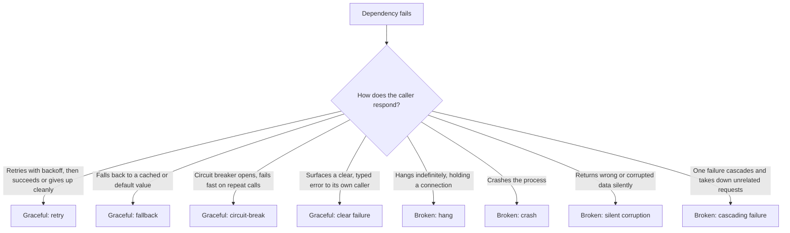

import LevelIntro from "../../../components/LevelIntro.astro";
import Checkpoint from "../../../components/Checkpoint.astro";

L1 established the gap: a suite can hit 100% line coverage and still
never exercise the one scenario that took the checkout service down —
a dependency that stops responding. This level builds the actual
mechanism for testing that on purpose, and names what a "passing"
result under failure should even look like.

<LevelIntro
  items={[
    "The fault types worth injecting, and what each simulates",
    "Graceful degradation as a testable property, not a vibe",
    "How fault injection differs from flaky tests and from test doubles",
  ]}
/>

## What actually goes wrong when a dependency fails?

**A network call to another service can fail in more than one way —
does it matter which way, for what you test?** It matters a lot,
because each failure mode exercises different code:

| Fault type                | What it simulates                                           | What it exercises in the caller                                                 |
| ------------------------- | ----------------------------------------------------------- | ------------------------------------------------------------------------------- |
| Timeout / hang            | Dependency never responds at all                            | Does the caller have a timeout, or wait forever?                                |
| Error response (e.g. 500) | Dependency responds, but with a failure status              | Does the caller check the status, or trust any response?                        |
| Connection refused        | Dependency is down or unreachable                           | Does the caller handle a connection-level failure, not just an HTTP one?        |
| Slow response             | Dependency responds, but well past a reasonable wait        | Does the caller distinguish "slow" from "hung," or block just as badly on both? |
| Partial / malformed body  | Dependency responds 200 OK with unusable or incomplete data | Does the caller validate the shape of what it got, or trust it blindly?         |

A suite that only ever tests the success path exercises none of the
right-hand column. Each row is a genuinely different bug waiting to
happen — a caller that handles a 500 correctly can still hang forever
on a pure timeout, because those are different code paths entirely.

<Checkpoint question="A caller checks `if (!response.ok) throw new Error(...)` after every request. Does that one check protect it against every fault type in the table above?">

No. It protects against the error-response row — a real HTTP response
with a failure status. It does nothing for a timeout or a hang,
because there's no response to check `.ok` on yet; the call is just
still pending. It also does nothing for a malformed 200 OK body, since
`response.ok` would be `true` — the failure is in the payload, not the
status. Each fault type needs its own test, because each one exercises
a different piece of defensive code.

</Checkpoint>

## Graceful degradation as a testable property

**What does "the system handled it well" actually mean, concretely
enough to write an assertion against?** It's not a feeling — it's one
of a small number of observable behaviors:

The left branch (graceful) all share one property: the failure stays
**contained** — it's visible, bounded in time, and doesn't take
anything else down with it. The right branch (broken) all share the
opposite property: the failure **spreads or hides** — it either takes
resources indefinitely (hang), stops the process (crash), lies about
having succeeded (silent corruption), or drags unrelated work down
with it (cascade). A fault-injection test's job is to force the
failure and assert which branch actually happened.

<Checkpoint question="A service retries a failed call 5 times with no delay between attempts, then gives up. Is that graceful degradation?">

Partially, and that's the point of naming the property precisely
instead of just asking "did it retry." It retries and eventually gives
up cleanly rather than hanging forever, which is graceful in shape.
But retrying 5 times with no backoff, against a dependency that's
already struggling, adds load to a failing system exactly when it can
least handle it — a real retry needs backoff (increasing delay between
attempts) to be graceful in practice, not just in that it eventually
stops. A fault-injection test can assert on this directly: inject a
failing dependency, and check both that the caller gives up eventually
_and_ that attempts are spaced out, not fired in a tight loop.

</Checkpoint>

## Not the same thing as a flaky test

`flaky-tests` covers tests that fail unpredictably for reasons the
test itself doesn't control — shared state, timing, environment
differences. It's worth being explicit about the difference, because
both involve a test behaving unexpectedly around timing or failure:

|                          | Flaky test                                                        | Fault-injection test                                               |
| ------------------------ | ----------------------------------------------------------------- | ------------------------------------------------------------------ |
| Is the failure intended? | No — it's an accident the test author didn't mean to introduce    | Yes — the test deliberately forces a dependency to fail            |
| Is it controlled?        | No — depends on ordering, timing, or environment outside the test | Yes — the fault type, timing, and response are all set by the test |
| What it does to trust    | Undermines trust in the suite — a red run might mean nothing      | Builds trust in the suite — a red run means a real gap was found   |
| The fix                  | Remove the non-determinism (isolate state, control time)          | Nothing to "fix" in the test — it's working as designed            |

A fault-injection test that reliably fails when a dependency hangs
isn't flaky — it's correct. The two can look superficially similar
(both involve a test whose outcome depends on timing or an external
call) but they're opposites in intent: one is an accident to eliminate,
the other is a deliberate probe to keep.

## Same seam as test doubles, different goal

`test-doubles` already covers swapping a real dependency for a stub,
fake, or mock at a seam — a point in the code where the dependency can
be substituted. Fault injection typically uses that exact same seam.
The difference is what gets put there:

- A **test double for isolation** returns a normal, successful
  response — its job is to let a test run fast and deterministically
  without needing the real dependency up and running.
- A **fault-injection double** deliberately returns a failure — a
  hang, an error, a malformed body — its job is to see what the caller
  does when the dependency it's talking to breaks.

Same mechanism (swap what's behind the seam), different question being
asked of it. A codebase with no seam at all — one that calls `fetch`
directly, inline, with nothing swappable — can't be fault-injection
tested without first creating one, for the same reason it can't be
unit tested with a stub either.

## Distinguishing from production chaos engineering

Briefly, since it comes up in L3: fault injection as covered here is a
**test-level** technique — a specific, known failure mode forced in a
controlled test, before code ships. **Chaos engineering** is the
production-scale relative: deliberately breaking things in a live
system (killing a real instance, injecting real network latency) to
surface failure modes nobody predicted in advance. Fault injection
catches known risks before deploy; chaos engineering finds unknown
risks after. Neither replaces the other.
