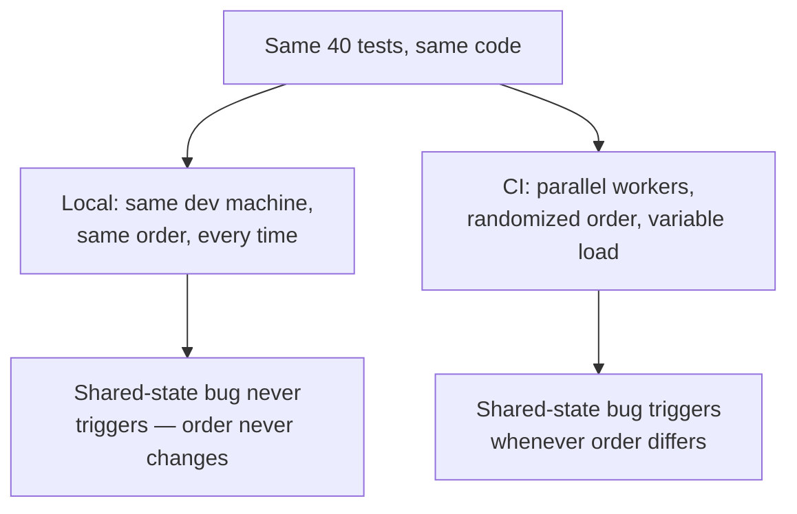

import LevelIntro from "../../../components/LevelIntro.astro";
import Checkpoint from "../../../components/Checkpoint.astro";

L1 named the shape of the problem — a test's outcome secretly depending on
something it doesn't control — without yet naming what that "something"
usually is. L2 breaks it into the four concrete causes and works out why
CI, specifically, is where they tend to surface.

<LevelIntro
  items={[
    "The four things a test's outcome can secretly depend on",
    "Why CI surfaces flakiness that local runs hide",
    "Failure modes that treat the symptom, not the cause",
  ]}
/>

## The four things a test's outcome can secretly depend on

**If a test's logic is correct, what else could make it fail
unpredictably?** Anything the test doesn't fully control but its
outcome quietly depends on:

| Cause                 | What it looks like                                                                        | Why it's non-deterministic                                                              |
| --------------------- | ----------------------------------------------------------------------------------------- | --------------------------------------------------------------------------------------- |
| Shared state leakage  | Two tests read/write the same in-memory store, file, or database row without resetting it | Whichever test happens to run first changes what the next one starts with               |
| Real time             | A test uses the actual system clock (`Date.now()`, `setTimeout`) instead of a fixed one   | Execution speed varies between machines and runs, so a hardcoded delay isn't reliable   |
| Real randomness       | A test relies on `Math.random()` or a real UUID generator without a fixed seed            | The exact value differs every run, so an assertion tied to a specific value is a gamble |
| Unresolved async work | A test asserts on the result of a promise/callback before it has actually resolved        | The assertion's timing depends on how fast the event loop happens to get to it          |

**Is this table saying flaky tests are always caused by bad luck?**
No — every one of these has a deterministic fix (reset state, inject
a fake clock, seed the randomness, actually await the async work).
Flakiness isn't inherent to testing async or stateful code — it's a
sign that one of these four dependencies was left uncontrolled.

<Checkpoint question="A test calls a function that reads Date.now() internally to decide which discount tier applies, and the test's expected value was hardcoded based on today's date. Which of the four causes is this, and what's the deterministic fix?">

This is the "real time" cause — the test's outcome depends on the actual
system clock rather than a value the test controls. The fix isn't to make
the test run faster or to update the hardcoded expectation periodically;
it's to inject a fake or fixed clock (freeze `Date.now()`, or pass the
current time in as a parameter the test controls) so the test's expected
value and the code's actual behavior are both anchored to the same fixed
point in time, regardless of when the test actually runs.

</Checkpoint>

## Why CI surfaces flakiness that local runs hide

**If the same shared-state bug exists locally too, why does it almost
only show up in CI?**

A local run on one machine tends to execute tests in the same fixed
order every single time — if that order happens to never expose the
shared-state dependency, the bug is invisible locally no matter how
many times it's run. CI frequently shuffles test order, runs tests
across multiple parallel workers, and experiences more variable
timing (shared build machines under load) — all of which increase the
chance that whatever order-dependency or timing-dependency exists
actually gets triggered.

**Does this mean CI is "flakier" than local, as if CI itself is the
problem?** No — CI isn't introducing new bugs, it's exposing bugs that
were always there but never had the right conditions to surface
locally. Treating "it passes locally" as proof of correctness ignores
that local runs are a much narrower sample of possible execution
conditions than CI actually exercises.

<Checkpoint question="A team's rule is 'if it passes locally, it's fine to merge — CI failures on that PR are probably just CI being flaky.' What's wrong with that reasoning, given what makes CI surface bugs that local runs don't?">

The reasoning has cause and effect backwards. CI isn't unreliable in the
sense of producing false failures out of nowhere — it's exercising a wider
range of execution conditions (shuffled order, parallel workers, variable
timing) than a single developer's machine ever does, so a CI failure is
more likely to be a real, pre-existing non-determinism the local run
simply never had the right conditions to expose. Treating "passes locally"
as sufficient proof of correctness, and a CI failure as noise to dismiss,
means the team will keep merging code with real order- or timing-
dependent bugs and just wait for them to surface again later, in
production or in an even harder-to-reproduce form.

</Checkpoint>

## Failure modes at this level

- **Re-running a failing test until it passes, then moving on.**
  This treats the symptom, not the cause — the underlying
  non-determinism is still there and will trigger again.
- **Assuming a flaky test is "probably fine" because it usually
  passes.** A test that fails 1 in 20 times is still exposing a real
  dependency the code or the test doesn't control — "usually passes"
  isn't the same as "correct."
- **Fixing flakiness by adding a longer `setTimeout` delay.** This
  narrows the window for the race condition without eliminating it —
  it's still non-deterministic, just less likely to trigger, which
  makes the eventual failure harder to reproduce and debug.
